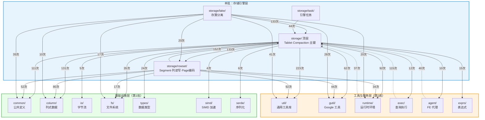

# StarRocks BE 源码分析 —— 存储引擎层

> **目标读者**：熟悉 Java 的工程师，希望快速理解 StarRocks BE（C++）中存储引擎层各目录与文件的职责。
>
> **阅读建议**：先看"目录总览"建立全局认知 → 再看"模块依赖关系图"理解模块间关系 → 最后按需查阅各子模块的文件级说明表。

---

## 1. 目录总览

本批共涵盖 **1 个目录（含 3 个子目录）**，约 463 个源文件。`storage/` 是 StarRocks BE 中最核心、体量第二大的模块，承担了从 Tablet 元数据管理到数据写入、Compaction、主键索引、存算分离等完整存储功能。

| 子模块 | 文件数 | 定位 | Java 类比 |
|--------|--------|------|-----------|
| `storage/`（顶层） | ~253 | 存储引擎核心：Tablet、Compaction、主键索引、DeltaWriter、事务管理等 | HBase RegionServer（Region/Store/MemStore/Compaction） |
| `storage/rowset/` | ~116 | 数据文件层：Rowset、Segment、列读写、Page 编码、索引 | HBase HFile / Parquet 文件格式层 |
| `storage/lake/` | ~79 | 存算分离模式：Cloud-native Tablet、对象存储上的元数据和数据管理 | Apache Iceberg / Hudi 的存储管理层 |
| `storage/task/` | ~15 | FE 下发的存储引擎任务（Clone、Alter、Compaction、迁移等） | HBase Procedure 任务 |

---

## 1.1 模块依赖关系图

> 下图基于源码 `#include` 统计，箭头表示"A 依赖 B"（A 的源文件 `#include` 了 B 的头文件），括号内数字为引用次数。
>
> **阅读方式**：从上往下看 — `storage/` 是一个重度依赖底层基础设施的核心模块，同时被上层查询引擎和服务层大量引用。

**关键观察**：

| 观察点 | 说明 |
|--------|------|
| **`storage/` 与 `rowset/` 双向强耦合** | 顶层引用 rowset 133 次，rowset 反向引用顶层 152 次。这是因为 Tablet 管理 Rowset 集合（向下），而 Rowset/Segment 需要引用 TabletSchema 等存储层定义（向上） |
| **`lake/` 重度依赖顶层 storage** | 133 次引用——Lake 模式复用了大量本地存储的基础组件（TabletSchema、DelVector、PrimaryIndex、Compaction 工具等） |
| **`util/` 是最重度依赖** | storage 顶层对 `util/` 的引用高达 223 次，远超其他模块。存储引擎广泛使用工具库的线程池、LRU Cache、Metrics 等 |
| **`column/` 是第二大依赖** | 131 次引用——所有数据读写都围绕 `Column` 和 `Chunk` 进行，体现了列式存储引擎的本质 |
| **`exec/` 是 storage 的最大消费者** | 查询执行层引用 storage 115 次，通过 `TabletReader` → `RowsetIterator` → `SegmentIterator` 链路读取数据 |
| **`task/` 单向依赖顶层 storage** | 44 次引用但无反向依赖，说明任务模块是纯消费者角色 |

---

## 2. `storage/`（顶层）—— 存储引擎核心

> 这是整个存储引擎的"大脑"，管理 Tablet 生命周期、数据写入管道、Compaction 调度、主键索引、事务等核心功能。
>
> **Java 类比**：类似 HBase 的 RegionServer 层——`StorageEngine` 对应 `HRegionServer`，`Tablet` 对应 `HRegion`，`DeltaWriter` + `MemTable` 对应 `HRegion.put()` + `MemStore`。

### 2.1 存储引擎入口与 Tablet 管理

| 文件 | 功能说明 | 功能边界 |
|------|---------|---------|
| **`storage_engine.h/cpp`** | `StorageEngine` 全局单例——存储引擎入口。管理所有 `DataDir`、`TabletManager`、`TxnManager`、`CompactionManager`、`UpdateManager` 等子系统的生命周期，启动后台线程（compaction/gc/检查点等）。Java 类比：HBase 的 `HRegionServer`。 | 不直接读写数据，不做具体 compaction 逻辑，委托给子组件。 |
| **`tablet.h/cpp`** | `Tablet`（继承 `BaseTablet`）——本地 tablet 实例，是数据读写的核心对象。管理 rowset 集合、版本信息、compaction 策略，主键表还持有 `TabletUpdates`。Java 类比：HBase 的 `HRegion`。 | 不管理跨 tablet 的全局调度，不负责磁盘空间管理。 |
| **`base_tablet.h/cpp`** | `BaseTablet`——所有 tablet 类的基类。持有 `TabletMeta` 和 `DataDir` 指针，提供 tablet_id、schema、状态等基础访问接口。 | 不含具体读写逻辑，仅提供基础属性访问。 |
| **`tablet_meta.h/cpp`** | `TabletMeta`——Tablet 的持久化元数据。包含 tablet_id、schema_hash、状态机（NOTREADY → RUNNING → TOMBSTONED → STOPPED → SHUTDOWN）、rowset 元信息列表等。Java 类比：HBase `RegionInfo`。 | 纯元数据的序列化/反序列化容器，不含运行时逻辑。 |
| **`tablet_manager.h/cpp`** | `TabletManager`——全局 tablet 管理器。维护 tablet_id → Tablet 映射，负责创建/删除/获取 tablet，从磁盘恢复元数据。Java 类比：HBase `RegionServerServices`。 | 不负责 tablet 内部的数据读写和 compaction 执行。 |
| **`tablet_schema.h/cpp`** | `TabletColumn` + `TabletSchema`——定义 tablet 的列 schema 信息（列名、类型、聚合方式、编码、索引等）以及完整 tablet schema（keys 类型、排序 key、short key 列数等）。Java 类比：HBase `ColumnFamilyDescriptor` + `TableDescriptor`。 | 不管理 schema 的全局去重。 |
| **`tablet_schema_map.h/cpp`** | `TabletSchemaMap` / `GlobalTabletSchemaMap`——全局 schema 去重映射表。相同 schema 的 tablet 共享一个 `TabletSchema` 对象以节省内存。Java 类比：`String.intern()` 的 schema 版。 | 只负责去重缓存，不创建和解析 schema。 |
| **`tablet_meta_manager.h/cpp`** | `TabletMetaManager`——基于 RocksDB（KVStore）持久化 tablet meta、rowset meta、del_vector、delta_column_group 等元数据的 CRUD。 | 不管理 tablet 运行时状态，只负责持久化存取。 |
| **`data_dir.h/cpp`** | `DataDir`——代表一个物理存储目录（磁盘）。管理磁盘状态（ONLINE/OFFLINE）、磁盘空间、KVStore 实例、tablet 注册/注销。Java 类比：HBase 的 `HFileSystem` + 磁盘管理。 | 不执行具体 I/O 操作，不管理文件内容。 |
| **`kv_store.h/cpp`** | `KVStore`——RocksDB 的封装。提供键值存储接口，用于持久化各类元数据。Java 类比：`RocksDB` Java 客户端。 | 不存储 segment 数据文件，只存元数据。 |

### 2.2 数据读取

| 文件 | 功能说明 | 功能边界 |
|------|---------|---------|
| **`tablet_reader.h/cpp`** | `TabletReader`（继承 `ChunkIterator`）——Tablet 级数据读取器。组合多个 rowset 的 segment 迭代器，执行版本合并、谓词过滤、聚合等，输出最终 Chunk。Java 类比：HBase 的 `RegionScanner`。 | 不负责谓词解析和 segment 底层 I/O。 |
| **`tablet_reader_params.h/cpp`** | `TabletReaderParams`——读取参数集合。包括读取类型（查询/compaction/schema_change）、是否使用 page cache、谓词列表、range 条件、runtime filter 等。 | 纯参数结构体。 |
| **`local_tablet_reader.h/cpp`** | `LocalTabletReader` / `LocalTabletReaderManager`——本地 tablet 的快照读取器，支持 multi_get（点查）和 scan（范围扫描）。 | 不支持写入。 |
| **`table_reader.h/cpp`** | `TableReader`——表级别的读取器，支持跨 tablet 的全表 multi_get 和 scan。可通过 RPC 访问远程 tablet。 | 不支持写入。 |

### 2.3 数据写入管道

| 文件 | 功能说明 | 功能边界 |
|------|---------|---------|
| **`delta_writer.h/cpp`** | `DeltaWriter`——数据写入核心组件。在事务内接收 Chunk 数据，写入 MemTable，flush 后生成 Rowset。支持 Primary/Secondary 副本模式。Java 类比：HBase `HRegion.put()` 的写入管道。 | 不负责事务管理（由 TxnManager 处理），不负责副本间同步的网络通信。 |
| **`async_delta_writer.h/cpp`** | `AsyncDeltaWriter`——`DeltaWriter` 的异步包装器，使用 bthread ExecutionQueue 按 FIFO 顺序异步执行所有写入任务。Java 类比：`CompletableFuture` 包装的写入器。 | 不做实际写入逻辑，委托给内部 `DeltaWriter`。 |
| **`memtable.h/cpp`** | `MemTable`——内存写入缓冲表。接收行级数据插入，达到阈值后 flush 到磁盘生成 segment。支持 AGG 模型的预聚合。Java 类比：HBase 的 `MemStore`。 | 不负责磁盘写入（由 MemTableSink 完成），不做跨 memtable 的 merge。 |
| **`memtable_flush_executor.h/cpp`** | `MemTableFlushExecutor` / `FlushToken`——MemTable 的异步 flush 执行器。通过线程池异步将 MemTable 刷写到磁盘。 | 不决定何时触发 flush，只负责执行。 |
| **`memtable_sink.h`** | `MemTableSink`——MemTable flush 下游的接口。定义 `flush_chunk()` 等抽象方法。 | 纯接口。 |
| **`memtable_rowset_writer_sink.h`** | `MemTableRowsetWriterSink`——将 MemTable flush 的数据通过 `RowsetWriter` 写入 rowset。 | 只做转发。 |
| **`push_handler.h/cpp`** | `PushHandler`——Spark Load 推送处理器。读取 Spark DPP 生成的 Parquet 文件并写入 rowset。 | 仅用于 Spark Load 批量导入。 |
| **`push_utils.h/cpp`** | `PushBrokerReader`——通过 broker 读取 Parquet 文件，负责数据类型转换。 | 不写入数据，只负责读取和格式转换。 |

### 2.4 Compaction 机制

| 文件 | 功能说明 | 功能边界 |
|------|---------|---------|
| **`compaction_manager.h/cpp`** | `CompactionManager`——Compaction 任务的全局调度管理器。维护候选 tablet 队列、控制并发数、选取候选 tablet 提交任务到线程池。Java 类比：HBase 的 `CompactSplitThread`。 | 不执行具体的数据合并，只负责调度和并发控制。 |
| **`compaction_task.h/cpp`** | `CompactionTask` / `CompactionTaskInfo`——Compaction 任务基类（新框架）。封装任务状态、输入 rowset、输出版本、执行统计等。子类实现 `run_impl()` 完成实际合并。 | 不做候选选择和调度。 |
| **`compaction_task_factory.h/cpp`** | `CompactionTaskFactory`——根据 tablet schema 和输入 rowset 创建合适的 CompactionTask 实例（水平/垂直）。 | 不执行 compaction，只创建任务对象。 |
| **`compaction_policy.h`** | `CompactionPolicy`（接口）——判断 tablet 是否需要 compaction 并创建对应的 CompactionTask。 | 纯接口。 |
| **`default_compaction_policy.h/cpp`** | `DefaultCumulativeBaseCompactionPolicy`——默认 compaction 策略（新框架），同时支持 cumulative 和 base compaction 的选择逻辑。 | 不适用于 size-tiered 场景。 |
| **`size_tiered_compaction_policy.h/cpp`** | `SizeTieredCompactionPolicy`——按 rowset 大小层级分组进行合并，适用于写多读少场景。Java 类比：Cassandra 的 SizeTieredCompactionStrategy。 | 不处理传统 cumulative/base 划分。 |
| **`horizontal_compaction_task.h/cpp`** | `HorizontalCompactionTask`——水平 compaction，所有列一起读取、合并、写入。适用于列数较少的表。 | 不支持按列组分批合并。 |
| **`vertical_compaction_task.h/cpp`** | `VerticalCompactionTask`——垂直 compaction，先合并 key 列确定行顺序，再分列组合并 value 列。适用于宽表，节省内存。 | key 列与 value 列使用不同的 merge 策略。 |
| **`compaction.h/cpp`** | `Compaction`（旧框架基类）——定义四步流程：pick rowsets → do compaction → modify rowsets → gc unused rowsets。 | 旧版框架，新框架使用 `CompactionTask`。 |
| **`base_compaction.h/cpp`** | `BaseCompaction`（旧框架）——选取 base 层 rowset 进行全量合并。 | 不处理增量 compaction。 |
| **`cumulative_compaction.h/cpp`** | `CumulativeCompaction`（旧框架）——选取 cumulative point 之后的增量 rowset 合并。 | 不处理 base compaction。 |
| **`compaction_candidate.h`** | `CompactionCandidate`——候选结构体，包含 tablet 指针、compaction 类型和分数。 | 纯数据结构。 |
| **`compaction_context.h`** | `CompactionContext`——存储 tablet 的 compaction 上下文（分数、类型、策略指针）。 | 纯数据容器。 |
| **`compaction_utils.h/cpp`** | `CompactionUtils`——工具类，提供算法枚举（HORIZONTAL/VERTICAL）、chunk size 计算、输出 RowsetWriter 构建等。 | 不执行 compaction 逻辑，只提供工具函数。 |

### 2.5 主键表与更新管理

| 文件 | 功能说明 | 功能边界 |
|------|---------|---------|
| **`primary_index.h/cpp`** | `PrimaryIndex`——内存 hash map 维护主键到 (rowset, segment, rowid) 的映射。Java 类比：`ConcurrentHashMap<PrimaryKey, RowLocation>`。 | 纯内存索引，不直接持久化。 |
| **`persistent_index.h/cpp`** | `PersistentIndex` / `MutableIndex` / `ImmutableIndex`——持久化主键索引，LSM-tree 式结构：L0（内存可变层）+ L1/L2（磁盘不可变层）。用于大数据量 tablet 避免全量内存加载。Java 类比：RocksDB 的 LSM-tree。 | 不直接处理 rowset 数据的读写，只维护主键 → rowid 映射。 |
| **`persistent_index_compaction_manager.h/cpp`** | `PersistentIndexCompactionManager`——持久化索引的 compaction 调度管理器，定期调度 L0→L1/L2 合并任务。 | 不执行具体的索引合并逻辑，只做调度和并发控制。 |
| **`persistent_index_tablet_loader.h/cpp`** | `PersistentIndexTabletLoader`——本地 tablet 的 PersistentIndex 加载器，遍历 rowset 提取主键构建索引。 | 不适用于 lake tablet。 |
| **`primary_key_encoder.h/cpp`** | `PrimaryKeyEncoder`——将复合主键编码为单一保序二进制 key。编码方法借鉴 Kudu。Java 类比：HBase `RowKey` 编码。 | 不做主键索引的存储管理。 |
| **`primary_key_dump.h/cpp`** | `PrimaryKeyDump`——主键 tablet 调试工具，生成 `.pkdump` 文件，含完整主键信息。 | 仅用于故障诊断。 |
| **`primary_key_compaction_conflict_resolver.h/cpp`** | `PrimaryKeyCompactionConflictResolver`（接口）——compaction 冲突解决器。当 compaction 期间有并发写入时，重新计算 del_vector 解决冲突。 | 不解决非主键表的冲突。 |
| **`local_primary_key_compaction_conflict_resolver.h/cpp`** | `LocalPrimaryKeyCompactionConflictResolver`——本地 tablet 的冲突解决器实现。 | 不适用于 lake tablet。 |
| **`primary_key_recover.h/cpp`** | `PrimaryKeyRecover`（接口）——主键表错误恢复。以 segment 文件为数据源重建 del_vector 和主键索引。 | 不处理数据损坏，只处理逻辑不一致。 |
| **`local_primary_key_recover.h/cpp`** | `LocalPrimaryKeyRecover`——本地 tablet 的主键恢复实现。 | 不适用于 lake tablet。 |
| **`tablet_updates.h/cpp`** | `TabletUpdates`——主键表的核心更新管理器。维护版本化 rowset 列表、PrimaryIndex、DelVector、delta column group。处理 apply、compaction、列模式更新。 | 仅管理本地 tablet 的更新，不处理跨节点同步。 |
| **`del_vector.h/cpp`** | `DelVector`——删除向量。使用 Roaring bitmap 存储一个 segment 中所有被删除行的 rowid。每个 DelVector 关联一个版本号。Java 类比：`RoaringBitmap` 标记删除行。 | 不决定哪些行该被删除，只存储已删除行集合。 |
| **`update_manager.h/cpp`** | `UpdateManager`——主键表全局更新管理器。维护 PrimaryIndex 缓存（DynamicCache）、del_vector 缓存、compaction state 缓存。 | 不直接修改数据文件。 |
| **`update_compaction_state.h/cpp`** | `CompactionState`——从 rowset segment 中加载主键列数据，用于 compaction 冲突检测。 | 不执行 compaction 逻辑。 |
| **`rowset_update_state.h/cpp`** | `RowsetUpdateState` / `PartialUpdateState`——行级 partial update 的状态管理。记录每行对应的源 rowset+rowid。 | 不处理列模式更新。 |
| **`rowset_column_update_state.h/cpp`** | `RowsetColumnUpdateState`——列模式 partial update 的状态管理。处理只更新部分列（column with row 模式）的场景。 | 不处理行级 partial update。 |
| **`delta_column_group.h/cpp`** | `DeltaColumnGroup`——增量列组，存储主键表列模式部分更新产生的增量列数据。 | 仅存储增量列数据，不参与全量读取。 |

### 2.6 迭代器体系

| 文件 | 功能说明 | 功能边界 |
|------|---------|---------|
| **`chunk_iterator.h/cpp`** | `ChunkIterator`——所有 Chunk 迭代器的基类。定义 `get_next(Chunk*)` 接口以批量方式读取数据。Java 类比：`Iterator<RecordBatch>`。 | 不指定数据来源，由子类实现。 |
| **`aggregate_iterator.h/cpp`** | `new_aggregate_iterator()` 工厂函数——创建聚合迭代器，对排序后的行按 key 进行聚合（AGG 模型）。 | 不做排序，需要输入已排序数据。 |
| **`merge_iterator.h/cpp`** | `new_heap_merge_iterator()` / `new_mask_merge_iterator()` ——merge-sort 迭代器：heap merge 归并排序，mask merge 按预定义序列合并。 | 不做聚合，只做归并排序。 |
| **`union_iterator.h/cpp`** | `new_union_iterator()`——按顺序拼接多个子迭代器的结果（不排序不去重）。 | 不排序、不去重、不聚合。 |
| **`unique_iterator.h/cpp`** | `new_unique_iterator()`——对连续相同 key 的行只保留最后一行（UNIQUE KEY 模型）。 | 需要输入已排序数据。 |
| **`empty_iterator.h/cpp`** | `new_empty_iterator()`——空迭代器，立即返回 EndOfFile。 | 不读取任何数据。 |
| **`projection_iterator.h/cpp`** | `new_projection_iterator()`——投影迭代器，从子迭代器输出中选择指定列。 | 不做过滤或聚合。 |

### 2.7 谓词下推

| 文件 | 功能说明 | 功能边界 |
|------|---------|---------|
| **`column_predicate.h`** | `ColumnPredicate`（抽象基类）——列级谓词，定义在 Column 上执行过滤的接口。支持 zone map / bloom filter / bitmap index 过滤。Java 类比：HBase `Filter`。 | 不决定谓词何时被应用。 |
| **`column_expr_predicate.h/cpp`** | `ColumnExprPredicate`——桥接计算层 `ExprContext` 到存储层 `ColumnPredicate`，实现更多谓词下推。 | 不支持 bloom filter 评估。 |
| **`column_or_predicate.h/cpp`** | `ColumnOrPredicate`——复合 OR 谓词，组合多个子谓词为"或"关系。只能作用于同一列。 | 不支持跨列 OR。 |
| **`column_operator_predicate.h`** | `ColumnOperatorPredicate<>`——基于模板的通用谓词实现框架。通过模板参数注入比较逻辑（EQ/LT/GT/IN 等）。 | 只是框架，具体操作由模板参数定义。 |
| **`column_predicate_rewriter.h/cpp`** | `ColumnPredicateRewriter`——将字典编码列的谓词重写为基于字典 code 的谓词以提升性能。 | 不重写非字典编码列的谓词。 |
| **`conjunctive_predicates.h/cpp`** | `ConjunctivePredicates`——多个谓词的 AND 关系集合。 | 不处理 OR 关系。 |
| **`disjunctive_predicates.h/cpp`** | `DisjunctivePredicates`——多个 `ConjunctivePredicates` 的 OR 关系。可跨列。 | 不直接作为 `ColumnPredicate` 使用。 |
| **`predicate_parser.h/cpp`** | `PredicateParser`——将 Thrift 条件或表达式上下文解析为可下推的 `ColumnPredicate`。 | 不执行谓词评估。 |
| **`delete_handler.h/cpp`** | `DeleteConditionHandler`——将 `TCondition` 转换为 `DeletePredicatePB`，验证合法性。 | 不执行实际数据删除。 |
| **`delete_predicates.h/cpp`** | `DeletePredicates`——多版本删除谓词集合，按版本存储删除条件。 | 不做谓词评估。 |
| **`in_predicate_utils.h`** | `ItemHashSet<T>` / `ArraySet<T,N>`——IN 谓词的数据结构工具：小集合用线性查找，大集合用哈希查找。 | 不构建谓词对象。 |
| **`olap_runtime_range_pruner.h`** | `OlapRuntimeScanRangePruner`——运行时 range 裁剪器。监听 runtime filter 到达，转换为 `ColumnPredicate` 实现动态谓词下推。 | 不创建 runtime filter。 |

### 2.8 Schema Change

| 文件 | 功能说明 | 功能边界 |
|------|---------|---------|
| **`schema_change.h/cpp`** | `SchemaChangeHandler` / `LinkedSchemaChange` / `ConvertedSchemaChange` / `SortedSchemaChange`——Schema change 执行框架，包括不同类型的处理器和总入口。 | 不处理 schema change 的元数据管理。 |
| **`schema_change_utils.h/cpp`** | `ChunkChanger` / `SchemaChangeParams`——将旧 schema 的 Chunk 转换为新 schema，处理列映射、类型转换、默认值填充、物化视图表达式。 | 不执行 rowset 的读取或写入。 |
| **`convert_helper.h/cpp`** | `TypeConverter` / `MaterializeTypeConverter` / `FieldConverter`——类型转换工具类集合。Java 类比：JDBC 类型转换。 | 不做整行级别的转换。 |
| **`column_mapping.h`** | `ColumnMapping`——列映射结构体。记录新 schema 每列来自旧 schema 的哪一列（或使用默认值）。 | 纯数据结构。 |
| **`column_aggregate_func.h/cpp`** | `ColumnAggregatorFactory`——为 key/value 列创建对应的聚合器（SUM/MIN/MAX/REPLACE 等）。 | 不执行聚合计算，只创建聚合器。 |
| **`column_aggregator.h`** | `ColumnAggregatorBase` / `KeyColumnAggregator` / `ValueColumnAggregatorBase`——列级聚合器，key 列用 selective copy，value 列支持各种聚合操作。 | 不决定行的分组方式。 |

### 2.9 事务与版本管理

| 文件 | 功能说明 | 功能边界 |
|------|---------|---------|
| **`txn_manager.h/cpp`** | `TxnManager`——事务管理器。维护 (partition_id, transaction_id) → (tablet_id, rowset) 映射。管理事务的准备、提交和回滚。Java 类比：简化版的两阶段提交协调器。 | 不处理分布式事务协议，只管理本地 BE 事务状态。 |
| **`publish_version_manager.h/cpp`** | `PublishVersionManager`——等待所有 tablet 的 apply 完成后向 FE 汇报 finish task。 | 不执行实际 apply 操作。 |
| **`version_graph.h/cpp`** | `VersionGraph`——版本图。使用邻接矩阵表示 rowset 版本连接关系，通过 BFS 找到最短版本路径。 | 不管理 rowset 本身，只维护版本拓扑。 |
| **`edit_version.h`** | `EditVersion`——编辑版本号（major + minor），128 位整数。用于主键表的版本管理。 | 不管理版本间依赖关系。 |

### 2.10 快照与复制

| 文件 | 功能说明 | 功能边界 |
|------|---------|---------|
| **`snapshot_manager.h/cpp`** | `SnapshotManager`——创建 tablet 数据快照（用于 clone/备份），从快照恢复 tablet 数据。 | 不做增量同步。 |
| **`snapshot_meta.h/cpp`** | `SnapshotMeta`——快照元数据容器（TabletMeta + RowsetMeta + DelVector + DeltaColumnGroup）。 | 不执行快照创建逻辑。 |
| **`replication_txn_manager.h/cpp`** | `ReplicationTxnManager`——跨集群 tablet 复制事务管理器。从远端 BE 获取 snapshot 并应用到本地。 | 不处理正常导入/查询事务。 |
| **`replication_utils.h/cpp`** | `ReplicationUtils`——封装远端 snapshot 的创建、释放、下载等 RPC 操作。 | 不做数据转换。 |
| **`segment_replicate_executor.h/cpp`** | `ReplicateChannel` / `ReplicateToken` / `SegmentReplicateExecutor`——Primary 副本通过 RPC 将 segment 数据发送到 Secondary 副本。 | 不处理数据的本地写入。 |
| **`segment_flush_executor.h/cpp`** | `SegmentFlushToken` / `SegmentFlushExecutor`——处理从 Primary 副本接收的 segment 数据并写入本地（replicated storage 场景）。 | 不适用于非复制存储模式。 |
| **`segment_stream_converter.h/cpp`** | `SegmentStreamConverter`——复制 snapshot 时修改 segment footer 中的 column_unique_id 映射。 | 不修改数据内容。 |
| **`file_stream_converter.h`** | `FileStreamConverter`——文件流转换器基类，将输入文件流写入输出文件。 | 不做内容转换。 |

### 2.11 Binlog

| 文件 | 功能说明 | 功能边界 |
|------|---------|---------|
| **`binlog_manager.h/cpp`** | `BinlogManager`——管理 tablet 级别的 binlog 文件集合、版本范围、过期清理。Java 类比：MySQL 的 binlog 管理。 | 不读写 binlog 文件内容。 |
| **`binlog_builder.h/cpp`** | `BinlogBuilder`——将一次 ingestion 的 binlog 写入多个 binlog 文件（insert/update/delete 事件）。 | 不管理 binlog 生命周期。 |
| **`binlog_reader.h/cpp`** | `BinlogReader`——从 binlog 文件中读取变更事件数据，实现 `ChunkIterator` 接口。 | 不写入 binlog。 |
| **`binlog_file_reader.h/cpp`** | `BinlogFileReader`——单个 binlog 文件的读取器，按 log entry 粒度读取。 | 不跨文件读取。 |
| **`binlog_file_writer.h/cpp`** | `BinlogFileWriter`——单个 binlog 文件的写入器，管理 page 组装和压缩写入。 | 不做跨文件写入。 |
| **`binlog_util.h/cpp`** | `BinlogLsn` / `BinlogUtil`——日志序列号定义和文件路径生成工具。 | 不读写文件。 |

### 2.12 辅助与工具

| 文件 | 功能说明 | 功能边界 |
|------|---------|---------|
| **`olap_common.h/cpp`** | 存储层公共类型：`ReaderType`、`Version`、`RowsetId`、`KeysType`、`CompactionType` 等核心类型别名和常量。 | 纯类型定义。 |
| **`olap_define.h/cpp`** | 存储引擎常量和路径名（文件前缀、版本号等）。 | 纯常量定义。 |
| **`options.h/cpp`** | `StorePath` / `EngineOptions`——存储引擎启动选项和存储路径配置。 | 仅做配置解析。 |
| **`types.h/cpp`** | `TypeInfo` / `ScalarTypeInfo`——存储层类型信息抽象，封装每种逻辑类型的大小、比较、编码等。 | 不做类型转换。 |
| **`type_traits.h`** | `CppTypeTraits<LogicalType>`——逻辑类型到 C++ 原生类型的模板映射。 | 纯类型映射。 |
| **`type_utils.h`** | `TypeUtils`——类型工具（字段大小估算等）。 | 不做类型转换。 |
| **`olap_type_infra.h`** | `APPLY_FOR_*` 宏和 `field_type_dispatch*` 动态分发函数——类型系统基础设施。 | 纯宏和分发工具。 |
| **`page_cache.h/cpp`** | `StoragePageCache`——Segment 列数据 page 的 LRU 缓存。分 DATA_PAGE 和 INDEX_PAGE 两种。Java 类比：HBase `BlockCache`。 | 不管理其他类型缓存。 |
| **`chunk_helper.h/cpp`** | `ChunkHelper` / `ChunkPipelineAccumulator`——Chunk 工具类，提供 Schema 转换、Chunk 创建、列填充等辅助方法。 | 不做数据过滤或聚合。 |
| **`chunk_aggregator.h/cpp`** | `ChunkAggregator`——Chunk 级别聚合器，对排序后的 Chunk 按 key 列分组聚合。 | 不做排序。 |
| **`meta_reader.h/cpp`** | `MetaReader`——元数据读取器基类，从 segment footer 和 dict page 读取列统计信息。 | 不读取实际行数据。 |
| **`olap_meta_reader.h/cpp`** | `OlapMetaReader`——本地 OLAP tablet 的元数据读取器实现。 | 不适用于 lake tablet。 |
| **`lake_meta_reader.h/cpp`** | `LakeMetaReader`——Lake tablet 的元数据读取器实现。 | 不适用于本地 OLAP tablet。 |
| **`short_key_index.h/cpp`** | `ShortKeyIndexBuilder` / `ShortKeyIndexDecoder`——Short key 索引的构建和解码。每隔 N 行存储前缀 key，用于快速定位。 | 不做全 key 索引。 |
| **`key_coder.h/cpp`** | `KeyCoder`——保序二进制编码器。将各种类型 key 值编码为可 memcmp 比较的格式。 | 不存储数据。 |
| **`row_source_mask.h/cpp`** | `RowSourceMask` / `RowSourceMaskBuffer`——垂直 compaction 中每行来自哪个 segment 的掩码。超限时溢出到磁盘临时文件。 | 不做数据合并。 |
| **`rows_mapper.h/cpp`** | `RowsMapperBuilder` / `RowsMapperIterator`——行映射文件，记录输入行到输出行的对应关系，用于主键表 compaction。 | 不做数据合并。 |
| **`rowset_merger.h/cpp`** | `compaction_merge_rowsets()`——基于堆排序的 rowset 合并器，专用于主键表 compaction。 | 不适用于非主键表。 |
| **`row_store_encoder.h/cpp`** | `RowStoreEncoder`——行存编码器接口。将 Chunk 多列编码为一行一个 binary 值。 | 不支持复合类型。 |
| **`row_store_encoder_factory.h/cpp`** | `RowStoreEncoderFactory`——编码器工厂（单例）。 | 不执行编解码。 |
| **`row_store_encoder_simple.h/cpp`** | `RowStoreEncoderSimple`——简单行存编码器实现。 | 不支持复合类型编码。 |
| **`row_store_encoder_util.h`** | 行存编码工具函数（整型大端编码等）。 | 不做行级编码。 |
| **`range.h`** | `Range<T>` / `SparseRange<T>`——行级范围表示。`SparseRange` 支持交集、并集、差集运算。Java 类比：Guava `Range` / `RangeSet`。 | 不管理实际数据。 |
| **`seek_range.h`** | `SeekRange`——查询的 key 范围（上下界 + 开闭区间标志）。 | 不做 key 编码。 |
| **`seek_tuple.h/cpp`** | `SeekTuple`——查询 key 的值元组，支持编码为 short key index 查找格式。 | 不做 range 管理。 |
| **`zone_map_detail.h`** | `ZoneMapDetail`——Zone map 统计信息（min/max/has_null），用于谓词过滤跳过不符合条件的数据块。 | 不做谓词评估。 |
| **`aggregate_type.h/cpp`** | `StorageAggregateType` 枚举——SUM/MIN/MAX/REPLACE/HLL_UNION/BITMAP_UNION 等。 | 不执行聚合计算。 |
| **`protobuf_file.h/cpp`** | `ProtobufFile` / `ProtobufFileWithHeader`——Protobuf 消息文件序列化/反序列化工具。 | 不管理文件路径。 |
| **`background_task.h`** | `BackgroundTask`——后台任务基类（run/start/stop）。 | 不管理任务调度。 |
| **`cluster_id_mgr.h/cpp`** | `ClusterIdMgr`——集群 ID 管理器，从 FE 获取 cluster_id 并持久化。 | 不管理其他集群配置。 |
| **`metadata_util.h/cpp`** | Thrift tablet schema → Protobuf 格式的转换工具。 | 不管理元数据存储。 |
| **`utils.h/cpp`** | `OlapReaderStatistics`——读取统计信息（bytes_read/rows_read/各类 filter 计数等）。 | 不含核心业务逻辑。 |
| **`decimal12.h/cpp`** | `decimal12_t`——旧版 12 字节 decimal 类型。 | 已被 DecimalV2/V3 替代。 |
| **`decimal_type_info.h/cpp`** | `get_decimal_type_info()`——Decimal 类型的 TypeInfo 获取工具。 | 不做 decimal 计算。 |
| **`uint24.h`** | `uint24_t`——24 位无符号整数（旧版 DATE 存储）。 | 已被 DATE_V2 替代。 |
| **`collection.h`** | `Collection`——ARRAY 类型的 C++ 表示。 | 不管理内存生命周期。 |
| **`tuple.h`** | `OlapTuple`——旧版 key range 元组。 | 不做类型化存取。 |
| **`delete_condition.h`** | `DelCondSatisfied` 枚举。 | 纯枚举定义。 |
| **`roaring2range.h`** | `roaring2range()` / `range2roaring()`——Roaring bitmap ↔ SparseRange 转换。 | 纯转换函数。 |
| **`rocksdb_status_adapter.h`** | `to_status()`——RocksDB Status → StarRocks Status 转换。 | 纯状态码映射。 |

---

## 3. `storage/rowset/` —— 数据文件层

> Rowset 是数据存储的基本单位（对应一次导入/compaction 的产物），每个 Rowset 包含若干个 Segment 文件。Segment 是物理数据文件，内部按列式组织，每列的数据分成多个 Page 进行编码压缩。
>
> **Java 类比**：类似 HBase 的 HFile——`Rowset` 对应 `HFile` 集合，`Segment` 对应单个 `HFile`，`ColumnReader/Writer` 对应 `HFileBlock` 读写器，`Page` 对应 `HFileBlock`。也类似 Parquet 文件——`Segment` 对应 Parquet 文件，`Column` 对应 ColumnChunk，`Page` 对应 DataPage。

### 3.1 Rowset 层

| 文件 | 功能说明 | 功能边界 |
|------|---------|---------|
| **`rowset.h/cpp`** | `Rowset`——数据存储的基本单位，封装一组 Segment 文件。管理生命周期状态机（UNLOADED → LOADED → UNLOADING），提供数据读取迭代器创建。Java 类比：HBase `StoreFile`。 | 不负责写入，写入由 `RowsetWriter` 承担。 |
| **`rowset_factory.h/cpp`** | `RowsetFactory`——创建 Rowset 和 RowsetWriter 的统一工厂。 | 纯工厂方法，不持有状态。 |
| **`rowset_meta.h/cpp`** | `RowsetMeta`——Rowset 元数据（基于 ProtoBuf），含 rowset_id、版本号、行数、数据量等。 | 不管理元数据的持久化存储。 |
| **`rowset_meta_manager.h/cpp`** | `RowsetMetaManager`——Rowset 元数据在 KVStore 中的持久化管理。 | 不操作 Rowset 数据文件。 |
| **`rowset_writer.h/cpp`** | `RowsetWriter`——Rowset 写入器基类。支持行式写入（`add_chunk`）、列式写入（`add_columns` + `flush_columns`）等模式。 | 不直接操作 Page 级编码，委托给 SegmentWriter。 |
| **`rowset_writer_context.h`** | `RowsetWriterContext`——RowsetWriter 配置参数。含路径、schema、版本号、写入模式（Horizontal/Vertical）等。 | 纯配置结构体。 |
| **`horizontal_update_rowset_writer.h/cpp`** | `HorizontalUpdateRowsetWriter`——列模式部分更新专用写入器，写入 update 文件而非完整 Segment。 | 不支持混合 upsert/delete 事务。 |
| **`rowset_options.h`** | `RowsetReadOptions`——Rowset 读取选项（谓词、range、删除谓词、全局字典等）。 | 纯配置结构体。 |
| **`rowset_id_generator.h`** | `RowsetIdGenerator`——线程安全的 Rowset ID 生成器接口。 | 不管理 Rowset 本身。 |
| **`unique_rowset_id_generator.h`** | `UniqueRowsetIdGenerator`——基于 Backend UID + 自增 ID 的唯一 ID 生成器。 | 纯内存 ID 生成。 |
| **`metadata_cache.h`** | `MetadataCache`——Rowset 元数据的 LRU 缓存。 | 不缓存数据页。 |

### 3.2 Segment 层

| 文件 | 功能说明 | 功能边界 |
|------|---------|---------|
| **`segment.h/cpp`** | `Segment`——Rowset 内数据文件在内存中的只读表示。管理 ColumnReader 创建、ShortKeyIndex、Footer 加载，提供 `new_iterator()` 创建行迭代器。Java 类比：Parquet `ParquetFileReader`。 | 不负责写入，不管理跨 Segment 逻辑。 |
| **`segment_writer.h/cpp`** | `SegmentWriter`——将数据写入单个 Segment 文件。管理 ColumnWriter、ShortKeyIndex 构建、Footer 序列化。Java 类比：Parquet `ParquetWriter`。 | 不管理多 Segment 协调。 |
| **`segment_iterator.h/cpp`** | `new_segment_iterator()` 工厂函数——创建 Segment 级 ChunkIterator。 | 头文件仅声明工厂函数。 |
| **`segment_options.h`** | `SegmentReadOptions`——Segment 读取配置（文件系统、范围、谓词、删除向量等）。 | 纯配置结构体。 |
| **`segment_rewriter.h/cpp`** | `SegmentRewriter`——重写已有 Segment 文件，添加或替换部分列（部分更新场景）。 | 不创建全新 Segment，只做增量修改。 |
| **`segment_group.h`** | `SegmentGroup`——将多个 Segment 的 ShortKey 索引组合成逻辑组，提供跨 Segment 的统一索引迭代。 | 不处理数据页读取。 |
| **`common.h`** | 基础类型定义：`rowid_t`（uint32_t）和 `ordinal_t`（uint64_t）。 | 纯类型定义。 |
| **`options.h`** | `PageBuilderOptions` / `IndexReadOptions`——Page 构建和索引读取的配置。 | 纯配置结构体。 |

### 3.3 列读写

| 文件 | 功能说明 | 功能边界 |
|------|---------|---------|
| **`column_reader.h/cpp`** | `ColumnReader`——管理单列的读取元数据（OrdinalPageIndex、ZoneMap、BloomFilter、BitmapIndex 等），被多个并发读取者共享。提供创建 ColumnIterator 的入口。Java 类比：Parquet `ColumnChunkMetaData` + `ColumnChunkPageReadStore`。 | 不直接读取数据页内容。 |
| **`column_writer.h/cpp`** | `ColumnWriter`——管理单列的数据写入（编码/压缩/zone_map/bitmap_index/bloom_filter）。协调 PageBuilder 和各类索引 Writer。Java 类比：Parquet `ColumnChunkPageWriteStore`。 | 不决定列的顺序和分组。 |
| **`column_iterator.h`** | `ColumnIterator`（抽象基类）——列数据迭代器接口。定义 seek、next_batch、zone_map/bloom_filter 过滤等核心方法。 | 不负责列的写入或元数据管理。 |
| **`scalar_column_iterator.h/cpp`** | `ScalarColumnIterator`——标量列迭代器实现（int/float/string 等），维护 ParsedPage 缓存和 OrdinalPageIndex 导航。 | 不处理复合类型。 |
| **`array_column_iterator.h/cpp`** | `ArrayColumnIterator`——ARRAY 类型列迭代器，组合 null/array_size/element 三个子迭代器。 | 不处理嵌套 Map/Struct。 |
| **`array_column_writer.h/cpp`** | `create_array_column_writer()`——创建 ARRAY 类型列的 ColumnWriter。 | 仅声明工厂函数。 |
| **`map_column_iterator.h/cpp`** | `MapColumnIterator`——MAP 类型列迭代器，组合 nulls/offsets/keys/values 四个子迭代器。 | 不处理 Map 序列化格式定义。 |
| **`map_column_writer.h/cpp`** | `create_map_column_writer()`——创建 MAP 类型列的 ColumnWriter。 | 仅声明工厂函数。 |
| **`struct_column_iterator.h/cpp`** | `create_struct_iter()`——创建 STRUCT 类型列迭代器。 | 仅声明工厂函数。 |
| **`struct_column_writer.h/cpp`** | `create_struct_column_writer()`——创建 STRUCT 类型列的 ColumnWriter。 | 仅声明工厂函数。 |
| **`default_value_column_iterator.h/cpp`** | `DefaultValueColumnIterator`——当列不存在于 Segment 中时（schema change 新增列），返回默认值。 | 不从文件读取数据。 |
| **`dictcode_column_iterator.h`** | `DictCodeColumnIterator`——代理迭代器，将 `next_batch()` 转为 `next_dict_codes()`，直接返回字典编码而非解码值。用于低基数字符串的全局字典优化。 | 不管理字典本身。 |
| **`fill_subfield_iterator.h/cpp`** | `FillSubfieldIterator`——STRUCT 子字段提前物化迭代器。 | 不支持 zone_map 过滤。 |
| **`rowid_column_iterator.h`** | `RowIdColumnIterator`——返回行 ID 序列而非实际列数据，用于延迟物化场景。 | 不读取文件中的列数据。 |
| **`column_decoder.h/cpp`** | `ColumnDecoder`——处理字典编码到全局字典的转换。 | 不做 Page 级编解码。 |
| **`rowid_range_option.h`** | `RowidRangeOption`——按 rowid 分片的范围选项，用于并行扫描。 | 不实际读取数据。 |
| **`short_key_range_option.h`** | `ShortKeyOption` / `ShortKeyRangeOption`——按 ShortKey 分割的查询范围端点。 | 不执行 key 比较。 |

### 3.4 Page 编码基础设施

| 文件 | 功能说明 | 功能边界 |
|------|---------|---------|
| **`page_builder.h`** | `PageBuilder`（抽象基类）——所有编码格式（Plain/RLE/BitShuffle/Dict 等）的 Page 构建器接口。Java 类比：Parquet `ValuesWriter`。 | 不负责 I/O（由 ColumnWriter 写入文件）。 |
| **`page_decoder.h`** | `PageDecoder`（抽象基类）——从 Page 数据解码值的接口。Java 类比：Parquet `ValuesReader`。 | 不负责 Page 的 I/O 读取。 |
| **`page_io.h/cpp`** | `PageIO`——Page 级 I/O 操作：从文件读取 Page（支持解压、校验、cache 交互）和写入。 | 不解析 Page 内部数据内容。 |
| **`page_handle.h`** | `PageHandle`——管理 Page 数据在内存中的存储，无论来自 Page Cache 还是直接读取。 | 不做数据编解码。 |
| **`page_pointer.h`** | `PagePointer`——Page 在 Segment 文件中的物理位置（offset + size）。 | 不做 Page 读取，只是位置描述符。 |
| **`parsed_page.h`** | `ParsedPage`——已解析的 Page，包含 ordinal 范围、PageDecoder、PageHandle。是 ScalarColumnIterator 内部管理数据页的核心数据结构。 | 不管理 Page 生命周期缓存。 |
| **`storage_page_decoder.h`** | `StoragePageDecoder`——存储层 Page 解码入口，根据 encoding 类型选择合适的 DataDecoder。 | 不做逻辑层面的值解码。 |
| **`encoding_info.h/cpp`** | `EncodingInfo`——编码信息注册中心。根据数据类型和编码类型查找对应的 PageBuilder/PageDecoder 创建函数。 | 不实现具体编码逻辑，只是注册表。 |
| **`index_page.h/cpp`** | `IndexPageBuilder` / `IndexPageReader`——IndexedColumn 的 B-Tree 索引节点（key → PagePointer 映射）。 | 不直接读取数据页。 |
| **`ordinal_page_index.h/cpp`** | `OrdinalIndexWriter` / `OrdinalIndexReader`——每个数据页的第一个 ordinal 值 → PagePointer 映射，用于按 ordinal 快速定位。 | 不读取数据页内容。 |
| **`indexed_column_reader.h/cpp`** | `IndexedColumnReader` / `IndexedColumnIterator`——用于读取 bitmap 索引字典列和 bloom filter 索引数据列。支持按 ordinal 和按 value 两种 seek。 | 不管理上层索引过滤逻辑。 |
| **`indexed_column_writer.h/cpp`** | `IndexedColumnWriter`——将 IndexedColumn 写入文件，自动构建 ordinal/value 索引。 | 不决定写入什么数据。 |

### 3.5 索引（Bitmap / BloomFilter / ZoneMap）

| 文件 | 功能说明 | 功能边界 |
|------|---------|---------|
| **`bitmap_index_reader.h/cpp`** | `BitmapIndexReader` / `BitmapIndexIterator`——Bitmap 索引读取器。为每个唯一值维护一个 Roaring Bitmap，支持按等值/范围条件查询匹配行。Java 类比：Lucene 的倒排索引。 | 不管理 bitmap 索引的创建。 |
| **`bitmap_index_writer.h/cpp`** | `BitmapIndexWriter`——Bitmap 索引写入接口。收集每个值出现的行号，写入字典列和 bitmap 列。 | 不读取或查询。 |
| **`bitmap_range_iterator.h`** | `BitmapRangeIterator`——将 Roaring Bitmap 的离散位转换为连续范围输出。 | 只读迭代。 |
| **`bloom_filter.h/cpp`** | `BloomFilter`——基于 Murmur3 哈希的 Bloom Filter 基类。Java 类比：Guava `BloomFilter`。 | 不管理序列化存储。 |
| **`block_split_bloom_filter.h/cpp`** | `BlockSplitBloomFilter`——基于分块的 Cache-Efficient Bloom Filter 实现。每个元素 hash 到一个 32 字节小块（适配单个 cache line）。 | 不管理多个 bloom filter 的索引组织。 |
| **`bloom_filter_index_reader.h/cpp`** | `BloomFilterIndexReader` / `BloomFilterIndexIterator`——按页加载 BloomFilter，为每个数据页提供对应的 BloomFilter。 | 不创建 bloom filter 索引。 |
| **`bloom_filter_index_writer.h/cpp`** | `BloomFilterIndexWriter`——收集每个数据页的值并构建 bloom filter，序列化到文件。 | 不读取或查询。 |
| **`zone_map_index.h/cpp`** | `ZoneMapIndexWriter` / `ZoneMapIndexReader`——Zone Map 索引（min/max 索引），为每个数据页记录最小值和最大值。Java 类比：Parquet `ColumnStatistics`。 | 不做精确行级过滤，只做页级过滤。 |

### 3.6 编码页实现

| 文件 | 功能说明 | 功能边界 |
|------|---------|---------|
| **`plain_page.h`** | `PlainPageBuilder<Type>` / `PlainPageDecoder<Type>`——定长数值的朴素编码（直接存储）。最简单的编码。 | 不做任何压缩优化。 |
| **`rle_page.h`** | `RlePageBuilder<Type>` / `RlePageDecoder<Type>`——RLE（Run-Length Encoding）编码，适用于整数和布尔类型。对重复值多的列效果好。 | 不处理字符串类型。 |
| **`bitshuffle_page.h`** | `BitshufflePageBuilder<Type>` / `BitShufflePageDecoder<Type>`——BitShuffle + LZ4 编码。按位重排后压缩，利用位排列的局部性提升压缩率。 | 仅适用于定长数值。 |
| **`bitshuffle_wrapper.h`** | BitShuffle 库封装，提供运行时 CPU 指令集分发（AVX2/SSE2）。 | 不管理 Page 格式，仅提供底层压缩原语。 |
| **`frame_of_reference_page.h`** | `FrameOfReferencePageBuilder<Type>` / `FrameOfReferencePageDecoder<Type>`——参考帧编码。先减去最小值，再用最小位宽编码差值。适用于值域跨度小的列。 | 不适用于字符串类型。 |
| **`binary_plain_page.h`** | `BinaryPlainPageBuilder` / `BinaryPlainPageDecoder`——字符串的朴素存储（直接按序存储 + 偏移量数组）。 | 不做任何编码优化。 |
| **`binary_dict_page.h`** | `BinaryDictPageBuilder` / `BinaryDictPageDecoder`——字符串字典编码。维护字典页，数据页存储字典编码。字典过大时自动降级为 plain。Java 类比：Parquet 的 `PLAIN_DICTIONARY` 编码。 | 不处理非字符串类型的字典编码。 |
| **`binary_prefix_page.h`** | `BinaryPrefixPageBuilder` / `BinaryPrefixPageDecoder`——字符串前缀编码。用于字典排序的字符串（如字典页本身），存储共享前缀长度 + 非共享部分。 | 不适用于未排序字符串。 |
| **`dict_page.h`** | `DictPageBuilder<Type>` / `DictPageDecoder<Type>`——数值类型的字典编码（对应 `binary_dict_page.h` 的数值版本）。字典页使用 BitShuffle 编码。 | 不处理字符串类型的字典编码。 |

---

## 4. `storage/lake/` —— 存算分离存储引擎

> Lake 模式是 StarRocks 的**存算分离架构**（Cloud-Native），数据存储在对象存储（S3/OSS/HDFS）上，计算节点无状态。Lake 模块复用了大量本地存储的基础组件，但元数据和数据生命周期管理方式完全不同——基于事务日志（TxnLog）和版本化元数据文件，而非 RocksDB + 本地文件系统。
>
> **Java 类比**：类似 Apache Iceberg / Hudi 的存储管理层——`TabletManager` 对应 Iceberg 的 `Catalog`，`TabletMetadata` 对应 `Snapshot`，`TxnLog` 对应 Iceberg 的 manifest list 变更。

### 4.1 Tablet 管理

| 文件 | 功能说明 | 功能边界 |
|------|---------|---------|
| **`lake/tablet.h/cpp`** | `Tablet`——Lake Tablet 的轻量级句柄类。封装 tablet_id 和 TabletManager 指针，提供元数据、事务日志和数据文件的访问代理。Java 类比：Iceberg `Table` 引用。 | 不持有数据，不管理生命周期。 |
| **`lake/tablet_manager.h/cpp`** | `TabletManager`——Lake 存储引擎核心管理器。负责 tablet 创建/删除、元数据和事务日志的读写持久化、compaction 调度、segment 缓存管理。 | 不直接执行数据写入或主键索引逻辑。 |
| **`lake/tablet_metadata.h`** | `TabletMetadata`（= `TabletMetadataPB`）——Tablet 元数据的类型别名定义。 | 纯类型别名。 |
| **`lake/versioned_tablet.h`** | `VersionedTablet`——绑定特定版本 TabletMetadata 的不可变 tablet 快照。Java 类比：Iceberg `Snapshot`。 | 不可变对象，不支持修改。 |
| **`lake/tablet_reader.h/cpp`** | Lake Tablet 的读取器。 | 从对象存储读取数据。 |

### 4.2 数据写入

| 文件 | 功能说明 | 功能边界 |
|------|---------|---------|
| **`lake/tablet_writer.h`** | `TabletWriter`——数据写入基础接口（open/write/flush/finish/close）。支持 kHorizontal 和 kVertical 两种写入模式。 | 不管理事务日志，不处理主键去重。 |
| **`lake/general_tablet_writer.h/cpp`** | `HorizontalGeneralTabletWriter` / `VerticalGeneralTabletWriter`——非主键表的通用写入器实现。 | 不支持行级写入和 delete 文件。 |
| **`lake/pk_tablet_writer.h/cpp`** | `HorizontalPkTabletWriter` / `VerticalPkTabletWriter`——主键表专用写入器。增加 `RowsetTxnMetaPB` 和 `RowsMapperBuilder` 用于 partial update 和冲突检测。 | 不直接操作主键索引。 |
| **`lake/delta_writer.h/cpp`** | `DeltaWriter` / `DeltaWriterBuilder`——面向上层的增量数据写入器。封装 TabletWriter 并管理事务日志写入。Builder 模式配置。 | 不负责异步调度，不管理元数据版本发布。 |
| **`lake/async_delta_writer.h/cpp`** | `AsyncDeltaWriter`——DeltaWriter 的异步非阻塞包装器，所有任务按 FIFO 顺序执行。 | 不直接执行 I/O，委托给内部 DeltaWriter。 |
| **`lake/rowset.h/cpp`** | `Rowset`——Lake 模式下的 rowset 表示，提供数据读取接口。 | 不负责数据写入。 |
| **`lake/rowset_update_state.h/cpp`** | `RowsetUpdateState` / `PartialUpdateState`——主键表行级/列级 partial update 的中间状态。 | 不执行实际读写。 |

### 4.3 Compaction

| 文件 | 功能说明 | 功能边界 |
|------|---------|---------|
| **`lake/compaction_policy.h/cpp`** | `CompactionPolicy`——策略基类。通过工厂方法 `create()` 根据 tablet 类型自动选择具体策略。 | 不执行实际 compaction。 |
| **`lake/primary_key_compaction_policy.h/cpp`** | 主键表专用策略。通过量化 IO 开销评分，优先合并 IO 代价高的 rowset。 | 不执行 compaction，只输出待合并 rowset 列表。 |
| **`lake/compaction_task.h/cpp`** | `CompactionTask`——Compaction 任务基类，持有 VersionedTablet 和输入 rowset 列表。 | 不负责任务调度。 |
| **`lake/compaction_task_context.h`** | `CompactionTaskContext` / `Progress` / `CompactionTaskStats`——任务运行时上下文（进度、IO 统计等）。 | 纯数据容器。 |
| **`lake/horizontal_compaction_task.h/cpp`** | `HorizontalCompactionTask`——横向 compaction 任务实现。 | 不支持按列组分批合并。 |
| **`lake/vertical_compaction_task.h/cpp`** | `VerticalCompactionTask`——纵向 compaction 任务实现。 | 不决定使用哪种算法。 |
| **`lake/compaction_scheduler.h/cpp`** | `CompactionScheduler` / `Limiter` / `WrapTaskQueues`——Compaction 任务调度器。管理请求队列、基于内存压力动态调整并发数。 | 不实现具体 compaction 逻辑。 |
| **`lake/update_compaction_state.h/cpp`** | `CompactionState`——主键表 compaction 时加载 segment 主键列数据到内存，用于去重判断。 | 不执行 compaction 合并。 |

### 4.4 主键索引

| 文件 | 功能说明 | 功能边界 |
|------|---------|---------|
| **`lake/lake_primary_index.h/cpp`** | `LakePrimaryIndex`（继承 `PrimaryIndex`）——内存主键索引，用于 upsert 时的行级去重和更新定位。 | 不持久化到本地磁盘。 |
| **`lake/lake_local_persistent_index.h/cpp`** | `LakeLocalPersistentIndex`（继承 `PersistentIndex`）——将主键索引持久化到本地磁盘，加速索引加载。 | 不管理索引生命周期和淘汰策略。 |
| **`lake/lake_local_persistent_index_tablet_loader.h/cpp`** | `LakeLocalPersistentIndexTabletLoader`——为 LakeLocalPersistentIndex 提供数据加载能力的适配器。 | 不构建索引，只提供数据加载。 |
| **`lake/lake_primary_key_compaction_conflict_resolver.h/cpp`** | `LakePrimaryKeyCompactionConflictResolver`——compaction 冲突解决器，通过主键索引比对生成正确的 delvec。 | 不直接修改主键索引。 |
| **`lake/lake_primary_key_recover.h/cpp`** | `LakePrimaryKeyRecover`——主键索引恢复工具，全量扫描 rowset 重建索引和 delvec。 | 仅用于异常恢复。 |
| **`lake/local_pk_index_manager.h/cpp`** | `LocalPkIndexManager`——本地持久化主键索引的生命周期管理器（GC/淘汰/major compaction 调度）。 | 不构建或查询索引。 |
| **`lake/update_manager.h/cpp`** | `UpdateManager`——主键表更新操作核心管理器。管理 PrimaryIndex/delvec/compaction state 缓存，负责 publish 阶段的主键索引更新、delvec 生成。 | 不直接执行数据写入或 compaction。 |

### 4.5 事务与元数据

| 文件 | 功能说明 | 功能边界 |
|------|---------|---------|
| **`lake/txn_log.h`** | `TxnLog`（= `TxnLogPB`）——事务日志类型别名。 | 纯类型别名。 |
| **`lake/txn_log_applier.h/cpp`** | `TxnLogApplier`——将事务日志（OpWrite/OpCompaction/OpSchemaChange 等）应用到 tablet 元数据，生成新版本。Java 类比：Iceberg 的 manifest 合并。 | 不负责事务日志的读写持久化。 |
| **`lake/transactions.h/cpp`** | `publish_version()` / `abort_txn()`——版本发布和事务中止的核心函数。加载基版本元数据，按序应用事务日志，持久化新版本。 | 不管理元数据缓存，不执行数据读写。 |
| **`lake/meta_file.h/cpp`** | `MetaFileBuilder`——Tablet 元数据文件构建器。在 publish 过程中聚合 delvec、OpWrite、OpCompaction 结果，生成并同步新版本元数据到对象存储。 | 不直接读取数据文件。 |
| **`lake/metacache.h/cpp`** | `Metacache`——Lake 元数据 LRU 缓存（TabletMetadata/TxnLog/TabletSchema/DelVector/Segment）。 | 纯缓存层，不保证一致性。 |
| **`lake/metadata_iterator.h`** | `MetadataIterator<T>`——元数据文件懒加载迭代器。 | 纯顺序迭代。 |
| **`lake/vacuum.h/cpp`** | `vacuum()` / `delete_tablets()` / `datafile_gc()`——Lake 存储的垃圾回收模块。 | 不判断哪些版本过期（由 FE 决策）。 |

### 4.6 Schema Change 与数据导入

| 文件 | 功能说明 | 功能边界 |
|------|---------|---------|
| **`lake/schema_change.h/cpp`** | `SchemaChangeHandler`——处理 Lake tablet 的 schema change（列增删改、数据类型变更等）。 | 不处理数据导入或查询。 |
| **`lake/spark_load.h/cpp`** | `SparkLoadHandler`——Spark Load 批量导入到 Lake tablet。 | 仅用于 Spark 批量导入。 |
| **`lake/replication_txn_manager.h/cpp`** | `ReplicationTxnManager`——Lake tablet 跨集群复制事务管理器。 | 不支持实时 CDC。 |

### 4.7 Location 与工具

| 文件 | 功能说明 | 功能边界 |
|------|---------|---------|
| **`lake/location_provider.h`** | `LocationProvider`（抽象基类）——将 tablet_id 映射到对象存储路径。定义 metadata/txn_log/segment/delvec 等文件的路径生成方法。Java 类比：Iceberg 的 `FileIO` + `LocationProvider`。 | 纯路径计算，不访问存储。 |
| **`lake/starlet_location_provider.h/cpp`** | `StarletLocationProvider`——基于 StarOS 的路径解析实现。仅 `USE_STAROS` 编译条件下可用。 | 不管理存储资源。 |
| **`lake/fixed_location_provider.h`** | `FixedLocationProvider`——固定路径实现，主要用于测试。 | 不支持多租户。 |
| **`lake/filenames.h`** | 文件命名规则和类型判断工具集（.meta/.log/.dat/.delvec/.del 等）。 | 纯工具函数。 |
| **`lake/join_path.h`** | 简单路径拼接工具函数。 | 不验证路径存在性。 |
| **`lake/types_fwd.h`** | 前向类型声明（`RowsetPtr`、`SegmentPtr`、`DelVectorPtr` 等）。 | 纯声明文件。 |
| **`lake/utils.h`** | 错误提示增强工具。NotFound 错误时追加常见原因说明。 | 不修复错误。 |

---

## 5. `storage/task/` —— FE 下发的存储引擎任务

> **Java 类比**：类似 HBase 的 `Procedure` 框架——FE 通过 RPC 下发任务，Agent 模块接收后创建对应的 EngineTask 提交到线程池执行。

| 文件 | 功能说明 | 功能边界 |
|------|---------|---------|
| **`task/engine_task.h`** | `EngineTask`——所有存储引擎任务的抽象基类，提供 `execute()` 虚方法。 | 不含任务调度逻辑。 |
| **`task/engine_alter_tablet_task.h/cpp`** | `EngineAlterTabletTask`——Schema Change 任务，执行 `TAlterTabletReqV2` 请求。 | 不处理 Lake 模式的 schema change。 |
| **`task/engine_batch_load_task.h/cpp`** | `EngineBatchLoadTask`——批量数据加载任务（Push 操作），处理 Spark Load 等文件导入。 | 不处理 Stream Load 或实时写入。 |
| **`task/engine_checksum_task.h/cpp`** | `EngineChecksumTask`——Tablet 数据校验和计算，用于一致性验证。 | 不修复数据不一致。 |
| **`task/engine_clone_task.h/cpp`** | `EngineCloneTask`——Tablet 副本克隆任务，从其他 BE 拉取数据到本地。 | 不处理 Lake 模式的跨集群复制。 |
| **`task/engine_compaction_control_task.h/cpp`** | `EngineCompactionControlTask`——Compaction 控制任务，按表粒度设置 compaction 禁用/启用。 | 不执行 compaction。 |
| **`task/engine_manual_compaction_task.h/cpp`** | `EngineManualCompactionTask`——手动触发的 Compaction 任务。 | 按指定参数直接执行，不选择策略。 |
| **`task/engine_storage_migration_task.h/cpp`** | `EngineStorageMigrationTask`——Tablet 磁盘间迁移任务（如 SSD→HDD）。 | 不支持跨节点迁移。 |

---

## 6. C++ 关键概念 → Java 类比 速查表

本批文档中频繁出现的 C++ 概念与 Java 对照：

| C++ 概念 | 说明 | Java 类比 |
|----------|------|-----------|
| RAII (Resource Acquisition Is Initialization) | 对象构造时获取资源，析构时释放。`DeltaWriter::close()` 在析构中自动清理 | try-with-resources / `AutoCloseable` |
| `std::shared_ptr<T>` | 共享所有权智能指针（引用计数），如 `TabletSharedPtr`、`RowsetSharedPtr` | 无直接对应（Java GC 隐式引用计数） |
| `std::unique_ptr<T>` | 独占所有权智能指针，如 `ColumnUniquePtr` | 无直接对应（概念类似 `AutoCloseable`） |
| 模板特化 (`template<>`) | 为特定类型提供专门实现，如 `BitshufflePageBuilder<TYPE_INT>` | Java 泛型不支持特化（类型擦除） |
| 宏展开 (`APPLY_FOR_ALL_*`) | 编译期代码生成，为每种 LogicalType 生成模板特化 | 代码生成 / APT |
| `virtual` / 纯虚函数 | 如 `ColumnIterator`、`CompactionPolicy` 的多态接口 | `abstract` 方法 / `interface` |
| LSM-tree | `PersistentIndex` 的 L0（内存可变）+ L1/L2（磁盘不可变）结构 | RocksDB Java / LevelDB |
| Roaring Bitmap | `DelVector` 使用 Roaring Bitmap 高效存储删除行集合 | `org.roaringbitmap.RoaringBitmap` |
| MVCC (Multi-Version Concurrency Control) | `VersionGraph` 和 `EditVersion` 管理多版本并发读写 | HBase 的 MVCC / Iceberg 的 Snapshot 隔离 |
| 状态机 (`RowsetStateMachine`) | Rowset 生命周期：UNLOADED → LOADED → UNLOADING | Java `enum` + 状态转移矩阵 |
| `StatusOr<T>` | 要么返回成功值，要么返回错误状态 | `Optional<T>` + 异常，或 Vavr `Either` |
| Visitor Pattern | `ColumnVisitor` 对不同列类型做分派 | Visitor 设计模式（用法一致） |
| Builder Pattern | `DeltaWriterBuilder`、`RowsetWriterContext` 等 | Lombok `@Builder` / Java Builder 模式（用法一致） |
| `bthread` / ExecutionQueue | `AsyncDeltaWriter` 使用 bthread 的 ExecutionQueue 串行化异步任务 | Java 21 Virtual Thread + `SingleThreadExecutor` |
| Page / Block 编码 | Plain / RLE / BitShuffle / FOR / Dictionary 等编码格式 | Parquet 的 `PLAIN` / `RLE` / `PLAIN_DICTIONARY` 编码 |
| Zone Map | 每个数据页记录 min/max 统计，用于谓词跳过 | Parquet `ColumnStatistics` / ORC `RowGroupIndex` |
| Short Key Index | 每隔 N 行存储前缀 key，加速行定位 | HBase 的 `BlockIndex` / HFile 的 `BlockIndexChunk` |
