# StarRocks BE 源码分析 —— 查询执行层

> **目标读者**：熟悉 Java 的工程师，希望快速理解 StarRocks BE（C++）中查询执行层各目录与文件的职责。
>
> **阅读建议**：先看"目录总览"建立全局认知 → 再看"模块依赖关系图"理解模块间关系 → 最后按需查阅各子模块的文件级说明表。

---

## 1. 目录总览

本批共涵盖 **1 个目录（含 12 个子目录）**，约 598 个源文件。`exec/` 是 StarRocks BE 中体量最大的模块，承载了完整的查询执行功能——从计划节点树、Pipeline 并行执行引擎、各类扫描器，到排序、聚合、Join、Spill 等核心算子。

| 子模块 | 文件数 | 定位 | Java 类比 |
|--------|--------|------|-----------|
| `exec/`（顶层） | ~160 | 执行计划节点（ExecNode 树）、扫描器、排序器、Hash Join 核心、DataSink 等 | Presto 的 `OperatorFactory` / Flink 的 `StreamOperator` |
| `exec/pipeline/` | ~245 | Pipeline 并行执行引擎：Driver、Operator、调度器、所有 Pipeline 算子 | Flink 的 `StreamTask` + `OperatorChain` |
| `exec/aggregate/` | ~15 | 聚合算子的哈希表实现（HashMap/HashSet 变体选择） | `ConcurrentHashMap` 的聚合特化版 |
| `exec/sorting/` | ~11 | 列式排序核心算法（比较器、增量排序、归并） | `Arrays.sort()` 的列式向量化版 |
| `exec/spill/` | ~25 | 数据溢写框架（内存不足时将数据写入磁盘） | Spark 的 `ExternalSorter` / Flink 的 `SpillableBuffer` |
| `exec/query_cache/` | ~14 | 按 Tablet 粒度的查询结果缓存 | Caffeine 缓存 + 查询结果复用 |
| `exec/workgroup/` | ~7 | 资源组（WorkGroup）管理与扫描任务调度 | YARN 的 `ResourceQueue` |
| `exec/stream/` | ~15 | 流式物化视图（MV）的增量计算引擎 | Flink 的有状态流处理 |
| `exec/schema_scanner/` | ~85 | `INFORMATION_SCHEMA` 等系统表的扫描器实现 | JDBC 的 `DatabaseMetaData` |
| `exec/es/` | ~10 | Elasticsearch 外表查询（谓词转换、Scroll API） | Elasticsearch Java High-Level Client |
| `exec/iceberg/` | ~4 | Iceberg 数据湖删除文件处理 | Apache Iceberg Java SDK |
| `exec/paimon/` | ~2 | Paimon 数据湖删除向量处理 | Apache Paimon Java SDK |
| `exec/partition/` | ~5 | 数据分区工具（按 Hash 拆分 Chunk） | Spark 的 `HashPartitioner` |

---

## 1.1 模块依赖关系图

> 下图基于源码 `#include` 统计，箭头表示"A 依赖 B"（A 的源文件 `#include` 了 B 的头文件），括号内数字为引用次数。
>
> **阅读方式**：从上往下看 — `exec/` 是查询引擎的核心，向上承接 `service/` 层的 RPC 调用，向下驱动 `storage/` 层的数据读取。

```mermaid
graph TD
    subgraph batch4 ["本批：查询执行层"]
        EXEC_TOP["exec/ 顶层<br/>ExecNode·Scanner·Sorter"]
        PIPELINE["exec/pipeline/<br/>Pipeline 引擎·Operator"]
        AGG_SUB["exec/aggregate/<br/>聚合哈希表"]
        SORTING["exec/sorting/<br/>排序算法"]
        SPILL["exec/spill/<br/>溢写框架"]
        QCACHE["exec/query_cache/<br/>查询缓存"]
        WG["exec/workgroup/<br/>资源组"]
        STREAM["exec/stream/<br/>流式 MV"]
    end

    subgraph infra ["基础设施层（第1批）"]
        COMMON["common/<br/>公共定义"]
        COLUMN["column/<br/>列式数据"]
        TYPES["types/<br/>数据类型"]
        SIMD["simd/<br/>SIMD 加速"]
        SERDE["serde/<br/>序列化"]
    end

    subgraph tools ["工具与服务层（第2批）"]
        UTIL["util/ + gutil/<br/>工具库"]
        RUNTIME["runtime/<br/>运行时环境"]
    end

    subgraph storage_layer ["存储引擎层（第3批）"]
        STORAGE["storage/<br/>Tablet·Rowset"]
    end

    subgraph other ["其他模块"]
        EXPRS["exprs/<br/>表达式"]
        FORMATS["formats/<br/>文件格式"]
        FS["fs/<br/>文件系统"]
        CONNECTOR["connector/<br/>外部数据源"]
    end

    %% exec 顶层依赖
    EXEC_TOP -->|"176次"| COMMON
    EXEC_TOP -->|"379次"| COLUMN
    EXEC_TOP -->|"472次"| RUNTIME
    EXEC_TOP -->|"289+92次"| UTIL
    EXEC_TOP -->|"115次"| STORAGE
    EXEC_TOP -->|"151次"| EXPRS
    EXEC_TOP -->|"60次"| TYPES
    EXEC_TOP -->|"30次"| FORMATS
    EXEC_TOP -->|"28次"| FS
    EXEC_TOP -->|"17次"| SIMD
    EXEC_TOP -->|"8次"| SERDE

    %% 内部依赖
    PIPELINE -->|"643次"| EXEC_TOP
    EXEC_TOP -->|"183次"| PIPELINE

    %% 外部 -> exec
    STORAGE -.->|"12次"| EXEC_TOP
    RUNTIME -.->|"反向引用"| EXEC_TOP

    %% 样式
    style batch4 fill:#e8f4fd,stroke:#2196F3,stroke-width:2px
    style infra fill:#e8fde8,stroke:#4CAF50,stroke-width:2px
    style tools fill:#fff3e0,stroke:#FF9800,stroke-width:2px
    style storage_layer fill:#fce4ec,stroke:#E91E63,stroke-width:2px
    style other fill:#f3e5f5,stroke:#9C27B0,stroke-width:2px
```

**关键观察**：

| 观察点 | 说明 |
|--------|------|
| **`runtime/` 是最重度依赖** | exec 对 runtime 的引用高达 472 次，因为几乎所有算子都需要 `RuntimeState`、`MemTracker`、`DataStreamSender`、`DescriptorTbl` 等运行时基础设施 |
| **`column/` 是第二大依赖** | 379 次引用——所有数据在 Pipeline 中以 `Chunk`（列式批次）形式流转，每个算子的输入输出都是 Column 和 Chunk |
| **`pipeline/` 与 `exec/` 顶层双向强耦合** | pipeline 引用顶层 643 次（Pipeline Operator 复用 ExecNode 的 HashJoiner/Aggregator/Analytor），顶层引用 pipeline 183 次（ExecNode 的 `decompose_to_pipeline()` 方法） |
| **`util/` + `gutil/` 合计 381 次** | 大量使用工具库的线程池、RuntimeProfile、LRU Cache、Metrics 等 |
| **`storage/` 引用 115 次** | 主要通过 `TabletScanner` → `TabletReader` → `RowsetIterator` 链路读取本地数据 |
| **`exprs/` 引用 151 次** | 谓词过滤、投影计算、聚合函数、窗口函数等都需要表达式计算引擎 |

---

## 2. `exec/`（顶层）—— 执行计划节点与核心组件

> 这里定义了传统的 ExecNode 计划树（Volcano 模型），以及被 Pipeline 引擎复用的核心执行引擎（HashJoiner、Aggregator、Analytor）。每个 ExecNode 都实现了 `decompose_to_pipeline()` 方法，将自身转换为 Pipeline 的 Operator 链。
>
> **Java 类比**：ExecNode 类似 Presto FE 的 `PlanNode`，但同时包含执行逻辑（类似 Presto 的 `Operator`）。Pipeline 模式下，ExecNode 仅作为"构建蓝图"使用。

### 2.1 计划节点基类与生命周期

| 文件 | 功能说明 | 功能边界 |
|------|---------|---------|
| **`exec_node.h/cpp`** | `ExecNode`——所有执行计划节点的抽象基类。定义标准生命周期：`init → prepare → open → get_next → close`。提供 `create_tree()` 从 Thrift 构建计划树、`eval_conjuncts()` 谓词过滤、`decompose_to_pipeline()` 转换为 Pipeline Operator。Java 类比：Presto 的 `PlanNode` + `Operator` 合一。 | 定义接口契约和通用逻辑，不包含具体算子实现。 |
| **`scan_node.h/cpp`** | `ScanNode`——所有扫描节点的抽象基类。引入 `set_scan_ranges()` 接口、定义扫描计数器（BytesRead、RowsRead 等）、Morsel 转换、Shared Scan 开关。 | 不实现具体的存储引擎读取逻辑。 |
| **`data_sink.h/cpp`** | `DataSink`——所有数据输出端的抽象基类。定义 `init/prepare/open/send_chunk/close` 生命周期，提供 `create_data_sink()` 工厂方法。Java 类比：Flink 的 `SinkFunction`。 | 不包含具体输出逻辑。 |

### 2.2 扫描节点

| 文件 | 功能说明 | 功能边界 |
|------|---------|---------|
| **`olap_scan_node.h/cpp`** | `OlapScanNode`——从 StarRocks 本地 OLAP 表读取数据。管理 TabletScanner 线程池、chunk_pool/result_chunks 生产者-消费者模式、谓词下推。Java 类比：HBase 的 `RegionScanner` 在查询引擎层的封装。 | 不处理外部数据源。 |
| **`connector_scan_node.h/cpp`** | `ConnectorScanNode`——通过 Connector 框架扫描外部数据源（Hive/JDBC/Iceberg 等）。管理 ConnectorScanner 线程和 DataSourceProvider 适配。 | 不扫描 StarRocks 内部 OLAP 表。 |
| **`file_scan_node.h/cpp`** | `FileScanNode`——Broker Load 的执行计划节点。协调多线程调度 FileScanner 子类（CSV/JSON/ORC/Parquet）。 | 仅用于 Broker Load 导入场景。 |
| **`schema_scan_node.h/cpp`** | `SchemaScanNode`——`INFORMATION_SCHEMA` 查询的执行节点。驱动 SchemaScanner 获取系统表数据。 | 不扫描用户数据。 |
| **`meta_scan_node.h/cpp`** | `MetaScanNode`——元数据扫描基类节点。 | 由 OlapMetaScanNode/LakeMetaScanNode 子类实现。 |
| **`olap_meta_scan_node.h/cpp`** | `OlapMetaScanNode`——本地 OLAP Tablet 元数据查询节点。 | 不适用于 Lake 模式。 |
| **`lake_meta_scan_node.h/cpp`** | `LakeMetaScanNode`——存算分离 Lake Tablet 元数据查询节点。 | 不适用于本地 OLAP 模式。 |
| **`exchange_node.h/cpp`** | `ExchangeNode`——数据流接收节点。创建 `DataStreamRecvr` 接收来自其他 Fragment 的数据，支持归并排序接收。Java 类比：Spark 的 `ShuffleReader`。 | 不负责数据发送。 |

### 2.3 Join 节点

| 文件 | 功能说明 | 功能边界 |
|------|---------|---------|
| **`hash_join_node.h/cpp`** | `HashJoinNode`——Hash Join 的计划节点封装，内部委托给 `HashJoiner`。支持 Runtime Filter 下推。 | 核心 Join 逻辑在 HashJoiner 中实现。 |
| **`hash_joiner.h/cpp`** | `HashJoiner`——Hash Join 的核心执行引擎。实现 Build/Probe/PostProbe 多阶段状态机，构建 Hash 表、探测匹配、处理 Outer/Anti/Semi 等各种 Join 类型。支持 Spill。Java 类比：Presto 的 `LookupJoinOperator`。 | 被 HashJoinNode 和 Pipeline Operator 共同复用。 |
| **`hash_join_components.h/cpp`** | `HashJoinProber` / `HashJoinBuilder`——Hash Join 的 Probe 端和 Build 端组件封装。 | 从 HashJoiner 中解耦的操作封装。 |
| **`join_hash_map.h/cpp`** | `JoinHashMap` / `JoinHashTable`——Hash Join 使用的哈希表实现。支持多种 key 类型（int/slice/固定宽度/序列化），含协程预取（coroutine prefetch）优化。 | 仅负责 Hash 表的构建和探测。 |
| **`cross_join_node.h/cpp`** | `CrossJoinNode`——笛卡尔积（Cross Join / Nested Loop Join）节点。右表物化到内存，逐行与左表交叉组合。 | 不支持等值 Join 优化。 |

### 2.4 聚合节点

| 文件 | 功能说明 | 功能边界 |
|------|---------|---------|
| **`aggregator.h/cpp`** | `Aggregator`——聚合算子的核心引擎。管理 Hash 表与聚合函数状态，支持 Group By 分组、Streaming/Blocking 模式、两级 Hash 阈值控制、Cache 模式。Java 类比：Presto 的 `HashAggregationOperator`。 | 被 Pipeline Operator 复用。 |
| **`sorted_streaming_aggregator.h/cpp`** | `SortedStreamingAggregator`——基于排序输入的流式聚合器。利用输入数据已按 GROUP BY 列排序的特性，逐行比较实现聚合。 | 要求输入已排序，不使用哈希表。 |

### 2.5 窗口函数节点

| 文件 | 功能说明 | 功能边界 |
|------|---------|---------|
| **`analytic_node.h/cpp`** | `AnalyticNode`——窗口函数执行节点。内部委托给 Analytor。 | 核心计算逻辑在 Analytor 中。 |
| **`analytor.h/cpp`** | `Analytor`——窗口函数的核心计算引擎。管理 Partition/Frame/PeerGroup 状态，实现窗口帧范围计算和聚合函数状态管理。Java 类比：Flink 的 `WindowOperator` 内部实现。 | 被 AnalyticNode 和 Pipeline Operator 共用。 |

### 2.6 其他计划节点

| 文件 | 功能说明 | 功能边界 |
|------|---------|---------|
| **`topn_node.h/cpp`** | `TopNNode`——TopN 排序节点（ORDER BY ... LIMIT）。使用 ChunksSorter 排序，支持 Partition TopN、排序 Runtime Filter。 | 全量排序也走此节点。 |
| **`select_node.h/cpp`** | `SelectNode`——过滤（conjuncts）+ LIMIT 的透传节点。 | 不做投影计算。 |
| **`project_node.h/cpp`** | `ProjectNode`——投影节点，计算表达式并输出指定列。支持字典优化。 | 不做过滤。 |
| **`union_node.h/cpp`** | `UnionNode`——UNION 操作节点。支持 passthrough（零拷贝透传）和 materialize（物化表达式求值）两种模式。 | 不去重（UNION ALL 行为）。 |
| **`except_node.h/cpp`** | `ExceptNode`——EXCEPT（差集）操作节点。用 Hash Set 构建第一个子节点数据集后逐个标记移除。 | 不做交集或并集。 |
| **`intersect_node.h/cpp`** | `IntersectNode`——INTERSECT（交集）操作节点。 | 不做差集或并集。 |
| **`repeat_node.h/cpp`** | `RepeatNode`——REPEAT 节点，用于 GROUPING SETS / CUBE / ROLLUP。将每行复制多份并为不参与分组的列填充 NULL。 | 不做聚合计算。 |
| **`table_function_node.h/cpp`** | `TableFunctionNode`——表函数执行节点（LATERAL VIEW / TABLE FUNCTION），调用 TableFunction 展开每行。 | 不实现具体表函数逻辑。 |
| **`dict_decode_node.h/cpp`** | `DictDecodeNode`——字典解码节点，将低基数字典编码列还原为原始字符串。StarRocks 特有的低基数优化。 | 不做编码，只做解码。 |
| **`empty_set_node.h/cpp`** | `EmptySetNode`——返回空结果集的节点。 | 不做任何计算或 IO。 |
| **`assert_num_rows_node.h/cpp`** | `AssertNumRowsNode`——断言行数节点，验证子查询返回行数是否符合预期。 | 仅做校验。 |

### 2.7 扫描器（Scanner）

| 文件 | 功能说明 | 功能边界 |
|------|---------|---------|
| **`tablet_scanner.h/cpp`** | `TabletScanner`——从本地 Tablet 读取 OLAP 数据。驱动 `TabletReader` 执行存储层扫描，管理全局字典和列裁剪。 | 不继承通用扫描基类。 |
| **`hdfs_scanner.h/cpp`** | `HdfsScanner`——HDFS/对象存储文件扫描的抽象基类。定义 `do_open/do_get_next/do_close` 模板方法，管理扫描参数和 IO 流。Java 类比：Hive 的 `RecordReader`。 | 不负责具体格式解析，由子类实现。 |
| **`hdfs_scanner_orc.h/cpp`** | `HdfsOrcScanner`——从 HDFS/数据湖读取 ORC 格式文件。支持谓词下推（SARGs）、字典过滤、Stripe 级 IO 合并。 | 仅处理 ORC 格式。 |
| **`hdfs_scanner_parquet.h/cpp`** | `HdfsParquetScanner`——从 HDFS/数据湖读取 Parquet 格式文件。 | 仅处理 Parquet 格式。 |
| **`hdfs_scanner_text.h/cpp`** | `HdfsTextScanner`——从 HDFS/数据湖读取 Hive TextFile 文件。支持自定义分隔符和压缩。 | 不用于 Broker Load。 |
| **`file_scanner.h/cpp`** | `FileScanner`——Broker Load 场景下文件扫描的抽象基类。 | 不处理数据湖查询场景。 |
| **`csv_scanner.h/cpp`** | `CSVScanner`——Broker Load 场景下读取 CSV 格式文件。 | 不用于数据湖。 |
| **`json_scanner.h/cpp`** | `JsonScanner`——Broker Load 场景下读取 JSON 格式文件。支持 JSON Path 提取。 | 不用于数据湖。 |
| **`avro_scanner.h/cpp`** | `AvroScanner`——Broker Load 场景下读取 Avro 格式文件。支持 Kafka Schema Registry 集成。 | 不用于数据湖。 |
| **`orc_scanner.h/cpp`** | `ORCScanner`——Broker Load 场景下读取 ORC 格式文件。 | 区别于 HdfsOrcScanner。 |
| **`parquet_scanner.h/cpp`** | `ParquetScanner`——Broker Load 场景下读取 Parquet 格式文件。基于 Arrow RecordBatch 桥接。 | 区别于 HdfsParquetScanner。 |
| **`jdbc_scanner.h/cpp`** | `JDBCScanner`——通过 JNI 调用 JDBC 从外部关系数据库读取数据。 | 不继承扫描基类。 |
| **`mysql_scanner.h/cpp`** | `MysqlScanner`——通过 MySQL C API 直接连接 MySQL 并执行查询。Java 类比：`java.sql.Statement` + `ResultSet`。 | 仅用于 MySQL 外表。 |
| **`jni_scanner.h/cpp`** | `JniScanner`——通过 JNI 调用 Java 扫描器的通用桥接类。继承 HdfsScanner，将数据获取委托给 Java 端。 | 不做数据格式解析，仅做 JNI 数据搬运。 |
| **`schema_scanner.h/cpp`** | `SchemaScanner`——`INFORMATION_SCHEMA` 系统表扫描的虚基类。通过工厂方法按表类型创建具体扫描器。Java 类比：JDBC 的 `DatabaseMetaData`。 | 不涉及用户数据。 |
| **`olap_meta_scanner.h/cpp`** | `OlapMetaScanner`——从本地 Tablet 读取元数据的扫描器。 | 不读取行数据。 |
| **`lake_meta_scanner.h/cpp`** | `LakeMetaScanner`——从 Lake Tablet 读取元数据的扫描器。 | 不读取行数据。 |

### 2.8 排序器

| 文件 | 功能说明 | 功能边界 |
|------|---------|---------|
| **`chunks_sorter.h/cpp`** | `ChunksSorter`——排序器抽象基类。定义 `update → done → get_next` 的排序流程接口。Java 类比：`Comparator` + `Arrays.sort()` 的接口层。 | 具体排序策略由子类实现。 |
| **`chunks_sorter_topn.h/cpp`** | `ChunksSorterTopn`——Top-N 排序器。通过分批归并+过滤高效获取前 N 条结果。 | 专用于有 LIMIT 的 ORDER BY。 |
| **`chunks_sorter_full_sort.h/cpp`** | `ChunksSorterFullSort`——全量排序器。采用"累积→局部排序→全局归并"三阶段策略，支持延迟物化。 | 专用于全量 ORDER BY。 |
| **`sort_exec_exprs.h/cpp`** | `SortExecExprs`——排序表达式管理器，封装 ORDER BY 表达式的生命周期。 | 不执行排序逻辑。 |

### 2.9 数据输出（Sink）与文件构建

| 文件 | 功能说明 | 功能边界 |
|------|---------|---------|
| **`tablet_sink.h/cpp`** | `OlapTableSink`——向 StarRocks OLAP 表写入数据（INSERT INTO / Stream Load）。将 Chunk 通过 NodeChannel/IndexChannel 发送到目标 BE 的 Tablet。Java 类比：JDBC 的 `PreparedStatement.executeBatch()`。 | 不读取数据，不做 DDL。 |
| **`file_builder.h`** | `FileBuilder`——文件写入的抽象接口：`add_chunk / file_size / finish`。 | 纯接口定义。 |
| **`parquet_builder.h/cpp`** | `ParquetBuilder`——将 Chunk 写入 Parquet 格式文件（用于 SELECT INTO OUTFILE）。 | 不负责文件路径管理。 |
| **`plain_text_builder.h/cpp`** | `PlainTextBuilder`——将 Chunk 以 CSV/纯文本格式写入文件。 | 不负责文件系统交互以外的操作。 |
| **`parquet_reader.h/cpp`** | `ParquetReaderWrap`——通过 Arrow Parquet Reader 读取 Parquet 文件。 | 不负责谓词下推。 |

### 2.10 辅助工具

| 文件 | 功能说明 | 功能边界 |
|------|---------|---------|
| **`short_circuit.h/cpp`** | `ShortCircuitExecutor`——短路径执行器，用于点查等简单查询的快速路径。构建简化执行树绕过 Pipeline。 | 不走 Pipeline 引擎，不适用于复杂查询。 |
| **`mor_processor.h/cpp`** | `DefaultMORProcessor` / `IcebergMORProcessor`——Merge-On-Read 处理器。使用 HashJoin 过滤 Iceberg equality delete 文件。 | 仅处理 Iceberg MOR 场景。 |
| **`olap_common.h`** | `ColumnValueRange<T>`——OLAP 扫描的列值范围描述（IN 集合 + 区间范围），用于谓词下推。 | 纯数据结构。 |
| **`olap_utils.h`** | `OlapScanRange` / `SQLFilterOp`——OLAP 扫描辅助工具。 | 纯数据结构和工具函数。 |
| **`arrow_to_starrocks_converter.h/cpp`** | `ArrowConvertContext`——将 Arrow Array 数据转换为 StarRocks 的列式 Column 数据。 | 仅做类型转换和数据拷贝。 |

---

## 3. `exec/pipeline/` —— Pipeline 并行执行引擎

> Pipeline 引擎是 StarRocks 的核心查询执行框架，实现了**Morsel-Driven 并行执行**模型。传统的 Volcano 模型（ExecNode 逐行拉取）被替换为基于 Pipeline 的 push/pull 混合模型——每条 Pipeline 由多个并行的 Driver 执行，Driver 之间通过 LocalExchange 进行数据重分布。
>
> **Java 类比**：整体架构类似 Flink 的 StreamTask + OperatorChain + TaskManager。`Pipeline` 对应 Flink 的 `OperatorChain`，`PipelineDriver` 对应 `StreamTask`，`GlobalDriverExecutor` 对应 `TaskManager` 的线程池。

### 3.1 核心框架

| 文件 | 功能说明 | 功能边界 |
|------|---------|---------|
| **`pipeline.h/cpp`** | `Pipeline`——持有一条算子链（OperatorFactory 列表），并据此实例化多个并行 Driver。Java 类比：Flink 的一段 `OperatorChain`。 | 仅描述算子拓扑，不负责调度和执行。 |
| **`pipeline_builder.h/cpp`** | `PipelineBuilderContext` / `PipelineBuilder`——将 ExecNode 计划树拆分为多条 Pipeline，在算子间插入 LocalExchange。Java 类比：Flink 的 `StreamGraphGenerator`。 | 负责"建图"阶段，不负责实际执行。 |
| **`pipeline_fwd.h`** | Pipeline 子系统所有核心类型的前置声明和类型别名定义。 | 纯声明文件。 |
| **`operator.h/cpp`** | `Operator` / `OperatorFactory`——算子基类。定义完整生命周期（prepare→finishing→finished→cancelled→closed）和数据流接口（`has_output`、`need_input`、`pull_chunk`、`push_chunk`）。Java 类比：Flink 的 `StreamOperator`。 | 定义接口契约，不含具体算子逻辑。 |
| **`source_operator.h/cpp`** | `SourceOperatorFactory` / `SourceOperator`——Source 算子基类。控制 Pipeline 的 DOP、Morsel 分配、LocalShuffle 策略和自适应并行度。 | 每条 Pipeline 的"头部"。 |

### 3.2 执行与调度

| 文件 | 功能说明 | 功能边界 |
|------|---------|---------|
| **`pipeline_driver.h/cpp`** | `PipelineDriver` / `DriverAcct` / `DriverState`——Pipeline 的一个并行执行实例。持有实际的 Operator 链并驱动 push/pull 数据流循环。状态机包含 NOT_READY/READY/RUNNING/BLOCKED/FINISH 等状态。Java 类比：Flink 的 `StreamTask`。 | 负责单实例内的数据流转，不负责跨 Driver 调度。 |
| **`pipeline_driver_executor.h/cpp`** | `DriverExecutor` / `GlobalDriverExecutor`——全局线程池执行器。从 DriverQueue 取出就绪 Driver 执行，管理 Driver 完整生命周期。Java 类比：`ThreadPoolExecutor` + 自定义调度队列。 | 负责"调度→执行→回收"完整循环。 |
| **`pipeline_driver_queue.h/cpp`** | `DriverQueue` / `SubQuerySharedDriverQueue` / `QuerySharedDriverQueue`——就绪 Driver 的优先级调度队列。支持公平调度、取消优先和让步策略。Java 类比：多级反馈 `PriorityBlockingQueue`。 | 仅管理就绪态 Driver 的入队/出队。 |
| **`pipeline_driver_poller.h/cpp`** | `PipelineDriverPoller`——轮询阻塞态 Driver 的条件是否满足，满足后放入就绪队列。Java 类比：Java NIO 的 `Selector`。 | 仅管理阻塞态和暂停态 Driver 的唤醒。 |

### 3.3 上下文管理

| 文件 | 功能说明 | 功能边界 |
|------|---------|---------|
| **`query_context.h/cpp`** | `QueryContext`——一个 Query 在单个 BE 上的全局上下文。管理所有 Fragment、内存追踪、Spill 管理、超时控制、Profile 收集。Java 类比：Spark 的 `SparkContext`（单节点视角）。 | 不涉及单个 Fragment 的执行细节。 |
| **`fragment_context.h/cpp`** | `FragmentContext`——一个 Fragment Instance 的运行时上下文。持有所有 Pipeline、RuntimeState、Morsel 队列、RuntimeFilter。Java 类比：Spark 的 `TaskContext`。 | 管理 Fragment 级别的生命周期。 |
| **`fragment_executor.h/cpp`** | `FragmentExecutor` / `UnifiedExecPlanFragmentParams`——Fragment 的入口执行器。负责从 RPC 请求解析→创建 QueryContext→构建 Pipeline→实例化 Driver→提交执行的完整流程。Java 类比：Flink 的 `Task.invoke()`。 | 整个执行引擎的"入口"。 |
| **`runtime_filter_types.h/cpp`** | `RuntimeFilterCollector` / `RuntimeFilterHolder`——Runtime Filter 的类型定义、收集和分发。 | 不涉及 Filter 的实际计算。 |
| **`morsel.h/cpp`** | `ScanMorsel` / `MorselQueue` / `MorselQueueFactory`——扫描任务的最小工作单元。Morsel 代表一个 Tablet 上的一段扫描范围，多个 Driver 从 MorselQueue 竞争获取实现负载均衡。Java 类比：Spark 的 `InputSplit`。 | 仅描述"扫描什么"。 |

### 3.4 Scan 算子（`pipeline/scan/`）

| 文件 | 功能说明 | 功能边界 |
|------|---------|---------|
| **`scan_operator.h/cpp`** | `ScanOperator`——所有 scan 类算子的基类。封装异步 IO 任务提交、chunk buffer 管理、workgroup 调度。通过 `create_chunk_source()` 委托子类创建具体数据源。 | 不直接读数据。 |
| **`chunk_source.h/cpp`** | `ChunkSource`——数据读取源的基类。定义 `buffer_next_batch_chunks_blocking()` 接口。 | 子类实现具体的 `_read_chunk()`。 |
| **`olap_scan_operator.h/cpp`** | `OlapScanOperator`——本地 OLAP 表的 Pipeline 扫描算子。从 Morsel 创建 OlapChunkSource。 | 不处理外部数据源。 |
| **`olap_chunk_source.h/cpp`** | `OlapChunkSource`——OLAP 扫描的具体数据读取实现。打开 TabletReader 按 Morsel 粒度读取 Chunk。 | 只做单个 Morsel 的数据读取。 |
| **`olap_scan_context.h/cpp`** | `OlapScanContext` / `OlapScanContextFactory`——OLAP 扫描共享上下文：谓词解析、tablet/rowset 捕获、共享 chunk buffer。 | 不执行实际数据读取。 |
| **`olap_scan_prepare_operator.h/cpp`** | `OlapScanPrepareOperator`——OLAP 扫描的前置准备算子。在 Runtime Filter 就绪后完成谓词解析等公共准备工作。 | 不产出数据 Chunk。 |
| **`connector_scan_operator.h/cpp`** | `ConnectorScanOperator`——外部数据源（Hive/Iceberg/JDBC 等）的 Pipeline 扫描算子。含 `ConnectorScanOperatorMemShareArbitrator` 内存共享仲裁。 | 不处理本地 OLAP 表。 |
| **`schema_scan_operator.h/cpp`** | `SchemaScanOperator`——系统表 `INFORMATION_SCHEMA` 的 Pipeline 扫描算子。 | 不扫描用户数据。 |
| **`meta_scan_operator.h/cpp`** | `MetaScanOperator`——Tablet 元数据的 Pipeline 扫描算子。 | 只扫描元数据信息。 |

### 3.5 HashJoin 算子（`pipeline/hashjoin/`）

| 文件 | 功能说明 | 功能边界 |
|------|---------|---------|
| **`hash_join_build_operator.h/cpp`** | `HashJoinBuildOperator`——Hash Join 构建端算子。接收右表数据→构建 hash table→发布 Runtime Filter。 | 只负责 build 侧。 |
| **`hash_join_probe_operator.h/cpp`** | `HashJoinProbeOperator`——Hash Join 探测端算子。等待 build 完成后逐 chunk 探测 hash table 输出匹配结果。 | 只负责 probe 侧。 |
| **`spillable_hash_join_build_operator.h/cpp`** | `SpillableHashJoinBuildOperator`——可 Spill 的 Hash Join 构建端。内存不足时按分区溢写到磁盘。 | 增加 spill 策略和分区管理。 |
| **`spillable_hash_join_probe_operator.h/cpp`** | `SpillableHashJoinProbeOperator`——可 Spill 的 Hash Join 探测端。对 spill 的 probe 数据按分区读回重新探测。 | 管理 probe 侧 spiller 和分区状态。 |

### 3.6 NLJoin 算子（`pipeline/nljoin/`）

| 文件 | 功能说明 | 功能边界 |
|------|---------|---------|
| **`nljoin_build_operator.h/cpp`** | `NLJoinBuildOperator`——Nested Loop Join 的 Build 端。收集右表数据到 NLJoinContext。 | 不执行 join 探测。 |
| **`nljoin_probe_operator.h/cpp`** | `NLJoinProbeOperator`——Nested Loop Join 的 Probe 端。实现块级 NLJ 算法，支持 inner/outer join。 | 依赖 Build 端已完成的右表数据。 |

### 3.7 Exchange 算子（`pipeline/exchange/`）

| 文件 | 功能说明 | 功能边界 |
|------|---------|---------|
| **`exchange_sink_operator.h/cpp`** | `ExchangeSinkOperator`——跨节点 Exchange 发送端。将 Chunk 序列化为 PB 通过 RPC 发送到远程 Fragment。支持 shuffle/broadcast/passthrough 分发模式。Java 类比：Spark 的 `ShuffleWriter`。 | 负责序列化和网络发送。 |
| **`exchange_source_operator.h/cpp`** | `ExchangeSourceOperator`——跨节点 Exchange 接收端。从 `DataStreamRecvr` 拉取远程数据。 | 不做排序。 |
| **`exchange_merge_sort_source_operator.h/cpp`** | `ExchangeMergeSortSourceOperator`——有序归并接收端。从多个 sender 接收已排序数据并做全局归并。用于 ORDER BY 下推场景。 | 在 Exchange 基础上增加排序归并。 |
| **`local_exchange.h/cpp`** | `Partitioner` / `LocalExchanger`（多种子类）——节点内 Local Exchange 的核心抽象。定义分区策略（shuffle/broadcast/passthrough/random 等）。Java 类比：Spark 的 `ShuffleManager`（节点内版本）。 | 只处理同一节点内 Driver 之间的数据重分布。 |
| **`local_exchange_source_operator.h/cpp`** | `LocalExchangeSourceOperator`——Local Exchange 消费端。从 Exchanger 拉取被重分布后的 Chunk。 | 只做 pull 侧。 |
| **`local_exchange_sink_operator.h/cpp`** | `LocalExchangeSinkOperator`——Local Exchange 生产端。接收上游 Chunk 并通过 Exchanger 分发。 | 只做 push 侧。 |

### 3.8 Aggregate 算子（`pipeline/aggregate/`）

| 文件 | 功能说明 | 功能边界 |
|------|---------|---------|
| **`aggregate_blocking_sink_operator.h/cpp`** | `AggregateBlockingSinkOperator`——阻塞式聚合 Sink 端（Phase2）。接收全部输入→构建完整 hash table。 | 需接收全部数据后才能输出。 |
| **`aggregate_blocking_source_operator.h/cpp`** | `AggregateBlockingSourceOperator`——阻塞式聚合 Source 端。等待 Sink 完成后从 hash table 输出结果。 | 依赖 Sink 端先完成。 |
| **`aggregate_streaming_sink_operator.h/cpp`** | `AggregateStreamingSinkOperator`——流式聚合 Sink 端（Phase1）。支持 AUTO/FORCE_STREAMING/FORCE_PREAGG 等预聚合策略。 | 可一边接收一边输出。 |
| **`aggregate_streaming_source_operator.h/cpp`** | `AggregateStreamingSourceOperator`——流式聚合 Source 端。从 chunk buffer 或 hash map 拉取结果。 | 与 Streaming Sink 共享 Aggregator。 |
| **`aggregate_distinct_blocking_sink/source_operator.h/cpp`** | DISTINCT 场景的阻塞式聚合 Sink/Source。 | 专用于 DISTINCT 去重。 |
| **`aggregate_distinct_streaming_sink/source_operator.h/cpp`** | DISTINCT 场景的流式聚合 Sink/Source。 | 专用于 DISTINCT 去重。 |
| **`sorted_aggregate_streaming_sink/source_operator.h/cpp`** | 基于排序输入的流式聚合 Sink/Source。 | 输入需已排序。 |
| **`spillable_aggregate_blocking/distinct_operator.h/cpp`** | 可 Spill 版本的阻塞式聚合和 DISTINCT 算子。 | 内存不足时溢写。 |
| **`repeat/repeat_operator.h/cpp`** | REPEAT 的 Pipeline 算子版本。 | 用于 GROUPING SETS / CUBE / ROLLUP。 |

### 3.9 Sort 算子（`pipeline/sort/`）

| 文件 | 功能说明 | 功能边界 |
|------|---------|---------|
| **`sort_context.h/cpp`** | `SortContext` / `SortContextFactory`——排序共享上下文。管理多个 partition sorter、全局归并 merger、TopN 参数、Runtime Filter 发布。 | 不执行具体排序算法。 |
| **`partition_sort_sink_operator.h/cpp`** | `PartitionSortSinkOperator`——分区排序 Sink 端。每个 Driver 独立排序自己分区的数据，完成后注册到 SortContext。支持 Spill。 | 多实例并行排序。 |
| **`local_merge_sort_source_operator.h/cpp`** | `LocalMergeSortSourceOperator`——本地归并排序 Source 端。从 SortContext 拉取全局有序的输出（单线程执行）。 | 不做排序本身，只做堆归并输出。 |
| **`local_partition_topn_sink.h/cpp`** | `LocalPartitionTopnSinkOperator`——局部 Partition TopN Sink。按 partition key 分桶后各桶独立做 TopN 裁剪（输出无序）。 | 目标是减少数据量而非全局排序。 |
| **`spillable_partition_sort_sink_operator.h/cpp`** | 可 Spill 版本的分区排序 Sink。 | 内存不足时溢写。 |

### 3.10 Set 算子（`pipeline/set/`）

| 文件 | 功能说明 | 功能边界 |
|------|---------|---------|
| **`union_passthrough_operator.h/cpp`** | `UnionPassthroughOperator`——UNION ALL 的 Passthrough 模式算子。将源列直接映射到目标列。 | 不带表达式的零拷贝透传。 |
| **`except_build_sink_operator.h/cpp`** | `ExceptBuildSinkOperator`——EXCEPT 的 Build 端，构建哈希表。 | 只负责构建。 |
| **`except_probe_sink_operator.h/cpp`** | EXCEPT 的 Probe 端，标记移除。 | 只负责探测标记。 |
| **`except_output_source_operator.h/cpp`** | EXCEPT 的 Output 端，输出差集结果。 | 只负责输出。 |
| **`intersect_build_sink/probe_sink/output_source_operator.h/cpp`** | INTERSECT 的 Build/Probe/Output 三阶段算子。 | 模式与 EXCEPT 类似。 |

### 3.11 Sink 算子（`pipeline/sink/`）

| 文件 | 功能说明 | 功能边界 |
|------|---------|---------|
| **`export_sink_operator.h/cpp`** | `ExportSinkOperator`——EXPORT 导出 Sink。将查询结果写入外部文件。 | 数据推入 IO 缓冲区。 |
| **`file_sink_operator.h/cpp`** | `FileSinkOperator`——SELECT INTO OUTFILE Sink。将结果写入指定文件。 | 数据推入 IO 缓冲区。 |
| **`memory_scratch_sink_operator.h/cpp`** | `MemoryScratchSinkOperator`——内存暂存 Sink。将结果转为 Arrow RecordBatch 放入队列，供 Arrow Flight 等外部 API 消费。 | 不涉及网络传输。 |

### 3.12 Analysis 算子（`pipeline/analysis/`）

| 文件 | 功能说明 | 功能边界 |
|------|---------|---------|
| **`analytic_sink_operator.h/cpp`** | `AnalyticSinkOperator`——窗口函数 Sink 端。接收排序后的输入推入共享的 Analytor。 | 窗口计算由 Analytor 完成。 |
| **`analytic_source_operator.h/cpp`** | `AnalyticSourceOperator`——窗口函数 Source 端。从 Analytor 拉取计算完成的结果。 | 与 Sink 通过同一 Analytor 共享数据。 |

### 3.13 其他 Pipeline 算子

| 文件 | 功能说明 | 功能边界 |
|------|---------|---------|
| **`project_operator.h/cpp`** | `ProjectOperator`——投影算子，计算表达式并输出新列（含公共子表达式优化）。 | push-pull 单 chunk 模式。 |
| **`select_operator.h/cpp`** | `SelectOperator`——过滤算子，对输入 Chunk 应用谓词过滤。含小 chunk 合并优化。 | 仅做谓词求值和行过滤。 |
| **`limit_operator.h/cpp`** | `LimitOperator`——LIMIT 算子。使用共享的 `atomic<int64_t>` 截断行数，保证多 Driver 全局 limit 语义。 | 仅做行数截断。 |
| **`dict_decode_operator.h/cpp`** | `DictDecodeOperator`——字典解码算子。将全局字典编码的整数列解码还原为原始字符串。 | 低基数字符串优化。 |
| **`table_function_operator.h/cpp`** | `TableFunctionOperator`——表函数算子。执行 LATERAL VIEW 展开，将单行展开为多行。 | 不实现具体表函数逻辑。 |
| **`chunk_accumulate_operator.h/cpp`** | `ChunkAccumulateOperator`——Chunk 累积算子。将多个小 Chunk 合并为足够大的 Chunk 后输出。 | 透传型算子。 |

### 3.14 Adaptive 自适应并行度（`pipeline/adaptive/`）

| 文件 | 功能说明 | 功能边界 |
|------|---------|---------|
| **`adaptive_dop_param.h`** | `AdaptiveDopParam`——自适应并行度参数（每 driver 最大 block 行数和最大输出放大因子）。 | 纯参数结构体。 |
| **`collect_stats_context.h/cpp`** | 统计信息收集上下文，用于决定最优 DOP。 | 统计采集。 |
| **`collect_stats_sink/source_operator.h/cpp`** | 统计信息收集 Sink/Source 算子对。 | 采集数据特征。 |
| **`lazy_instantiate_drivers_operator.h/cpp`** | 延迟实例化 Driver 的算子。根据统计结果动态决定 DOP 后再创建后续 Driver。 | 自适应 DOP 的核心控制算子。 |

---

## 4. `exec/aggregate/` —— 聚合哈希表

> 为聚合算子提供高性能的哈希表（HashMap/HashSet）实现。根据 key 的类型和数量自动选择最优的哈希表变体。
>
> **Java 类比**：类似于为不同数据类型特化的 `HashMap` 实现，但比 Java 的泛型 HashMap 快得多——通过模板特化消除装箱开销。

| 文件 | 功能说明 | 功能边界 |
|------|---------|---------|
| **`agg_hash_map.h`** | 聚合 HashMap 实现集合：`AggHashMapWithOneNumberKey`（单整数 key）、`SliceAggHashMap`（字符串 key）、`AggHashMapWithSerializedKey`（多列序列化 key）等。Key→AggDataPtr 映射。 | 只负责 key 到聚合状态指针的映射，不含聚合函数计算。 |
| **`agg_hash_set.h`** | 聚合 HashSet 实现集合：用于 DISTINCT / GROUP BY 去重。 | 只负责 key 的去重判断，不存储聚合状态。 |
| **`agg_hash_variant.h`** | `AggHashMapVariant` / `AggHashSetVariant`——用 `std::variant` 封装所有哈希表类型变体。根据 key 类型和聚合阶段自动选择最优实现。 | 类型分发中枢。 |
| **`agg_profile.h`** | `AggStatistics`——聚合算子的 RuntimeProfile 计数器集合。 | 仅定义性能指标。 |

---

## 5. `exec/sorting/` —— 排序核心算法

> 列式排序的底层实现——增量排序（column-wise sort-and-tie）、比较器、归并算法。
>
> **Java 类比**：类似 `Arrays.sort()` 内部的 TimSort，但操作对象是列向量而非标量数组。

| 文件 | 功能说明 | 功能边界 |
|------|---------|---------|
| **`sorting.h/cpp`** | `SortDesc` / `SortDescs` + 核心排序函数（`sort_and_tie_column`、`sort_vertical_chunks`、`compare_column`）——列式增量排序、批量比较、tie 构建。 | 定义排序的原子操作，不负责完整的 TopN/FullSort 调度。 |
| **`sort_helper.h`** | `SorterComparator<T>` 模板特化——为各种数据类型（Slice、DateValue、float 等）提供统一的 compare 接口。 | 仅提供两值比较。 |
| **`merge.h/cpp`** | `SortedRun` / `SortedRuns` / `MergeTwoSortedRuns`——有序数据段的归并合并。支持两路/多路归并。 | 只负责归并，不负责初始排序。 |

---

## 6. `exec/spill/` —— 数据溢写框架

> 当内存不足时（如大表 Join、大 GROUP BY），将中间数据写入磁盘并在需要时读回。
>
> **Java 类比**：Spark 的 `ExternalSorter` / `UnsafeExternalSorter`，或 Flink 的 `SpillableBuffer`。

| 文件 | 功能说明 | 功能边界 |
|------|---------|---------|
| **`spiller.h/cpp`** | `Spiller`——Spill 框架的核心组件。协调 MemTable、Serde、BlockManager 完成 append/flush/restore 全流程。 | 具体的序列化/块管理由子组件实现。 |
| **`spiller_factory.h/cpp`** | `SpillerFactory`——Spiller 工厂类。 | 仅创建 Spiller 实例。 |
| **`dir_manager.h/cpp`** | `Dir` / `DirManager`——Spill 目录管理器。管理可用的溢写目录及容量控制。 | 不涉及文件 I/O。 |
| **`mem_table.h/cpp`** | `SpillableMemTable`——Spill 数据的内存缓冲表。支持 append→done→flush 写入流程。 | 负责缓冲数据到内存并触发 flush 回调。 |
| **`block_manager.h/cpp`** | `Block` / `BlockReader` / `BlockManager`——Spill 存储块的抽象接口。Block 支持追加写入和顺序读取。 | 定义块存储接口抽象。 |
| **`serde.h/cpp`** | `Serde` / `SerdeContext`——Spill 数据的序列化/反序列化接口。将 Chunk 序列化到 Block。 | 仅定义序列化协议接口。 |

---

## 7. `exec/query_cache/` —— 查询缓存

> 按 Tablet 粒度缓存聚合查询结果。当查询命中缓存时可跳过扫描和聚合，直接返回结果。
>
> **Java 类比**：Caffeine 缓存 + 查询结果复用机制。

| 文件 | 功能说明 | 功能边界 |
|------|---------|---------|
| **`cache_manager.h/cpp`** | `CacheManager` / `CacheValue`——基于 ShardedLRUCache 的查询缓存管理器。提供 populate（写入）和 probe（查询）接口。 | 仅管理缓存存取与淘汰。 |
| **`cache_operator.h/cpp`** | `CacheOperator`——Pipeline 算子。在扫描与聚合之间插入缓存探测/填充逻辑，按 Tablet 粒度缓存聚合结果。 | 负责缓存命中判断与数据路由。 |
| **`ticket_checker.h/cpp`** | `TicketChecker`——倒计数器，跟踪 ScanMorsel 拆分后的 EOS 到达情况。 | 仅做计数和完成判断。 |
| **`lane_arbiter.h/cpp`** | `LaneArbiter`——多车道分配仲裁器，管理 lane 的获取/释放/passthrough。 | 只负责 lane 所有权分配。 |
| **`conjugate_operator.h/cpp`** | `ConjugateOperator`——将 AggregateSink 和 AggregateSource 组合为复合算子，用于 per-tablet 聚合。 | 聚合逻辑由被封装的算子承担。 |

---

## 8. `exec/workgroup/` —— 资源组管理

> 实现多租户资源隔离——不同工作负载分配到不同的资源组（WorkGroup），通过 CPU 配额、内存限制和调度优先级实现公平性。
>
> **Java 类比**：YARN 的 `ResourceQueue` 或 Kubernetes 的 ResourceQuota。

| 文件 | 功能说明 | 功能边界 |
|------|---------|---------|
| **`work_group.h/cpp`** | `WorkGroup` / `WorkGroupManager` / `WorkGroupSchedEntity`——资源组定义。包含 CPU 配额、vruntime 调度、内存限制等多维资源控制。 | 管理资源组定义和调度实体，不执行算子。 |
| **`scan_executor.h/cpp`** | `ScanExecutor`——扫描任务执行器。持有线程池和任务队列，从队列取出 ScanTask 在工作线程中执行。 | 仅负责调度执行。 |
| **`scan_task_queue.h/cpp`** | `ScanTask` / `ScanTaskQueue` / `WorkGroupScanTaskQueue` / `MultiLevelFeedScanTaskQueue`——扫描任务队列体系。支持优先级队列、多级反馈队列、基于 WorkGroup 的两级调度。 | 负责任务的排队和取出策略。 |

---

## 9. `exec/stream/` —— 流式物化视图引擎

> 为 StarRocks 的**流式物化视图**（Materialized View）提供增量计算能力——监听数据变更，增量更新物化视图的聚合结果。
>
> **Java 类比**：Flink 的有状态流处理引擎（`WindowFunction` + `StateBackend`）。

| 文件 | 功能说明 | 功能边界 |
|------|---------|---------|
| **`stream_aggregator.h/cpp`** | `StreamAggregator`——增量聚合器。继承 Aggregator，支持按行处理并结合 StateTable/StateCache 做增量状态管理。 | 专用于流式 MV，不处理普通批量聚合。 |
| **`state_table.h/cpp`** | `StateTable` / `StateTableResult`——有状态算子的中间状态存储抽象表。提供 seek/prefix_scan/write/commit 接口。Java 类比：Flink 的 `StateBackend`。 | 接口规范，具体存储由子类实现。 |
| **`stream_scan_operator.h/cpp`** | `StreamScanOperator`——流式 MV 的扫描算子。继承 ConnectorScanOperator，支持 Epoch 管理和增量数据读取。 | 不处理聚合或状态计算。 |

---

## 10. `exec/schema_scanner/` —— 系统表扫描器

> 实现 `INFORMATION_SCHEMA`、`SYS` 等系统表的扫描。每个系统表对应一个 SchemaScanner 子类，大部分通过 RPC 从 FE 获取数据。
>
> **Java 类比**：JDBC 的 `DatabaseMetaData`（`getTables()`、`getColumns()` 等）。

| 文件 | 功能说明 | 功能边界 |
|------|---------|---------|
| **`schema_helper.h/cpp`** | `SchemaHelper`——封装所有向 FE 发起的元数据 RPC 调用的静态工具类（`get_db_names`/`get_table_names`/`describe_table` 等）。 | 纯 RPC 调用封装。 |
| **`schema_tables_scanner.h/cpp`** | `SchemaTablesScanner`——实现 `information_schema.tables`。 | 通过 FE RPC 获取表信息。 |
| **`schema_columns_scanner.h/cpp`** | `SchemaColumnsScanner`——实现 `information_schema.columns`。 | 逐库逐表获取列描述。 |
| **其他 ~80 个文件** | 每个系统表/虚拟表对应一个 Scanner（如 `schema_be_tablets_scanner`、`schema_materialized_views_scanner`、`schema_task_runs_scanner` 等）。 | 每个仅扫描对应的系统元数据表。 |

---

## 11. `exec/es/` —— Elasticsearch 外表查询

> 实现 StarRocks 对 Elasticsearch 外表的查询支持。完整查询链路：谓词描述→查询构建→Scroll API 读取→结果解析。
>
> **Java 类比**：Elasticsearch Java High-Level REST Client 的查询流程。

| 文件 | 功能说明 | 功能边界 |
|------|---------|---------|
| **`es_predicate.h/cpp`** | `EsPredicate`——将 StarRocks 谓词转换为 ES 可识别的谓词描述结构体。 | 不生成最终 ES 查询 DSL。 |
| **`es_query_builder.h/cpp`** | `ESQueryBuilder` + 多种 `QueryBuilder` 子类——将 EsPredicate 翻译为 ES JSON Query DSL（term/range/bool 等）。 | 不发送 HTTP 请求。 |
| **`es_scroll_query.h/cpp`** | `ESScrollQueryBuilder`——构建 ES Scroll 请求的 JSON body。 | 不负责 HTTP 发送。 |
| **`es_scan_reader.h/cpp`** | `ESScanReader`——通过 HTTP Scroll API 从 ES 批量拉取文档数据。 | 负责 scroll 上下文管理。 |
| **`es_scroll_parser.h/cpp`** | `ScrollParser`——将 ES Scroll 返回的 JSON 解析为 StarRocks Chunk。 | 仅做 JSON→Chunk 转换。 |

---

## 12. `exec/iceberg/` 与 `exec/paimon/` —— 数据湖删除文件处理

| 文件 | 功能说明 | 功能边界 |
|------|---------|---------|
| **`iceberg/iceberg_delete_builder.h/cpp`** | `PositionDeleteBuilder` / `EqualityDeleteBuilder`——读取 Iceberg 的 Position Delete / Equality Delete 文件，构建需要跳过的行集合或 MOR 处理器。 | 不负责数据文件的实际扫描。 |
| **`paimon/paimon_delete_file_builder.h/cpp`** | `PaimonDeleteFileBuilder`——解析 Paimon 的 deletion file（版本号+bitmap 格式），提取跳过的行号集合。 | 不负责数据文件扫描。 |

---

## 13. `exec/partition/` —— 数据分区工具

| 文件 | 功能说明 | 功能边界 |
|------|---------|---------|
| **`chunks_partitioner.h/cpp`** | `ChunksPartitioner`——按分区表达式将输入 Chunk 拆分到不同分区。Java 类比：Spark 的 `HashPartitioner`。 | 负责分区键计算和分区分发。 |
| **`partition_hash_variant.h`** | 为不同数据类型定义的分区 Hash Map 类型别名集合。 | 纯类型定义。 |

---

## 14. C++ 关键概念 → Java 类比 速查表

本批文档中频繁出现的 C++ 概念与 Java 对照：

| C++ 概念 | 说明 | Java 类比 |
|----------|------|-----------|
| Morsel-Driven Parallelism | 将扫描任务拆分为小粒度 Morsel，多个 Driver 竞争获取实现负载均衡 | Spark 的 `InputSplit` + 工作窃取调度 |
| Pipeline / PipelineDriver | 算子链模板 / 并行执行实例，push/pull 混合数据流模型 | Flink 的 `OperatorChain` / `StreamTask` |
| Operator (push_chunk / pull_chunk) | 算子的数据流接口，每个 Operator 实现拉取和推送 | Flink 的 `StreamOperator.processElement()` |
| `std::variant` | 类型安全联合体，用于 AggHashMapVariant 等运行时类型选择 | `Object` + `instanceof`（但编译期类型安全） |
| 模板特化 (`template<>`) | 为特定类型提供专门实现，如 `SorterComparator<Slice>` | Java 泛型不支持特化 |
| 协程预取 (coroutine prefetch) | JoinHashMap 中使用协程在 hash 探测前预取内存行，减少 cache miss | Java 无直接对应，需手工优化 |
| `std::atomic<int64_t>` | LimitOperator 使用原子变量跨 Driver 共享 limit 计数 | `AtomicLong` |
| RAII (Resource Acquisition Is Initialization) | Spiller / Driver 等对象在析构时自动释放资源 | try-with-resources / `AutoCloseable` |
| `bthread` / ExecutionQueue | 异步任务串行化执行（AsyncDeltaWriter 等） | Java 21 Virtual Thread + `SingleThreadExecutor` |
| 状态机 (DriverState) | PipelineDriver 的 13 种状态（NOT_READY→READY→RUNNING→BLOCKED→FINISH 等） | Java `enum` + 状态转移矩阵 |
| Runtime Filter | Hash Join Build 端构建的 Bloom Filter / In-List，下推到 Scan 端提前过滤不匹配行 | Presto 的 `DynamicFilter` |
| `StatusOr<T>` | 要么返回成功值，要么返回错误状态 | `Optional<T>` + 异常，或 Vavr `Either` |
| Spill（溢写） | 内存不足时将中间数据写入磁盘并在需要时读回 | Spark `ExternalSorter` / Flink `SpillableBuffer` |
| Local Exchange | 同一节点内不同 Pipeline Driver 之间的数据重分布（shuffle/broadcast） | Spark 的 Intra-Node Shuffle |
| WorkGroup | 多租户资源隔离组，控制 CPU、内存、IO 配额 | YARN `ResourceQueue` / K8s `ResourceQuota` |
