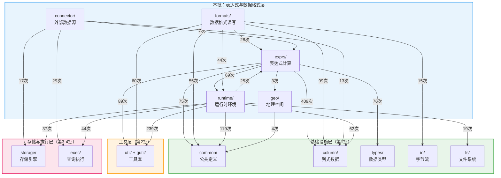

# StarRocks BE 源码分析 —— 表达式与数据格式层

> **目标读者**：熟悉 Java 的工程师，希望快速理解 StarRocks BE（C++）中表达式求值、数据格式读写、外部连接器、运行时环境和地理空间计算等模块的职责。
>
> **阅读建议**：先看"目录总览"建立全局认知 → 再看"模块依赖关系图"理解模块间关系 → 最后按需查阅各目录的文件级说明表。

---

## 1. 目录总览

本批共涵盖 **5 个目录（含多个子目录）**，约 592 个源文件。这五个模块覆盖了"表达式如何求值"、"数据文件如何读写"、"外部数据源如何接入"、"查询如何运行"以及"地理空间如何计算"五大核心主题。

| 目录 | 文件数 | 定位 | Java 类比 |
|------|--------|------|-----------|
| `exprs/` | ~191 | 表达式计算引擎：标量函数、聚合函数、谓词、类型转换、表函数等 | Calcite 的 `RexNode` + Presto 的 `FunctionRegistry` |
| `formats/` | ~204 | 数据文件格式的读写（Parquet、ORC、CSV、JSON、Avro） | Hadoop `InputFormat`/`OutputFormat` + Hive SerDe |
| `connector/` | ~16 | 外部数据源连接器抽象及实现（Hive、JDBC、ES、MySQL 等） | Presto 的 `Connector` SPI |
| `runtime/` | ~173 | 查询运行时环境：全局环境、内存追踪、Fragment 执行、数据流、Load 通道等 | Presto 的 `TaskContext` + Flink 的 `RuntimeContext` |
| `geo/` | ~8 | 地理空间计算（基于 S2 几何库） | JTS (Java Topology Suite) |

---

## 1.1 模块依赖关系图

> 下图基于源码 `#include` 统计，箭头表示"A 依赖 B"（A 的源文件 `#include` 了 B 的头文件），括号内数字为引用次数。
>
> **阅读方式**：从上往下看 — `runtime/` 是运行时枢纽，`exprs/` 和 `formats/` 重度依赖基础设施层，`connector/` 则主要桥接 `exec/` 和 `storage/`。

**关键观察**：

| 观察点 | 说明 |
|--------|------|
| **`exprs/` 是 `column/` 的最大消费者** | 409 次引用 `column/`，表达式求值的本质是"对列式数据做批量函数运算" |
| **`runtime/` 是万物枢纽** | 被 `exprs/`(69次)、`formats/`(44次) 依赖，自身又依赖 `util/`(239次)、`common/`(119次)、`exec/`(44次)、`storage/`(37次)，是所有模块的运行时粘合层 |
| **`formats/` 依赖 `exprs/`** | 28 次引用——用于谓词下推（Parquet/ORC 读取时利用表达式做过滤） |
| **`connector/` 偏向 `exec/` 和 `storage/`** | 29 次引用 `exec/`、17 次引用 `storage/`——连接器本质是 Pipeline Scanner 框架和存储引擎的桥梁 |
| **`geo/` 高度独立** | 仅依赖 `common/`(4次)，不依赖其他任何模块。`exprs/` 通过 `geo_functions.h` 调用 `geo/` |
| **`util/` 仍是所有模块的地基** | `runtime/`(239次)、`exprs/`(89次)、`formats/`(60次) 均重度使用工具库 |

---

## 2. `exprs/` —— 表达式计算引擎

> 表达式是 SQL 查询的核心计算单元。`SELECT a + 1, upper(b) FROM t WHERE c > 10` 中的 `a + 1`、`upper(b)`、`c > 10` 都是表达式。StarRocks 使用向量化方式——每次对一个 Chunk（4096 行）的列数据批量求值，而非逐行计算。Java 类比：Calcite 的 `RexNode` 表达式树 + 各类函数的向量化实现。

### 2.1 核心基类与上下文

| 文件 | 功能说明 | 功能边界 |
|------|---------|---------|
| **`expr.h/cpp`** | `Expr` 抽象基类——所有表达式节点的顶层接口。定义了表达式的生命周期方法（`prepare()` → `open()` → `evaluate_checked()` → `close()`）和树结构管理（子表达式 `_children`）。静态方法 `create_expr_tree()` 从 Thrift 节点树递归构建表达式树。Java 类比：Calcite 的 `RexNode`。 | 定义表达式接口和树结构，不含具体计算逻辑。 |
| **`expr_context.h/cpp`** | `ExprContext` 类——表达式树的执行上下文。管理 `FunctionContext` 的创建和生命周期，支持 `clone()` 实现多线程并行求值（每个线程一份独立的 Context）。Java 类比：Calcite 的 `RexExecutor`。 | 管理表达式执行状态，不参与计算。 |
| **`function_context.h/cpp`** | `FunctionContext` 类——单个函数调用的执行上下文。包含参数类型描述、返回类型、函数状态（`FRAGMENT_LOCAL` / `THREAD_LOCAL`）、内存分配器等。Java 类比：UDF 的 `FunctionContext`。 | 为函数提供运行时信息，不含函数实现。 |
| **`function_helper.h/cpp`** | `FunctionHelper` 工具类——向量化函数开发辅助。提供 Nullable 列拆包（`get_data_column_of_nullable()`）、多列 Null 标志合并（`union_nullable_column()`）等通用操作。 | 函数开发的便捷方法，不含具体函数。 |
| **`predicate.h`** | `Predicate` 基类——谓词表达式的基类，继承 `Expr`。增加 `merge()` 方法用于将多个谓词合并。 | 谓词接口定义。 |

### 2.2 字面量与列引用

| 文件 | 功能说明 | 功能边界 |
|------|---------|---------|
| **`literal.h/cpp`** | `VectorizedLiteral` 类——常量字面量表达式。求值时直接返回一个 `ConstColumn`。Java 类比：Calcite 的 `RexLiteral`。 | 常量值的表达式表示。 |
| **`column_ref.h/cpp`** | `ColumnRef` 类——列引用表达式。通过 `slot_id` 从 Chunk 中获取对应的列。Java 类比：Calcite 的 `RexInputRef`。 | 列数据的引用，不做计算。 |
| **`placeholder_ref.h/cpp`** | `PlaceHolderRef` 类——占位符引用。用于全局字典优化场景，占位后续被替换为字典编码列。 | 全局字典优化的占位表达式。 |
| **`info_func.h/cpp`** | `VectorizedInfoFunc` 类——信息函数表达式（`version()`、`current_user()` 等）。返回固定的系统信息值。 | 系统信息查询，不做数据计算。 |

### 2.3 函数调用

| 文件 | 功能说明 | 功能边界 |
|------|---------|---------|
| **`function_call_expr.h/cpp`** | `VectorizedFunctionCallExpr` 类——标量函数调用表达式。在 `prepare()` 阶段通过函数名从 `BuiltinFunctions` 注册表查找对应的函数指针，`evaluate_checked()` 时调用该函数。Java 类比：反射调用 `Method.invoke()`。 | 标量函数调用的分发框架。 |
| **`builtin_functions.h`** | `BuiltinFunctions` 类和 `FunctionDescriptor` 结构——内置函数注册表。提供 `find_builtin_function()` 按函数 ID 查找函数描述符（含函数指针、`prepare`/`close` 回调等）。 | 函数注册与查找，不含函数实现。 |
| **`java_function_call_expr.h/cpp`** | Java UDF 调用表达式——通过 JNI 调用 Java 实现的用户自定义标量函数。 | Java UDF 的 JNI 桥接。 |

### 2.4 谓词表达式

| 文件 | 功能说明 | 功能边界 |
|------|---------|---------|
| **`binary_predicate.h/cpp`** | `VectorizedBinaryPredicateFactory` 工厂——创建二元比较谓词（`=`、`!=`、`<`、`>`、`<=`、`>=`）。根据操作数类型和比较运算符选择模板特化实现。Java 类比：`Comparator` 的向量化版。 | 比较谓词的工厂，不含具体比较实现。 |
| **`compound_predicate.h/cpp`** | `VectorizedCompoundPredicateFactory` 工厂——创建复合谓词（`AND`、`OR`、`NOT`）。支持短路求值优化。 | 逻辑组合谓词的工厂。 |
| **`in_predicate.h/cpp`** | `VectorizedInPredicateFactory` 工厂——创建 `IN` 谓词。对于大列表使用 HashSet 加速查找。 | IN 谓词的工厂。 |
| **`in_const_predicate.hpp/cpp`** | `VectorizedInConstPredicate<T>` 模板——常量 IN 列表的特化实现。将常量列表构建为 `phmap::flat_hash_set`，O(1) 查找。 | 常量 IN 的高性能实现。 |
| **`is_null_predicate.h/cpp`** | `VectorizedIsNullPredicateFactory` 工厂——`IS NULL` / `IS NOT NULL` 谓词。直接检查 Nullable 列的 null 标志位。 | NULL 检查谓词。 |
| **`like_predicate.h/cpp`** | `LikePredicate` 类——LIKE / REGEXP 模式匹配。提供 `like_prepare()` / `regex_prepare()` 进行模式预编译（使用 `re2` 库或 `hs_compile` Hyperscan 库），`like()` / `regex()` 执行匹配。 | 字符串模式匹配。 |

### 2.5 条件与分支表达式

| 文件 | 功能说明 | 功能边界 |
|------|---------|---------|
| **`condition_expr.h/cpp`** | `VectorizedConditionExprFactory` 工厂——创建条件表达式：`IF(cond, a, b)`、`IFNULL(a, b)`、`NULLIF(a, b)`、`COALESCE(a, b, ...)`。Java 类比：三目运算符 `?:` 的向量化版。 | 条件表达式工厂。 |
| **`case_expr.h/cpp`** | `VectorizedCaseExprFactory` 工厂——`CASE WHEN ... THEN ... ELSE ... END`。根据是否有 CASE 操作数、分支数量选择不同实现。 | CASE WHEN 工厂。 |

### 2.6 类型转换

| 文件 | 功能说明 | 功能边界 |
|------|---------|---------|
| **`cast_expr.h/cpp`** | `VectorizedCastExprFactory` 工厂——类型转换表达式。覆盖所有类型之间的 CAST 转换（整数↔浮点、字符串↔日期、字符串↔JSON/Array/Map 等）。`from_thrift()` 和 `from_type()` 根据源/目标类型创建对应的 Cast 表达式。 | 类型转换的分发框架。 |
| **`cast_expr_array.cpp`** | CAST(STRING AS ARRAY)、CAST(ARRAY AS STRING) 等数组相关 Cast 实现。 | 数组类型转换。 |
| **`cast_expr_json.cpp`** | CAST(STRING AS JSON)、CAST(JSON AS INT/STRING/...) 等 JSON 相关 Cast 实现。 | JSON 类型转换。 |
| **`cast_nested.cpp`** | 嵌套类型（ARRAY、MAP、STRUCT）之间的 Cast 实现。 | 嵌套类型转换。 |
| **`decimal_cast_expr.h`** | Decimal 类型的 Cast 特化——处理精度和标度的转换。 | Decimal 类型转换。 |

### 2.7 算术表达式

| 文件 | 功能说明 | 功能边界 |
|------|---------|---------|
| **`arithmetic_expr.h/cpp`** | `VectorizedArithmeticExprFactory` 工厂——算术表达式（`+`、`-`、`*`、`/`、`%`、位运算）。根据操作数类型和运算符选择模板特化实现。 | 算术运算工厂。 |
| **`arithmetic_operation.h`** | 算术运算的模板实现——定义 `AddOp`、`SubOp`、`MulOp`、`DivOp`、`ModOp` 等运算模板，处理溢出检查和 Decimal 精度计算。 | 算术运算模板。 |
| **`binary_function.h`** | `BaseBinaryFunction` 模板——二元向量化函数的通用框架。提供 `vector_vector()`、`vector_const()`、`const_vector()`、`const_const()` 四种执行路径。 | 二元函数的通用执行框架。 |
| **`unary_function.h`** | `ProduceNullUnaryFunction` 模板——一元向量化函数的通用框架。 | 一元函数的通用执行框架。 |
| **`overflow.h`** | 算术溢出检测——使用编译器内置函数（`__builtin_add_overflow` 等）检测加减乘运算的整数溢出。 | 溢出检查工具。 |
| **`decimal_binary_function.h`** | Decimal 二元运算辅助——处理 Decimal 加减乘除的精度和标度推断及溢出处理。 | Decimal 运算辅助。 |

### 2.8 标量函数库

| 文件 | 功能说明 | 功能边界 |
|------|---------|---------|
| **`string_functions.h/cpp`** | 字符串函数集——`concat`、`substring`、`trim`、`pad`、`reverse`、`upper`/`lower`、`replace`、`regexp_extract` 等。Java 类比：`String` 方法 + `Pattern` 正则。 | 字符串操作函数。 |
| **`math_functions.h/cpp`** | 数学函数集——`abs`、`ceil`、`floor`、`round`、`pow`、`log`、`sqrt`、`rand` 等。Java 类比：`java.lang.Math`。 | 数学运算函数。 |
| **`time_functions.h/cpp`** | 时间函数集——`now()`、`date_format()`、`date_add()`、`date_diff()`、`unix_timestamp()`、`str_to_date()` 等。Java 类比：`java.time` API。 | 日期时间函数。 |
| **`json_functions.h/cpp`** | JSON 函数集——`get_json_int/string/double()`、`json_query()`、`json_exists()`、`json_each()` 等。 | JSON 操作函数。 |
| **`jsonpath.h/cpp`** | `JsonPath` 类——JSONPath 表达式解析器。将 `$.store.book[0].title` 解析为路径节点序列用于 JSON 字段提取。 | JSONPath 解析。 |
| **`bitmap_functions.h/cpp`** | Bitmap 标量函数——`bitmap_count()`、`bitmap_and()`、`bitmap_or()`、`bitmap_to_string()` 等。 | Bitmap 操作函数。 |
| **`hyperloglog_functions.h/cpp`** | HLL 标量函数——`hll_cardinality()`、`hll_serialize()` 等。 | HLL 操作函数。 |
| **`array_functions.h/cpp`** | 数组标量函数——`array_length()`、`array_contains()`、`array_sort()`、`array_distinct()` 等。 | 数组操作函数。 |
| **`map_functions.h/cpp`** | Map 标量函数——`map_keys()`、`map_values()`、`map_size()` 等。 | Map 操作函数。 |
| **`struct_functions.h/cpp`** | Struct 标量函数——`named_struct()`、`struct()` 等结构体构造函数。 | Struct 操作函数。 |
| **`hash_functions.h`** | 哈希函数——`murmur_hash3_32()`、`xxhash64()` 等，用于 Hash Join/Aggregation 和分桶。 | 哈希计算函数。 |
| **`bit_functions.h`** | 位运算函数——`bitand()`、`bitor()`、`bitxor()`、`bitnot()` 等。 | 位运算函数。 |
| **`geo_functions.h/cpp`** | 地理空间函数——`ST_Point()`、`ST_Contains()`、`ST_Distance()`、`ST_AsText()` 等。调用 `geo/` 模块实现。 | 地理空间函数的表达式入口。 |
| **`encryption_functions.h/cpp`** | 加密函数——`aes_encrypt()`、`aes_decrypt()`、`md5()`、`sha2()` 等。 | 加密与哈希函数。 |
| **`percentile_functions.h/cpp`** | 百分位标量函数——`percentile_approx_raw()`、`percentile_empty()` 等。 | 百分位计算函数。 |
| **`utility_functions.h/cpp`** | 工具函数——`uuid()`、`version()`、`sleep()`、`current_backend()` 等系统级函数。 | 系统工具函数。 |
| **`es_functions.h/cpp`** | Elasticsearch 辅助函数——用于 ES 外表查询时的谓词转换。 | ES 专用函数。 |
| **`base64.h/cpp`** | Base64 编解码——`to_base64()`、`from_base64()` 函数实现。 | Base64 编解码。 |
| **`grouping_sets_functions.h/cpp`** | GROUPING SETS 相关函数——`grouping()`、`grouping_id()` 用于标识分组级别。 | 分组集函数。 |

### 2.9 集合与嵌套类型表达式

| 文件 | 功能说明 | 功能边界 |
|------|---------|---------|
| **`array_expr.h/cpp`** | `ArrayExprFactory` 工厂——构造数组字面量 `[1, 2, 3]`。 | 数组构造。 |
| **`array_element_expr.h/cpp`** | `ArrayElementExprFactory` 工厂——数组下标访问 `arr[i]`。 | 数组元素访问。 |
| **`array_map_expr.h/cpp`** | `ArrayMapExpr` 类——`array_map(lambda, arr1, arr2, ...)` 高阶函数，对数组每个元素应用 Lambda。 | 数组 map 操作。 |
| **`map_expr.h/cpp`** | `MapExpr` / `MapExprFactory`——Map 字面量构造 `map{'a':1, 'b':2}`。 | Map 构造。 |
| **`map_element_expr.h/cpp`** | `MapElementExprFactory` 工厂——Map 键访问 `map['key']`。 | Map 元素访问。 |
| **`map_apply_expr.h/cpp`** | Map 上的 apply 表达式——对 Map 应用 Lambda 函数。 | Map apply 操作。 |
| **`subfield_expr.h/cpp`** | `SubfieldExprFactory` 工厂——嵌套字段访问表达式（`struct.field`、`array.element.field`）。用于 Nested Type 列的延迟物化。 | 嵌套字段访问。 |
| **`lambda_function.h/cpp`** | Lambda 函数表达式——支持 `x -> x + 1` 形式的 Lambda，用于 `array_map()`、`array_filter()` 等高阶函数。 | Lambda 表达式支持。 |

### 2.10 聚合函数（`agg/` 子目录）

> 聚合函数将多行数据聚合为一个结果（如 SUM、COUNT、AVG）。StarRocks 的聚合函数是无状态的——`AggregateFunction` 实例不持有聚合状态，状态存储在外部的 `AggDataPtr`（字节数组指针）中，由执行引擎管理。Java 类比：Flink 的 `AggregateFunction<IN, ACC, OUT>`。

#### 2.10.1 聚合框架

| 文件 | 功能说明 | 功能边界 |
|------|---------|---------|
| **`agg/aggregate.h`** | `AggregateFunction` 接口——所有聚合函数的基类。定义核心方法：`create()`（初始化状态）、`update()`（逐行更新）、`merge()`（合并两个状态）、`serialize()`（序列化状态用于网络传输）、`finalize()`（输出最终结果）。还支持批量操作（`update_batch`）和窗口函数操作（`update_batch_removable_cumulatively`）。 | 聚合函数接口定义。 |
| **`agg/aggregate_factory.h/cpp`** | 聚合函数工厂——`get_aggregate_function()` 和 `get_window_function()` 根据函数名和参数类型查找对应的聚合/窗口函数实例。 | 聚合函数注册与查找。 |
| **`agg/aggregate_traits.h`** | `AggDataTypeTraits` 模板——将 `LogicalType` 映射到对应的聚合状态数据类型（如 `TYPE_INT` → `int64_t` 用于 SUM）。 | 聚合类型映射。 |
| **`agg/nullable_aggregate.h`** | 可空聚合包装——为任意聚合函数添加 NULL 处理逻辑（跳过 NULL 值、处理全 NULL 输入等）。 | NULL 处理装饰器。 |

#### 2.10.2 基础聚合函数

| 文件 | 功能说明 | 功能边界 |
|------|---------|---------|
| **`agg/sum.h`** | `SumAggregateFunction<T>` 模板——SUM 聚合。状态为累加值。 | SUM 实现。 |
| **`agg/count.h`** | `CountAggregateFunction` 类——COUNT 聚合（含 COUNT(*)）。状态为 `int64_t` 计数器。 | COUNT 实现。 |
| **`agg/avg.h`** | `AvgAggregateFunction<T>` 模板——AVG 聚合。状态为（累加值，计数）二元组。 | AVG 实现。 |
| **`agg/maxmin.h`** | `MaxAggregateFunction<T>` / `MinAggregateFunction<T>` 模板——MAX/MIN 聚合。 | MAX/MIN 实现。 |
| **`agg/maxmin_by.h`** | `MaxByAggregateFunction` / `MinByAggregateFunction`——`MAX_BY(val, key)` / `MIN_BY(val, key)`，按 key 找 max/min 时返回 val。 | MAX_BY/MIN_BY 实现。 |
| **`agg/any_value.h`** | `AnyValueAggregateFunction`——ANY_VALUE 聚合，返回分组中的任意一个值。 | ANY_VALUE 实现。 |
| **`agg/distinct.h`** | 去重聚合——`COUNT(DISTINCT)`、`SUM(DISTINCT)` 的实现，内部使用 HashSet 去重。 | 去重聚合实现。 |
| **`agg/group_concat.h`** | `GroupConcatAggregateFunction`——GROUP_CONCAT 字符串拼接聚合。 | 字符串拼接聚合。 |

#### 2.10.3 统计聚合函数

| 文件 | 功能说明 | 功能边界 |
|------|---------|---------|
| **`agg/variance.h`** | 方差/标准差聚合——`VAR_SAMP`、`VAR_POP`、`STDDEV_SAMP`、`STDDEV_POP`。使用 Welford 在线算法。 | 方差/标准差实现。 |
| **`agg/covariance.h`** | 协方差聚合——`COVAR_SAMP`、`COVAR_POP`、`CORR`。 | 协方差/相关系数实现。 |
| **`agg/histogram.h`** | `HistogramAggregateFunction`——HISTOGRAM 聚合，构建等宽或等频直方图。 | 直方图实现。 |
| **`agg/percentile_approx.h`** | 近似百分位聚合——`PERCENTILE_APPROX`，基于 t-digest 算法。 | 近似百分位实现。 |
| **`agg/percentile_cont.h`** | 连续百分位聚合——`PERCENTILE_CONT`，精确计算。 | 精确百分位实现。 |
| **`agg/percentile_union.h`** | 百分位合并——`PERCENTILE_UNION`，合并多个百分位状态。 | 百分位状态合并。 |
| **`agg/approx_top_k.h`** | 近似 Top-K 聚合——`APPROX_TOP_K`，基于 Space-Saving 算法。 | 近似 Top-K 实现。 |

#### 2.10.4 Bitmap 与 HLL 聚合函数

| 文件 | 功能说明 | 功能边界 |
|------|---------|---------|
| **`agg/bitmap_union.h`** | `BitmapUnionAggregateFunction`——BITMAP_UNION 聚合，合并多个 Bitmap。 | Bitmap 并集聚合。 |
| **`agg/bitmap_union_count.h`** | `BitmapUnionCountAggregateFunction`——BITMAP_UNION_COUNT，先合并再计数。 | Bitmap 并集计数。 |
| **`agg/bitmap_intersect.h`** | `BitmapIntersectAggregateFunction`——BITMAP_INTERSECT，求 Bitmap 交集。 | Bitmap 交集聚合。 |
| **`agg/bitmap_agg.h`** | `BitmapAggAggregateFunction`——BITMAP_AGG，将整数列聚合为 Bitmap。 | 整数到 Bitmap 聚合。 |
| **`agg/bitmap_union_int.h`** | 整数 Bitmap 并集——将整数直接添加到 Bitmap 中。 | 整数 Bitmap 并集。 |
| **`agg/hll_union.h`** | `HllUnionAggregateFunction`——HLL_UNION 聚合。 | HLL 并集聚合。 |
| **`agg/hll_union_count.h`** | `HllUnionCountAggregateFunction`——HLL_UNION_COUNT。 | HLL 并集计数。 |
| **`agg/hll_ndv.h`** | HLL 基数估计——NDV/APPROX_COUNT_DISTINCT 的 HLL 实现。 | 基数估计聚合。 |

#### 2.10.5 高级聚合函数

| 文件 | 功能说明 | 功能边界 |
|------|---------|---------|
| **`agg/array_agg.h`** | `ArrayAggAggregateFunction`——ARRAY_AGG 聚合，将多行收集为数组。 | 多行收集为数组。 |
| **`agg/array_union_agg.h`** | `ArrayUnionAggAggregateFunction`——ARRAY_UNION_AGG，将多个数组合并为一个去重数组。 | 数组并集聚合。 |
| **`agg/retention.h`** | 留存分析聚合——`RETENTION([cond1, cond2, ...])`，用于用户留存率计算。 | 留存分析函数。 |
| **`agg/window_funnel.h`** | 漏斗分析聚合——`WINDOW_FUNNEL(window, timestamp, [cond1, cond2, ...])`，计算转化漏斗。 | 漏斗分析函数。 |
| **`agg/intersect_count.h`** | 交集计数——`INTERSECT_COUNT(bitmap, column, ...)`，多条件交集计数。 | 多条件交集计数。 |

#### 2.10.6 窗口函数

| 文件 | 功能说明 | 功能边界 |
|------|---------|---------|
| **`agg/window.h`** | `WindowFunction` 接口——窗口函数基类。增加 `update_state()` 和可回退更新 `update_state_removable_cumulatively()` 方法，支持滑动窗口。 | 窗口函数接口。 |
| **`agg/java_window_function.h/cpp`** | Java 窗口函数——通过 JNI 调用 Java 实现的窗口函数。 | Java 窗口函数桥接。 |
| **`agg/java_udaf_function.h/cpp`** | Java UDAF——通过 JNI 调用 Java 实现的聚合函数。 | Java 聚合函数桥接。 |

#### 2.10.7 聚合函数工厂解析器（`agg/factory/` 子目录）

| 文件 | 功能说明 | 功能边界 |
|------|---------|---------|
| **`agg/factory/aggregate_factory.hpp`** | 聚合函数工厂核心——注册所有内置聚合函数，按名称和类型组合创建对应实例。 | 聚合函数注册。 |
| **`agg/factory/aggregate_resolver_xxx.cpp`** | 各类聚合函数的解析器（`avg`、`bitmap`、`approx`、`count`、`distinct`、`hll`、`minmax`、`percentile`、`sum`、`window`、`others` 等）——将函数名解析为对应的模板特化实例。 | 按类型注册聚合函数。 |

#### 2.10.8 流式聚合（`agg/stream/` 子目录）

| 文件 | 功能说明 | 功能边界 |
|------|---------|---------|
| **`agg/stream/retract_maxmin.h`** | 流式 MAX/MIN——支持 retract（回退）操作的 MAX/MIN 聚合，用于增量物化视图。 | 可回退的 MAX/MIN。 |
| **`agg/stream/stream_detail_state.h`** | 流式聚合状态——增量物化视图的详细状态管理。 | 流式聚合状态。 |

### 2.11 表函数（`table_function/` 子目录）

> 表函数（Table-valued Function / UDTF）将一行输入展开为多行。Java 类比：Flink 的 `TableFunction<T>`。

| 文件 | 功能说明 | 功能边界 |
|------|---------|---------|
| **`table_function/table_function.h`** | `TableFunction` 接口和 `TableFunctionState` 类——表函数基类。核心方法 `process(state, chunk, result)`：接收输入 Chunk，输出展开后的 Chunk。 | 表函数接口定义。 |
| **`table_function/table_function_factory.h/cpp`** | 表函数工厂——按名称创建对应的表函数实例。 | 表函数注册与查找。 |
| **`table_function/unnest.h`** | `Unnest` 类——`UNNEST(array)` 将数组展开为多行。Java 类比：Hive 的 `LATERAL VIEW explode()`。 | 数组展开。 |
| **`table_function/multi_unnest.h`** | `MultiUnnest` 类——多列数组同时展开 `UNNEST(arr1, arr2, ...)`。 | 多列数组展开。 |
| **`table_function/unnest_bitmap.h`** | Bitmap 展开——`UNNEST_BITMAP(bitmap)` 将 Bitmap 展开为整数行。 | Bitmap 展开。 |
| **`table_function/generate_series.h`** | `GenerateSeries` 类——`GENERATE_SERIES(start, stop, step)` 生成整数序列。Java 类比：`IntStream.range()`。 | 整数序列生成。 |
| **`table_function/subdivide_bitmap.h`** | `SubdivideBitmap` 类——`SUBDIVIDE_BITMAP(bitmap, size)` 将大 Bitmap 拆分为多个小 Bitmap。 | Bitmap 分割。 |
| **`table_function/json_each.h/cpp`** | `JsonEach` 类——`JSON_EACH(json)` 将 JSON 对象/数组展开为键值对行。 | JSON 展开。 |
| **`table_function/list_rowsets.h/cpp`** | `ListRowsets` 类——`LIST_ROWSETS(tablet_id)` 列出 Tablet 的所有 Rowset 信息（系统表函数）。 | Rowset 信息列举。 |
| **`table_function/java_udtf_function.h/cpp`** | Java UDTF——通过 JNI 调用 Java 实现的表函数。 | Java 表函数桥接。 |

### 2.12 运行时过滤与调试

| 文件 | 功能说明 | 功能边界 |
|------|---------|---------|
| **`runtime_filter.h/cpp`** | `RuntimeFilter` 类——运行时过滤器。在 Hash Join 的 Build 端构建（Bloom Filter / Min-Max / IN List），在 Probe 端或 Scan 端用于提前过滤不匹配的行。Java 类比：Presto 的 Dynamic Filter。 | 运行时过滤器的数据结构和评估逻辑。 |
| **`runtime_filter_bank.h/cpp`** | `RuntimeFilterPort` 类——运行时过滤器管理器。管理一个执行节点上所有 RuntimeFilter 的发布/订阅，支持本地和全局过滤器的合并。 | 过滤器的生命周期管理。 |
| **`dictmapping_expr.h/cpp`** | 字典映射表达式——全局字典优化场景下，将低基数列的函数运算映射到字典空间执行，避免字符串比较。 | 字典映射优化。 |
| **`dict_query_expr.h/cpp`** | 字典查询表达式——从外部字典表查询数据的表达式。 | 字典表查询。 |
| **`clone_expr.h`** | `CloneExpr` 类——列克隆表达式，用于在执行计划中显式复制一列。 | 列克隆。 |
| **`debug_expr.h/cpp`** | `DebugExpr` 和 `DebugFunctions`——调试表达式。提供 `chunk_memusage()`、`chunk_check_valid()` 等函数用于运行时诊断。 | 调试工具函数。 |
| **`anyval_util.h/cpp`** | 类型转换工具——AnyVal（旧版标量值表示）与新向量化类型之间的转换。 | 类型兼容工具。 |

---

## 3. `formats/` —— 数据文件格式读写

> 负责将外部文件格式（Parquet、ORC、CSV、JSON、Avro）的数据读取为 StarRocks 内部的 `Chunk`（列式数据批次），或将 Chunk 写出为外部格式。Java 类比：Hadoop 的 `InputFormat`/`OutputFormat` 体系。

### 3.1 通用工具

| 文件 | 功能说明 | 功能边界 |
|------|---------|---------|
| **`utils.h`** | `Utils` 工具类——提供 `format_name()` 函数用于列名格式化（大小写敏感/不敏感匹配）。 | 列名格式化工具。 |

### 3.2 Parquet 格式（`parquet/` 子目录）

> Apache Parquet 是最常用的列式存储格式。StarRocks 的 Parquet 读写实现支持完整的列式读取、谓词下推、统计信息过滤、字典过滤、延迟物化等高级优化。Java 类比：`parquet-mr` Java SDK。

#### 3.2.1 读取链路

读取分层架构：`FileReader` → `GroupReader` → `ColumnReader` → `StoredColumnReader` → `ColumnChunkReader` → `PageReader`

| 文件 | 功能说明 | 功能边界 |
|------|---------|---------|
| **`file_reader.h/cpp`** | `FileReader` 类——Parquet 文件读取入口。负责解析 Footer 元数据、筛选需要读取的 Row Group（基于统计信息过滤）、构建 `GroupReader`，提供 `get_next(ChunkPtr*)` 逐批读取数据。 | 文件级别的读取协调。 |
| **`group_reader.h/cpp`** | `GroupReader` 类——Row Group 读取器。协调多个列的并行读取，支持延迟物化（Late Materialization）——先读谓词列过滤，再读投影列。还支持字典过滤（Dict Filter）。 | Row Group 级别的列协调和优化。 |
| **`column_reader.h/cpp`** | `ColumnReader` 抽象——列读取工厂与接口。按 Parquet 字段类型创建对应的列读取器（`ScalarColumnReader`、`ListColumnReader`、`MapColumnReader`、`StructColumnReader`）。 | 列读取抽象与工厂。 |
| **`stored_column_reader.h/cpp`** | `StoredColumnReader` 抽象——底层列存储读取。按照 Parquet 的 required/optional/repeated 三种重复级别区分读取策略。 | 底层列数据的 level 处理和数据读取。 |
| **`column_chunk_reader.h/cpp`** | `ColumnChunkReader` 类——列块读取器。负责解析 Page、Level 解码和数据解码，协调 `PageReader`、`LevelDecoder` 和 `Decoder`。 | 列块级别的 Page 解析和解码。 |
| **`page_reader.h/cpp`** | `PageReader` 类——Page 头解析与数据读取。 | Page 级别的解析。 |
| **`column_converter.h/cpp`** | `ColumnConverter` 接口和 `ColumnConverterFactory` 工厂——Parquet 物理类型到 StarRocks 逻辑类型的转换。如 Parquet INT96 → StarRocks TIMESTAMP。 | 类型转换。 |

#### 3.2.2 写入链路

| 文件 | 功能说明 | 功能边界 |
|------|---------|---------|
| **`file_writer.h/cpp`** | `FileWriterBase` / `SyncFileWriter` 类——Parquet 文件写入。封装 Arrow/Parquet C++ API，将 StarRocks Chunk 写为 Parquet 文件。 | 文件级别的写入。 |
| **`chunk_writer.h/cpp`** | `ChunkWriter` 类——封装 `parquet::RowGroupWriter`，将 Chunk 数据写入 Row Group。 | Row Group 级别的写入。 |
| **`column_chunk_writer.h/cpp`** | `ColumnChunkWriter` 类——封装 `parquet::ColumnWriter`，将单列数据写入 Column Chunk。 | 列块级别的写入。 |
| **`level_builder.h/cpp`** | `LevelBuilderContext` / `LevelBuilderResult`——写入时构建 Parquet 的 definition level 和 repetition level。 | Level 构建。 |

#### 3.2.3 编解码

| 文件 | 功能说明 | 功能边界 |
|------|---------|---------|
| **`encoding.h/cpp`** | `Encoder` / `Decoder` 抽象——Parquet 编解码接口。 | 编解码抽象。 |
| **`encoding_dict.h`** | 字典编码——Parquet 字典编码的实现。 | 字典编解码。 |
| **`encoding_plain.h`** | Plain 编码——Parquet Plain 编码的实现。 | Plain 编解码。 |
| **`level_codec.h/cpp`** | `LevelDecoder` 类——RLE/Bit-packed 编码的 Level 解码器。 | Level 编解码。 |

#### 3.2.4 元数据与统计

| 文件 | 功能说明 | 功能边界 |
|------|---------|---------|
| **`schema.h/cpp`** | `ParquetField` / `LevelInfo`——Parquet Schema 定义和 Level 信息。 | Schema 元数据。 |
| **`metadata.h/cpp`** | `FileMetaData` / `ApplicationVersion`——Parquet 文件元数据和写入器版本信息。 | 文件元数据。 |
| **`meta_helper.h/cpp`** | `MetaHelper` 类——元数据辅助。列名映射（大小写匹配）、读取列准备等。 | 元数据辅助工具。 |
| **`statistics_helper.h/cpp`** | `StatisticsHelper` 类——统计信息过滤。利用 Column Chunk 的 min/max 统计信息跳过不需要读取的 Row Group 和 Page（类似索引下推）。 | 统计信息过滤。 |
| **`column_read_order_ctx.h/cpp`** | `ColumnReadOrderCtx`——列读取顺序上下文。优化列的读取顺序以提升 I/O 效率。 | 读取顺序优化。 |

#### 3.2.5 工具

| 文件 | 功能说明 | 功能边界 |
|------|---------|---------|
| **`types.h`** | Parquet 内部类型定义和映射。 | 类型定义。 |
| **`utils.h/cpp`** | Parquet 内部工具函数。 | 工具函数。 |

### 3.3 ORC 格式（`orc/` 子目录）

> Apache ORC 是 Hive 生态常用的列式存储格式。Java 类比：`orc-core` Java SDK。

| 文件 | 功能说明 | 功能边界 |
|------|---------|---------|
| **`orc_chunk_reader.h/cpp`** | `OrcChunkReader` 类——ORC 读取核心。负责创建 StarRocks Chunk、将 ORC 数据转换为列式数据、谓词下推（`SearchArgument` 构建）。是 ORC 格式与 StarRocks 列模型之间的桥梁。 | ORC 文件读取与类型转换。 |
| **`column_reader.h/cpp`** | `ORCColumnReader` 抽象——ORC 列读取器。按列类型创建 `PrimitiveColumnReader`（基本类型）、`ComplexColumnReader`（嵌套类型）或 `DefaultColumnReader`。 | ORC 列级别读取。 |
| **`orc_input_stream.h/cpp`** | `ORCHdfsFileStream` 类——实现 ORC 库的 `orc::InputStream` 接口，适配 StarRocks 的文件系统抽象（HDFS/S3 等）。支持 IO Coalesce 优化。 | ORC 的 IO 适配层。 |
| **`orc_mapping.h/cpp`** | `OrcMapping` / `OrcMappingOptions`——ORC 列 ID 到 StarRocks Schema 的映射。支持嵌套结构的递归映射。 | Schema 映射。 |
| **`orc_schema_builder.h/cpp`** | ORC Schema 构建——将 StarRocks Schema 转换为 ORC 的 `orc::Type` 结构。 | Schema 转换。 |
| **`orc_min_max_decoder.h/cpp`** | ORC Min/Max 统计解码——用于 Row Group 级别的谓词过滤。 | 统计信息解码。 |
| **`orc_memory_pool.h/cpp`** | ORC 内存池——适配 StarRocks 内存管理到 ORC 库的 `orc::MemoryPool` 接口。 | 内存池适配。 |
| **`utils.h/cpp`** | ORC 工具函数。 | 工具函数。 |

### 3.4 CSV 格式（`csv/` 子目录）

> CSV 是最通用的文本数据格式，用于 Stream Load、Broker Load 等数据导入场景。

#### 3.4.1 核心读取

| 文件 | 功能说明 | 功能边界 |
|------|---------|---------|
| **`csv_reader.h/cpp`** | `CSVReader` / `CSVBuffer` / `CSVRow` / `CSVParseOptions` 类——CSV 行解析器。将文本按分隔符拆分为字段，支持自定义分隔符、引用符、转义符。 | CSV 文本解析。 |
| **`array_reader.h/cpp`** | `ArrayReader` 抽象及其实现：`DefaultArrayReader`（`[[1,2],[3,4]]` 格式）和 `HiveTextArrayReader`（Hive `^C`/`^B` 分隔格式）。 | 数组文本解析。 |

#### 3.4.2 类型转换器（Converter 体系）

> 每种数据类型有对应的 Converter，负责文本 ↔ 列值的双向转换。Java 类比：Hive SerDe 中的 `ObjectInspector`。

| 文件 | 功能说明 | 功能边界 |
|------|---------|---------|
| **`converter.h/cpp`** | `Converter` 抽象基类——CSV 类型转换接口。核心方法 `read_string()`（文本→列值）和 `write_string()`（列值→文本）。工厂函数 `get_converter()` / `get_hive_converter()` 按类型创建。 | 类型转换接口与工厂。 |
| **`numeric_converter.h`** | `NumericConverter<T>` 模板——数值类型（INT/BIGINT/FLOAT/DOUBLE 等）的文本转换。 | 数值类型转换。 |
| **`string_converter.h`** | `StringConverter`——字符串类型的转换（含引号处理）。 | 字符串转换。 |
| **`boolean_converter.h`** | `BooleanConverter`——布尔类型转换（`true`/`false`/`1`/`0`）。 | 布尔转换。 |
| **`date_converter.h`** | `DateConverter`——日期类型转换。 | 日期转换。 |
| **`datetime_converter.h`** | `DatetimeConverter`——日期时间类型转换。 | 日期时间转换。 |
| **`float_converter.h`** | `FloatConverter<T>`——浮点类型特化转换。 | 浮点转换。 |
| **`decimalv2_converter.h`** | `DecimalV2Converter`——DecimalV2 类型转换。 | DecimalV2 转换。 |
| **`decimalv3_converter.h`** | `DecimalV3Converter`——DecimalV3 类型转换。 | DecimalV3 转换。 |
| **`json_converter.h`** | `JsonConverter`——JSON 类型转换。 | JSON 转换。 |
| **`nullable_converter.h`** | `NullableConverter`——可空列包装转换器，处理 NULL 标记（`\N`）。 | NULL 处理装饰器。 |
| **`default_value_converter.h`** | `DefaultValueConverter`——默认值处理，当列缺失时填充默认值。 | 默认值填充。 |
| **`array_converter.h`** | `ArrayConverter`——数组类型的文本转换。 | 数组转换。 |
| **`map_converter.h`** | `MapConverter`——Map 类型的文本转换。 | Map 转换。 |
| **`varbinary_converter.h`** | `VarBinaryConverter`——二进制类型的十六进制/Base64 转换。 | 二进制转换。 |

#### 3.4.3 输出流

| 文件 | 功能说明 | 功能边界 |
|------|---------|---------|
| **`output_stream.h`** | `OutputStream` 抽象——CSV 输出流接口。 | 输出流接口。 |
| **`output_stream_string.h`** | 字符串输出流——将 CSV 写入 `std::string`。 | 字符串输出。 |
| **`output_stream_file.h`** | 文件输出流——将 CSV 写入文件。 | 文件输出。 |

### 3.5 JSON 格式（`json/` 子目录）

> 基于 simdjson 库实现高性能 JSON 解析，用于 Stream Load JSON 格式导入。

| 文件 | 功能说明 | 功能边界 |
|------|---------|---------|
| **`numeric_column.h`** | `add_numeric_column<T>()` 模板函数——将 JSON 数值字段写入对应类型的列。 | JSON 数值解析。 |
| **`binary_column.h`** | JSON 字符串/二进制字段到列的转换。 | JSON 字符串解析。 |
| **`struct_column.h`** | `add_struct_column()` 函数——将 JSON 对象解析为 Struct 列。 | JSON 对象解析。 |
| **`map_column.h`** | `add_map_column()` 函数——将 JSON 对象解析为 Map 列。 | JSON Map 解析。 |
| **`nullable_column.h`** | JSON NULL 值的处理。 | JSON NULL 处理。 |

### 3.6 Avro 格式（`avro/` 子目录）

> 基于 avro-c 库实现 Avro 数据解析。

| 文件 | 功能说明 | 功能边界 |
|------|---------|---------|
| **`binary_column.h`** | `add_binary_column()` / `add_native_json_column()` 函数——Avro 二进制和 JSON 字段到列的转换。 | Avro 二进制/JSON 解析。 |
| **`numeric_column.h`** | `add_numeric_column<T>()` 模板函数——Avro 数值字段到列的转换。 | Avro 数值解析。 |
| **`nullable_column.h`** | Avro union（nullable）类型的处理。 | Avro NULL 处理。 |

---

## 4. `connector/` —— 外部数据源连接器

> 统一的外部数据源抽象层。所有外部表扫描（Hive、JDBC、ES、MySQL 等）都通过 Connector 框架接入 Pipeline 执行引擎。Java 类比：Presto/Trino 的 `Connector` SPI。

### 4.1 核心接口

| 文件 | 功能说明 | 功能边界 |
|------|---------|---------|
| **`connector.h/cpp`** | 三层抽象接口：(1) `DataSource`——单次扫描的数据读取，核心方法 `open()` → `get_next(chunk)` → `close()`，携带谓词、RuntimeFilter、读取限制等。(2) `DataSourceProvider`——创建 DataSource 实例和 Morsel（扫描片段）。(3) `Connector`——按外部表类型创建 DataSourceProvider。Java 类比：JDBC 的 `Connection` → `Statement` → `ResultSet`。 | 连接器接口定义与工厂。 |

### 4.2 连接器实现

| 文件 | 功能说明 | 功能边界 |
|------|---------|---------|
| **`hive_connector.h/cpp`** | `HiveConnector` / `HiveDataSourceProvider` / `HiveDataSource`——Hive 外表连接器。通过 `HdfsScanner` 读取 HDFS/S3 上的 Parquet/ORC/CSV 文件。支持谓词下推和分区裁剪。 | Hive 数据读取。 |
| **`lake_connector.h/cpp`** | `LakeConnector`——存算分离（Lake）表连接器。创建 Lake 类型的 DataSourceProvider，走 StarRocks 存算分离存储路径。 | Lake 表数据读取。 |
| **`file_connector.h/cpp`** | `FileConnector` / `FileDataSourceProvider` / `FileDataSource`——文件连接器。使用 `FileScanner` 读取 Broker 文件（CSV、Parquet 等格式），用于 Broker Load 导入。 | 文件数据读取。 |
| **`mysql_connector.h/cpp`** | `MySQLConnector` / `MySQLDataSourceProvider` / `MySQLDataSource`——MySQL 外表连接器。通过 `MysqlScanner` 读取 MySQL 表数据。 | MySQL 数据读取。 |
| **`jdbc_connector.h/cpp`** | `JDBCConnector` / `JDBCDataSourceProvider` / `JDBCDataSource`——JDBC 连接器。通过 `JDBCScanner` 读取任意 JDBC 数据源。 | JDBC 数据读取。 |
| **`es_connector.h/cpp`** | `ESConnector` / `ESDataSourceProvider` / `ESDataSource`——Elasticsearch 连接器。通过 `ESScanReader` 使用 Scroll API 读取 ES 数据。 | ES 数据读取。 |
| **`binlog_connector.h/cpp`** | `BinlogConnector` / `BinlogDataSourceProvider` / `BinlogDataSource`——Binlog 连接器。继承 `StreamDataSource`，支持流式读取数据库变更日志，用于增量物化视图。 | Binlog 流式读取。 |

---

## 5. `runtime/` —— 查询运行时环境

> 这是 StarRocks BE 的运行时"中枢神经"。管理查询的全局环境、内存、Fragment 执行、数据流传输、Load 数据写入、结果返回等核心能力。Java 类比：Presto 的 `TaskContext` + Spring 的 `ApplicationContext`。

### 5.1 全局环境

| 文件 | 功能说明 | 功能边界 |
|------|---------|---------|
| **`exec_env.h/cpp`** | `ExecEnv` 单例——BE 全局执行环境。持有所有核心管理器的指针：`FragmentMgr`、`DataStreamMgr`、`LoadChannelMgr`、`StorageEngine`、`RuntimeFilterWorker`、`QueryCacheManager` 等。是 BE 进程级的"服务定位器"。Java 类比：Spring 的 `ApplicationContext`。 | 全局单例容器，不含业务逻辑。 |
| **`runtime_state.h/cpp`** | `RuntimeState` 类——单个查询 Fragment Instance 的运行时状态。包含 `query_id`、`fragment_instance_id`、`MemTracker`（内存追踪器）、`DescriptorTbl`（描述符表）、时区、查询选项（`TQueryOptions`）、全局字典（`GlobalDictMaps`）等。所有 ExecNode 和 Operator 通过 `RuntimeState` 访问运行时信息。Java 类比：Presto 的 `OperatorContext`。 | 查询运行时上下文，不含执行逻辑。 |
| **`current_thread.h/cpp`** | `CurrentThread` 类——线程局部存储（TLS）管理器。每个线程维护当前的 `MemTracker`、`query_id`、`fragment_instance_id` 等信息。提供 `SCOPED_THREAD_LOCAL_MEM_TRACKER_SETTER` 宏用于自动设置/恢复线程的内存追踪器。 | 线程级运行时信息。 |

### 5.2 内存管理

| 文件 | 功能说明 | 功能边界 |
|------|---------|---------|
| **`mem_tracker.h/cpp`** | `MemTracker` 类——五级内存追踪器（process → pool → query → fragment → instance）。支持内存限制、消耗追踪（`Consume()` / `Release()`）、GC 回调（`GcFunction`）。当超过限制时触发内存释放。Java 类比：Flink 的 `MemoryManager`。 | 内存消耗的追踪和限制。 |
| **`mem_pool.h/cpp`** | `MemPool` 类——基于 Arena 的内存分配器。将多次小内存分配合并为大块分配，在 Pool 销毁时统一释放。用于查询执行过程中的临时内存分配。Java 类比：Arena 分配器。 | Arena 内存分配。 |
| **`memory/mem_chunk.h`** | `MemChunk` 结构——连续内存块，包含 data 指针、size 和 core_id（用于 NUMA 感知）。 | 内存块数据结构。 |
| **`memory/mem_chunk_allocator.h/cpp`** | `MemChunkAllocator` 类——内存块分配器。使用 Free List 和 NUMA 感知策略缓存和复用内存块。 | 内存块缓存与复用。 |
| **`memory/memory_resource.h`** | 内存资源抽象——适配标准库 `std::pmr::memory_resource` 接口。 | 内存资源接口。 |
| **`memory/system_allocator.h/cpp`** | `SystemAllocator` 类——系统级内存分配器，基于 `mmap`/`malloc`。 | 系统内存分配。 |

### 5.3 描述符系统

| 文件 | 功能说明 | 功能边界 |
|------|---------|---------|
| **`descriptors.h/cpp`** | 描述符体系。(1) `DescriptorTbl`——描述符表，存储所有 Tuple 和 Slot 描述符。(2) `TupleDescriptor`——元组描述符，包含一组 Slot 和所属表信息。(3) `SlotDescriptor`——槽位描述符，定义一个列的 ID、类型、偏移量、NULL 指示位等。(4) `TableDescriptor` 及其子类（`OlapTableDescriptor`、`HiveTableDescriptor` 等）——表描述符。还定义了 `NullIndicatorOffset` 用于 NULL 标志位定位。Java 类比：JDBC 的 `ResultSetMetaData`。 | 查询计划的元数据描述。 |
| **`descriptor_helper.h`** | `DescriptorTblBuilder` 类——描述符表构建器，用于测试中方便地构建描述符。 | 测试辅助工具。 |

### 5.4 Fragment 执行管理

| 文件 | 功能说明 | 功能边界 |
|------|---------|---------|
| **`fragment_mgr.h/cpp`** | `FragmentMgr` 类——Fragment 管理器。管理本 BE 上所有 Plan Fragment 的执行。提供 `exec_plan_fragment()` 接口接收 FE 下发的查询计划并启动执行。 | Fragment 生命周期管理。 |
| **`plan_fragment_executor.h/cpp`** | `PlanFragmentExecutor` 类——单个 Plan Fragment 的执行器。负责执行计划的 setup（构建 ExecNode 树）、执行（循环调用 `get_next()`）和 teardown（关闭资源、上报 Profile）。 | 单个 Fragment 的执行流程。 |

### 5.5 数据流传输

| 文件 | 功能说明 | 功能边界 |
|------|---------|---------|
| **`data_stream_mgr.h/cpp`** | `DataStreamMgr` 类——数据流管理器。管理所有 incoming 数据流，为 `TransmitData` RPC 和 Exchange 节点提供收发能力。按 `(fragment_instance_id, dest_node_id)` 路由接收到的数据到对应的 `DataStreamRecvr`。Java 类比：Flink 的 `NetworkBufferPool`。 | 数据流的路由和管理。 |
| **`data_stream_sender.h/cpp`** | `DataStreamSender` 类——数据流发送器。将 Chunk 数据通过 BRPC 发送到其他 BE 节点的 `DataStreamRecvr`。支持多种分区策略（Hash、Random、Broadcast）。 | 数据发送到远程节点。 |
| **`data_stream_recvr.h/cpp`** | `DataStreamRecvr` 类——数据流接收器。接收来自多个发送端的数据，按序或乱序合并后提供给 Exchange 节点消费。内部使用 `SenderQueue` 缓冲。 | 数据接收与缓冲。 |
| **`sender_queue.h/cpp`** | `SenderQueue` 类——发送者队列。为每个发送端维护一个数据缓冲队列，支持背压。 | 数据缓冲队列。 |
| **`sorted_chunks_merger.h/cpp`** | `SortedChunksMerger` 类——有序 Chunk 归并。将多个有序数据源（如多路 Exchange 的有序数据）归并为一个全局有序流。 | 多路有序归并。 |
| **`chunk_cursor.h/cpp`** | `ChunkCursor` 类——Chunk 行游标。提供逐行遍历 Chunk 的能力，用于归并排序的比较。 | Chunk 行级访问。 |

### 5.6 查询结果输出

| 文件 | 功能说明 | 功能边界 |
|------|---------|---------|
| **`result_buffer_mgr.h/cpp`** | `ResultBufferMgr` 类——查询结果缓冲管理器。按 `query_id` 管理 `BufferControlBlock` 实例。 | 结果缓冲管理。 |
| **`buffer_control_block.h/cpp`** | `BufferControlBlock` 类——结果缓冲控制块。生产者（Scan/Compute 线程）写入结果，消费者（RPC 返回线程）读取结果，使用条件变量同步。 | 结果缓冲的生产者-消费者。 |
| **`result_writer.h`** | `ResultWriter` 抽象——结果写入器基类。将 Chunk 转换为特定协议格式并写入。 | 结果写入接口。 |
| **`mysql_result_writer.h/cpp`** | `MysqlResultWriter`——将结果按 MySQL 协议格式写入，用于 MySQL 客户端查询。 | MySQL 协议结果输出。 |
| **`http_result_writer.h/cpp`** | `HttpResultWriter`——将结果按 HTTP/JSON 格式写入，用于 HTTP API 查询。 | HTTP 结果输出。 |
| **`file_result_writer.h/cpp`** | `FileResultWriter`——将结果写入文件（用于 `SELECT ... INTO OUTFILE`）。 | 文件结果输出。 |
| **`variable_result_writer.h/cpp`** | `VariableResultWriter`——`SHOW VARIABLES` 等的结果写入。 | 变量查询结果。 |
| **`statistic_result_writer.h/cpp`** | `StatisticResultWriter`——统计信息收集的结果写入。 | 统计信息结果。 |
| **`result_queue_mgr.h/cpp`** | `ResultQueueMgr`——Arrow Flight 协议的结果队列管理。 | Arrow Flight 结果管理。 |
| **`result_sink.h/cpp`** | `ResultSink`——查询结果的最终 Sink，将数据路由到 `ResultWriter`。 | 结果汇聚。 |

### 5.7 数据 Sink（导出与外部写入）

| 文件 | 功能说明 | 功能边界 |
|------|---------|---------|
| **`multi_cast_data_stream_sink.h/cpp`** | `MultiCastDataStreamSink`——多播数据流 Sink。将同一份数据发送到多个下游消费者（用于 CTE、物化视图等需要共享中间结果的场景）。 | 数据多播。 |
| **`mysql_table_sink.h/cpp`** | `MysqlTableSink`——将数据写入外部 MySQL 表。 | MySQL 外表写入。 |
| **`mysql_table_writer.h/cpp`** | `MysqlTableWriter`——MySQL 外表的实际写入器，构建 INSERT SQL 并执行。 | MySQL 写入执行。 |
| **`hive_table_sink.h/cpp`** | `HiveTableSink`——将数据写入 Hive 外表（Parquet/ORC 格式）。 | Hive 外表写入。 |
| **`iceberg_table_sink.h/cpp`** | `IcebergTableSink`——将数据写入 Iceberg 数据湖表。 | Iceberg 写入。 |
| **`export_sink.h/cpp`** | `ExportSink`——`EXPORT` 语句的 Sink，将数据导出到文件。 | 数据导出。 |
| **`memory_scratch_sink.h/cpp`** | `MemoryScratchSink`——将数据写入内存（用于 Arrow Flight 等场景）。 | 内存结果 Sink。 |
| **`schema_table_sink.h/cpp`** | `SchemaTableSink`——系统表写入（如 `be_configs`）。 | 系统表写入。 |
| **`table_function_table_sink.h/cpp`** | `TableFunctionTableSink`——表函数表的写入 Sink。 | 表函数表写入。 |
| **`message_body_sink.h/cpp`** | `MessageBodySink`——HTTP 消息体的 Sink，用于 Stream Load 接收。 | HTTP 消息体接收。 |

### 5.8 Stream Load（流式导入）

| 文件 | 功能说明 | 功能边界 |
|------|---------|---------|
| **`stream_load/stream_load_context.h`** | `StreamLoadContext` 类——Stream Load 上下文。包含导入参数（表名、格式、分隔符等）、事务 ID、Kafka 配置（`KafkaLoadInfo`）、错误处理等。 | Stream Load 上下文定义。 |
| **`stream_load/stream_load_pipe.h/cpp`** | `StreamLoadPipe` 类——生产者到消费者的数据管道。HTTP 线程写入数据，Scanner 线程读取数据。使用循环缓冲区和条件变量实现背压。 | 数据管道。 |
| **`stream_load/stream_load_executor.h/cpp`** | `StreamLoadExecutor` 类——Stream Load 执行器。协调事务（BEGIN/COMMIT/ABORT）和查询执行。 | Stream Load 执行协调。 |
| **`stream_load/load_stream_mgr.h`** | `LoadStreamMgr` 类——管理所有活跃的 `StreamLoadPipe`，按 ID 注册和查找。 | 管道管理。 |
| **`stream_load/transaction_mgr.h`** | `StreamContextMgr` / `TransactionMgr`——管理 StreamLoadContext 和事务（用于 Transaction Stream Load）。 | 事务管理。 |

### 5.9 Routine Load（常规导入）

| 文件 | 功能说明 | 功能边界 |
|------|---------|---------|
| **`routine_load/data_consumer.h/cpp`** | `DataConsumer` 抽象及 `KafkaDataConsumer` 实现——数据消费者。从 Kafka 消费数据并写入 `StreamLoadPipe`。 | Kafka 数据消费。 |
| **`routine_load/data_consumer_group.h`** | `DataConsumerGroup` 类——消费者组，管理多个 `DataConsumer`。 | 消费者组管理。 |
| **`routine_load/data_consumer_pool.h/cpp`** | `DataConsumerPool` 类——消费者对象池。缓存和复用 Kafka Consumer 实例。 | 消费者对象池。 |
| **`routine_load/routine_load_task_executor.h/cpp`** | `RoutineLoadTaskExecutor` 类——Routine Load 任务执行器。接收 FE 下发的 Routine Load 任务，提交到线程池执行。 | 任务调度与执行。 |
| **`routine_load/kafka_consumer_pipe.h`** | `KafkaConsumerPipe` 类——Kafka 消费管道，继承 `StreamLoadPipe`，增加按消息偏移量切分的能力。 | Kafka 消费管道。 |

### 5.10 Load Channel（数据写入通道）

| 文件 | 功能说明 | 功能边界 |
|------|---------|---------|
| **`load_channel_mgr.h/cpp`** | `LoadChannelMgr` 类——Load Channel 管理器。管理所有活跃的 `LoadChannel`，负责本 BE 上所有 Load 数据的路由。Java 类比：Netty 的 `ChannelGroup`。 | Load 通道全局管理。 |
| **`load_channel.h/cpp`** | `LoadChannel` 类——单次 Load 任务的通道。包含多个 `TabletsChannel`，每个对应一个目标表。 | 单次 Load 的通道管理。 |
| **`tablets_channel.h/cpp`** | `TabletsChannel` 抽象——Tablet 写入通道接口。 | Tablet 写入接口。 |
| **`local_tablets_channel.h/cpp`** | `LocalTabletsChannel`——本地 Tablet 写入通道。将数据路由到对应的 `DeltaWriter` 写入本地存储。 | 本地 Tablet 写入。 |
| **`lake_tablets_channel.h/cpp`** | `LakeTabletsChannel`——存算分离 Tablet 写入通道。写入到 Lake 存储。 | Lake Tablet 写入。 |

### 5.11 全局字典（`global_dict/` 子目录）

> 低基数字符串列的全局字典优化——将字符串编码为整数，在执行过程中尽量使用整数运算替代字符串操作。Java 类比：Presto 的 Dictionary Block 优化。

| 文件 | 功能说明 | 功能边界 |
|------|---------|---------|
| **`global_dict/types_fwd_decl.h`** | 全局字典类型前向声明——`GlobalDictMap`（`Slice → DictId`）、`RGlobalDictMap`（`DictId → Slice`）、`GlobalDictMaps`（列 ID → 字典映射）。 | 类型定义。 |
| **`global_dict/types.h/cpp`** | 全局字典类型的完整定义和输出运算符。 | 类型定义与调试输出。 |
| **`global_dict/config.h`** | 全局字典配置常量——`DictId` 类型、`DICT_DECODE_MAX_SIZE` 等。 | 配置常量。 |
| **`global_dict/parser.h/cpp`** | `DictOptimizeParser` 类——字典优化解析器。分析表达式和谓词，将可以字典化的操作重写为字典空间的等价操作。 | 表达式重写。 |
| **`global_dict/decoder.h/cpp`** | `GlobalDictDecoder` 接口——全局字典解码器。将字典编码列解码回原始字符串列。 | 字典解码。 |
| **`global_dict/dict_column.h`** | `LowCardDictColumn` 类型别名——低基数字典列（实际为 `Int32Column`）。 | 类型别名。 |
| **`global_dict/miscs.h`** | `extract_column_with_codes()` 函数——从 GlobalDictMap 提取带编码的列。 | 字典辅助工具。 |

### 5.12 运行时过滤

| 文件 | 功能说明 | 功能边界 |
|------|---------|---------|
| **`runtime_filter_worker.h/cpp`** | `RuntimeFilterWorker` 类——运行时过滤器工作线程。负责 RuntimeFilter 的跨节点发布和接收，处理全局 RuntimeFilter 的合并。 | 过滤器的网络传输与合并。 |
| **`runtime_filter_cache.h/cpp`** | `RuntimeFilterCache` 类——运行时过滤器缓存。缓存已构建的 RuntimeFilter，避免重复构建。 | 过滤器缓存。 |

### 5.13 其他运行时组件

| 文件 | 功能说明 | 功能边界 |
|------|---------|---------|
| **`types.h/cpp`** | 运行时类型工具——`TypeDescriptor` 等运行时类型定义和辅助函数。 | 运行时类型定义。 |
| **`datetime_value.h/cpp`** | `DateTimeValue` 类——旧版日期时间值（兼容 DorisDB），用于部分历史代码路径。 | 日期时间值（旧版）。 |
| **`decimalv2_value.h/cpp`** | `DecimalV2Value` 类——旧版 Decimal 值（128 位定点数），保留用于兼容。 | Decimal 值（旧版）。 |
| **`large_int_value.h/cpp`** | `LargeIntValue` 类——128 位大整数的工具函数（字符串转换等）。 | 大整数工具。 |
| **`string_value.h`** | `StringValue` 结构——旧版字符串值表示（指针 + 长度）。 | 字符串值（旧版）。 |
| **`broker_mgr.h/cpp`** | `BrokerMgr` 类——Broker 连接管理器。维护到各 Broker 节点的存活检测。 | Broker 连接管理。 |
| **`client_cache.h/cpp`** | `ClientCache<T>` 模板——Thrift 客户端连接缓存。缓存到 FE、Broker 等节点的 Thrift 连接。 | RPC 连接缓存。 |
| **`jdbc_driver_manager.h/cpp`** | `JDBCDriverManager` 类——JDBC 驱动管理器。管理 JDBC 驱动 JAR 文件的下载和缓存。 | JDBC 驱动管理。 |
| **`small_file_mgr.h/cpp`** | `SmallFileMgr` 类——小文件管理器。从 FE 下载并缓存 SSL 证书等小文件。 | 小文件管理。 |
| **`load_path_mgr.h/cpp`** | `LoadPathMgr` / `DummyLoadPathMgr`——Load 数据路径管理器。管理和清理临时的 Load 数据目录。 | Load 路径管理。 |
| **`snapshot_loader.h/cpp`** | `SnapshotLoader` 类——快照加载器。用于备份恢复场景，从远程存储下载 Tablet 快照。 | 快照加载。 |
| **`lake_snapshot_loader.h/cpp`** | `LakeSnapshotLoader`——存算分离模式的快照加载器。 | Lake 快照加载。 |
| **`external_scan_context_mgr.h/cpp`** | `ExternalScanContextMgr`——外部扫描上下文管理（用于 Arrow Flight 等外部数据访问协议）。 | 外部扫描上下文。 |
| **`profile_report_worker.h/cpp`** | `ProfileReportWorker`——查询 Profile 上报工作线程。定期向 FE 上报查询执行的 Profile 信息。 | Profile 上报。 |
| **`query_statistics.h/cpp`** | `QueryStatistics` / `QueryStatisticsRecvr`——查询统计信息（扫描行数、字节数等）的收集和聚合。 | 查询统计。 |
| **`user_function_cache.h/cpp`** | `UserFunctionCache`——UDF 缓存。管理 Java UDF JAR 文件和 native UDF .so 文件的下载和加载。 | UDF 文件管理。 |
| **`heartbeat_flags.h`** | `HeartbeatFlags`——心跳标志位，记录 BE 是否需要强制上报等状态。 | 心跳状态标志。 |

---

## 6. `geo/` —— 地理空间计算

> 基于 Google S2 Geometry 库实现地理空间类型和计算。Java 类比：JTS (Java Topology Suite) / H3。

| 文件 | 功能说明 | 功能边界 |
|------|---------|---------|
| **`geo_types.h/cpp`** | 地理形状类体系。(1) `GeoShape` 抽象基类——定义 `from_wkt()`（从 WKT 文本构造）、`from_encoded()`（从序列化数据构造）、`encode_to()`（序列化）、`as_wkt()`（转为 WKT 文本）、`contains()`（包含关系）等接口。(2) `GeoPoint`——基于 S2 的经纬度点。(3) `GeoLine`——基于 S2Polyline 的线段。(4) `GeoPolygon`——基于 S2Polygon 的多边形。(5) `GeoCircle`——基于 S2Cap 的球面圆。Java 类比：JTS 的 `Geometry` → `Point` / `LineString` / `Polygon`。 | 地理形状的创建、序列化和空间关系计算。 |
| **`geo_common.h/cpp`** | 公共定义。`GeoShapeType` 枚举（`POINT`、`LINE_STRING`、`POLYGON`、`CIRCLE` 等）和 `GeoParseStatus` 枚举（解析结果状态）。 | 类型和状态枚举。 |
| **`wkt_parse.h/cpp`** | `WktParse` 类——WKT（Well-Known Text）解析器入口。`parse_wkt()` 将 WKT 文本字符串（如 `POINT(121.47 31.23)`）解析为 `GeoShape` 对象。内部使用 Flex/Bison 生成的词法和语法分析器。 | WKT 文本解析。 |
| **`wkt_parse_ctx.h`** | `WktParseContext` 结构——WKT 解析上下文。持有 lexer scanner、解析结果（`GeoShape`）和解析状态。 | 解析上下文。 |
| **`wkt_parse_type.h`** | WKT 解析中间数据结构——`GeoCoordinate`（单个坐标对）、`GeoCoordinateList`（坐标列表）、`GeoCoordinateListList`（坐标列表的列表）。用于解析器构建几何对象。 | 解析中间结构。 |

---

## 7. C++ 关键概念 → Java 类比 速查表

本批文档中频繁出现的 C++ 概念与 Java 对照：

| C++ 概念 | 说明 | Java 类比 |
|----------|------|-----------|
| `AggDataPtr` (`uint8_t*`) | 聚合状态存储为原始字节指针，函数无状态 | Flink 的 `ACC` 泛型参数（但 C++ 用裸指针+手动管理） |
| `__restrict` 关键字 | 告诉编译器两个指针不会指向同一内存，启用自动向量化优化 | Java 无直接对应（JIT 编译器自动分析） |
| 模板特化 + 宏展开 | `APPLY_FOR_ALL_NUMBER_TYPE` 宏为每种数值类型生成特化的函数实例 | 泛型 + 代码生成（如 APT） |
| `phmap::flat_hash_set` | Abseil/Parallel Hashmap 高性能哈希集合，用于 IN 谓词 | `java.util.HashSet`（但 phmap 性能显著更高） |
| Visitor Pattern + 工厂模式 | 表达式通过 `Factory::from_thrift()` 根据 Thrift 节点类型创建对应实现 | 工厂模式 + 策略模式 |
| `FunctionStateScope` | 函数状态的生命周期作用域（`FRAGMENT_LOCAL` 或 `THREAD_LOCAL`） | ThreadLocal / 实例变量 |
| S2 Geometry | Google 球面几何库，将地球表面映射为 S2 Cell ID 层次结构 | H3 / JTS + S2 Java Port |
| `simdjson` / `re2` / `Hyperscan` | 高性能 JSON 解析 / 正则表达式引擎 | Jackson / java.util.regex（但 C++ 版本利用 SIMD 显著更快） |
| Flex/Bison | 词法/语法分析器生成器，用于 WKT 解析 | ANTLR / JavaCC |
| 线程局部存储 (TLS) | `CurrentThread` 用 `thread_local` 存储每线程的 MemTracker 等状态 | `ThreadLocal<T>` |
| Arena 分配器 (`MemPool`) | 批量分配内存，统一释放，避免频繁 malloc/free | 无直接对应（Java GC 自动管理，但 Netty 的 `PooledByteBufAllocator` 类似） |
| 五级 MemTracker 层次 | process → pool → query → fragment → instance，层层追踪内存消耗 | Flink 的 `MemoryManager` 层次 |
