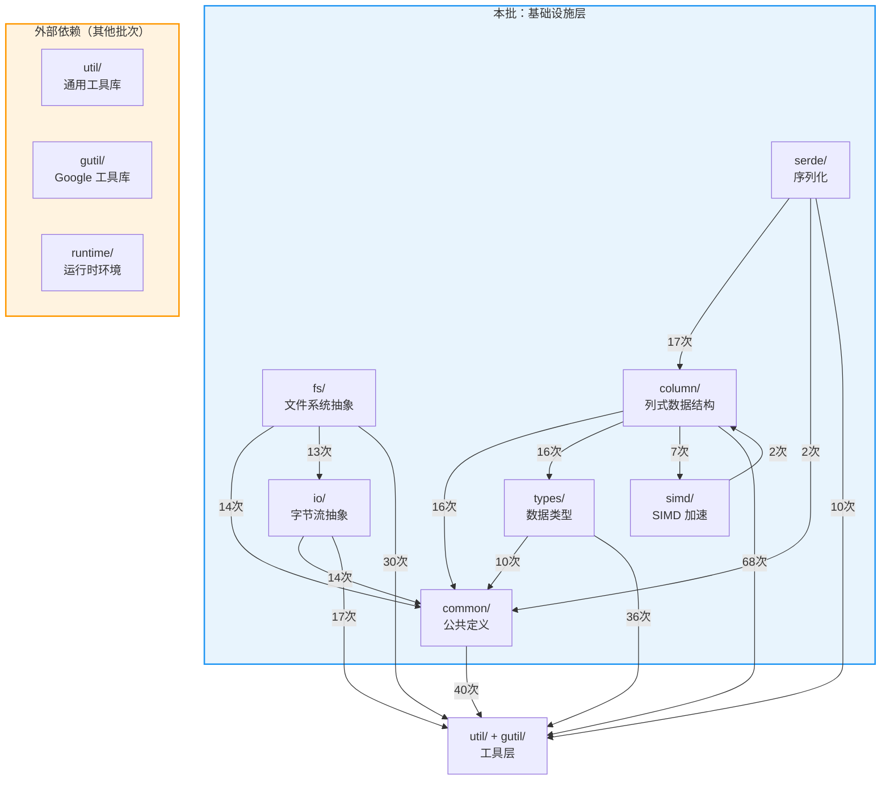

# StarRocks BE 源码分析 —— 基础设施层

> 本文档覆盖 `be/src` 中以下 7 个目录的**每个文件**，说明其功能、实现要点和职责边界。
> 对于 Java 工程师，会在关键处用 Java 类比来辅助理解 C++ 概念。

---

## 目录总览

| 目录 | 定位 | Java 类比 |
|------|------|-----------|
| `common/` | 全局公共基础设施（配置、错误处理、日志、进程管理等） | `java.lang` + Spring 配置 |
| `types/` | 数据类型定义（逻辑类型、日期、Bitmap、HLL 等） | `java.sql.Types` + 自定义值类型 |
| `column/` | 向量化列式内存数据结构（核心数据容器） | 类似 Arrow 的 `FieldVector` |
| `serde/` | 列数据的序列化/反序列化 | `Serializable` + Protobuf |
| `simd/` | SIMD 向量化加速原语 | 无直接对应，底层 CPU 指令优化 |
| `io/` | 字节流抽象（输入/输出/可寻址流） | `java.io.InputStream/OutputStream` |
| `fs/` | 文件系统抽象层（POSIX/S3/HDFS/Broker 等） | `java.nio.file.FileSystem` |

---

## 模块依赖关系图

> 下图基于源码 `#include` 统计，箭头表示"A 依赖 B"（A 的源文件 `#include` 了 B 的头文件），括号内数字为引用次数。
>
> **阅读方式**：从上往下看 — 上层模块调用下层模块，同层模块之间也存在横向依赖。



**关键观察**：

| 观察点 | 说明 |
|--------|------|
| **`common/` 是最底层的基础** | 被本批所有其他模块依赖（fs 14次、column 16次、io 14次、types 10次、serde 2次），自身不依赖本批任何模块 |
| **`column/` 是数据结构核心** | 被 `serde/`(17次) 和 `simd/`(2次) 依赖，同时自身强依赖 `types/`(16次) 和 `simd/`(7次)，形成数据模型的核心三角 |
| **`fs/` 构建在 `io/` 之上** | `fs/` 引用 `io/` 达 13次，体现了"文件系统 → 字节流"的分层设计 |
| **`types/` 与 `column/` 双向关联** | `column/` 依赖 `types/`(16次) 获取类型定义，`types/` 反向依赖 `column/`(1次，用于 LogicalType→ColumnType 映射) |
| **所有模块都重度依赖 `util/gutil`** | `column/`(68次)、`common/`(40次)、`types/`(36次)、`fs/`(30次) 均大量使用工具库，说明工具层是真正的地基 |
| **`simd/` 高度独立** | 仅依赖 `column/`(2次)，不依赖 `common/`，是纯粹的 CPU 加速原语层 |

---

## 1. `common/` —— 全局公共基础设施

### 核心配置与启动

| 文件 | 功能说明 | 功能边界 |
|------|---------|---------|
| **`config.h`** | 定义 BE 所有运行时配置参数（端口、线程数、内存限制、页缓存等），使用 `CONF_*` 宏声明。相当于 Java 的 `application.properties` 的类型安全版本。 | 仅声明配置项和默认值，不含解析逻辑。 |
| **`configbase.h` / `configbase.cpp`** | 配置基础框架。定义 `ConfigInfo` 结构体存储每个配置的元数据（名称、类型、默认值、是否可变）。提供注册、解析、热更新机制。类比 Java 的 `@ConfigurationProperties` 底层实现。 | 提供配置注册和解析引擎，不包含具体业务配置项。 |
| **`daemon.h` / `daemon.cpp`** | `Daemon` 类——BE 后台守护线程管理器。负责启动/停止各种后台任务（内存监控、缓存回收、Compaction 调度等）。类比 Spring Boot 的 `ApplicationRunner`。 | 管理后台线程的生命周期，不包含具体业务逻辑实现。 |
| **`version.h` / `version_internal.h`** | 声明编译时写入的版本信息变量（版本号、Git commit、编译时间、编译用户等）。类比 Java 的 `BuildInfo`。 | 仅声明外部常量，实际赋值在编译脚本中完成。 |

### 错误处理

| 文件 | 功能说明 | 功能边界 |
|------|---------|---------|
| **`status.h` / `status.cpp`** | `Status` 类——StarRocks 核心错误处理机制，类似 `absl::Status`。封装错误码 + 错误信息，支持 `OK`、`NotFound`、`IOError`、`NotSupported` 等状态。Java 类比：受检异常 `Exception` 的返回值形式。 | 定义错误表示和传播，不包含业务异常类型。 |
| **`statusor.h`** | `StatusOr<T>` 模板类——表示"要么是成功值 T，要么是错误 Status"。类比 Java 的 `Optional<T>` + `Exception` 合体，或者 Rust 的 `Result<T, E>`。 | 仅提供容器语义，不包含具体错误类型。 |
| **`statusor_internal.h`** | `StatusOr` 的内部辅助模板，用于检测类型转换运算符和可构造性。 | 纯模板元编程辅助，不对外暴露。 |

### 日志与诊断

| 文件 | 功能说明 | 功能边界 |
|------|---------|---------|
| **`logging.h`** | glog 日志库的封装。定义 `LOG`、`VLOG`、`DCHECK` 等日志宏，以及分模块日志级别（`VLOG_QUERY`、`VLOG_FILE`、`VLOG_ROW`）。还提供 `QUERY_LOG` 宏用于按 QueryID 记录日志。Java 类比：SLF4J/Log4j。 | 日志宏定义与级别管理，不含日志持久化实现。 |
| **`greplog.h` / `greplog.cpp`** | 日志搜索工具。提供按时间戳、日志级别、正则模式搜索日志文件的函数，返回 `GrepLogEntry` 结构。类比 Java 中的日志分析工具。 | 仅提供日志搜索功能，不涉及日志写入。 |
| **`minidump.h` / `minidump.cpp`** | 崩溃报告（Minidump）。使用 `google_breakpad` 在程序崩溃时生成 minidump 文件用于事后分析。Java 类比：JVM 的 hs_err_pid 日志。 | 仅负责崩溃捕获和 dump 生成，不含 dump 分析。 |
| **`tracer.h` / `tracer.cpp`** | 分布式追踪接口。提供 OpenTelemetry 兼容的 `Tracer` 类，支持创建 Span、设置父子关系、导出到 Jaeger。Java 类比：OpenTelemetry Java SDK。 | 提供追踪数据的创建和导出接口，不含具体追踪策略。 |

### 类型与常量

| 文件 | 功能说明 | 功能边界 |
|------|---------|---------|
| **`global_types.h`** | 定义查询计划中使用的全局类型别名：`TupleId`、`SlotId`、`TableId`、`PlanNodeId` 等（均为 `int` 别名），以及 `TupleSlotMapping` 用于 RuntimeFilter 重写。 | 纯类型定义，无逻辑。 |
| **`constexpr.h`** | 编译期常量定义：`DEFAULT_CHUNK_SIZE`(4096)、`MAX_CHUNK_SIZE`(65535)、`NUM_LOCK_SHARD`(32) 等。 | 纯常量定义，无逻辑。 |

### 工具类

| 文件 | 功能说明 | 功能边界 |
|------|---------|---------|
| **`object_pool.h`** | `ObjectPool`——线程安全的对象池。存储 C++ 堆对象，在池销毁时统一释放。使用 `SpinLock` 保证并发安全。Java 类比：`Arena` 分配器，在查询结束时批量释放所有临时对象。 | 仅管理对象生命周期，不负责对象构造逻辑。 |
| **`closure_guard.h`** | RAII 守卫，确保 `google::protobuf::Closure` 的 `Run()` 方法在作用域结束时必然被调用，同时重置线程局部内存追踪器。Java 类比：try-finally 模式。 | 仅负责 Closure 的安全调用，不涉及 Closure 内容。 |
| **`compiler_util.h`** | 编译器特定优化宏：`LIKELY`/`UNLIKELY`（分支预测提示）、`PREFETCH`（缓存预取）。Java 无直接对应，属于 C++ 性能优化手段。 | 纯宏定义，无运行时逻辑。 |
| **`s3_uri.h` / `s3_uri.cpp`** | `S3URI` 类——解析和管理 S3 URI 的各组成部分（scheme、bucket、key、region、endpoint）。Java 类比：`java.net.URI` 的 S3 特化版。 | 仅负责 URI 解析，不涉及 S3 API 调用。 |
| **`ownership.h`** | 定义 `Ownership` 枚举（`kTakesOwnership` / `kDontTakeOwnership`），用于指示函数/对象是否接管传入指针的所有权。这是 C++ 特有的内存管理概念，Java 由 GC 自动管理。 | 纯枚举定义。 |
| **`process_exit.h`** | 提供原子标志和函数来管理进程退出状态（`set_process_exit`、`process_exit_in_progress`），用于优雅关闭。 | 仅负责退出状态标记，不含关闭流程实现。 |
| **`utils.h`** | 定义 `AuthInfo` 结构体和 `set_request_auth` 模板函数，用于在 Thrift 请求中设置认证信息。 | 仅处理认证信息的封装，不含认证逻辑。 |
| **`type_list.h`** | 编译期 `TypeList` 元编程工具，提供 `IsEmpty`、`Front`、`PopFront`、`PushFront`、`PushBack`、`InList` 等类型列表操作。Java 类比：无直接对应，类似泛型工具类但在编译期执行。 | 纯模板元编程，无运行时开销。 |

---

## 2. `types/` —— 数据类型系统

### 逻辑类型定义

| 文件 | 功能说明 | 功能边界 |
|------|---------|---------|
| **`logical_type.h`** | 定义 `LogicalType` 枚举，列举 StarRocks 支持的所有数据类型：`TYPE_BOOLEAN`、`TYPE_TINYINT`、`TYPE_SMALLINT`、`TYPE_INT`、`TYPE_BIGINT`、`TYPE_LARGEINT`、`TYPE_FLOAT`、`TYPE_DOUBLE`、`TYPE_VARCHAR`、`TYPE_CHAR`、`TYPE_DATE`、`TYPE_DATETIME`、`TYPE_DECIMAL32/64/128`、`TYPE_JSON`、`TYPE_ARRAY`、`TYPE_MAP`、`TYPE_STRUCT`、`TYPE_HLL`、`TYPE_OBJECT`(Bitmap) 等。Java 类比：`java.sql.Types`。 | 纯枚举定义，不含类型操作逻辑。 |
| **`logical_type_infra.h`** | 为 `LogicalType` 提供宏基础设施（`APPLY_FOR_ALL_INT_TYPE`、`APPLY_FOR_ALL_NUMBER_TYPE`、`APPLY_FOR_ALL_STRING_TYPE` 等），用于生成针对不同类型的模板特化代码。这是 StarRocks 向量化引擎的核心模式——用宏展开替代运行时多态。 | 宏定义和类型映射基础设施，不含具体类型操作。 |
| **`constexpr.h`** | 类型相关的常量：`HLL_COLUMN_PRECISION`(14)、`HLL_REGISTERS_COUNT`(16384)、`MAX_INT128` 等。 | 纯常量定义。 |

### 复合值类型

| 文件 | 功能说明 | 功能边界 |
|------|---------|---------|
| **`date_value.h` / `date_value.cpp`** | `DateValue` 类——日期值（YYYY-MM-DD），内部基于 Julian Day Number 存储。提供日期创建、转换（from/to 字符串和字面量）、日期截断（`trunc_to_month`、`trunc_to_year`）、日期算术等方法。Java 类比：`java.time.LocalDate`。 | 仅处理日期计算，不含时间部分。 |
| **`timestamp_value.h` / `timestamp_value.cpp`** | `TimestampValue` 类——时间戳值（日期+时间），提供从字面量、字符串创建，以及年/月/日/时/分/秒各分量的提取方法。Java 类比：`java.time.LocalDateTime`。 | 日期时间计算，不含时区处理（时区在其他模块）。 |
| **`bitmap_value.h` / `bitmap_value_detail.h`** | `BitmapValue` 类——位图值类型，基于 `roaring::Roaring` 高效位图库实现。支持单值、集合、完整 Roaring Bitmap 三种内部表示，提供并集、交集、基数统计等操作。定义了序列化格式（`BitmapTypeCode`）。Java 类比：`RoaringBitmap` 库。 | 位图数据操作，不含 Bitmap 索引的存储层实现。 |
| **`hll.h` / `hll.cpp`** | `HyperLogLog` 类——基数估算数据结构。基于 HyperLogLog 算法实现近似去重计数，支持空、显式集合、稀疏、完整四种模式。Java 类比：`stream-lib` 的 `HyperLogLog`。 | HLL 算法实现，不含聚合函数框架。 |

### 类型信息管理

| 文件 | 功能说明 | 功能边界 |
|------|---------|---------|
| **`array_type_info.h`** | 提供 `get_array_type_info()` 和 `get_item_type_info()` 函数，用于获取 ARRAY 类型的元数据信息。 | ARRAY 类型的元信息查询。 |
| **`map_type_info.h`** | 提供 `get_map_type_info()`、`get_key_type_info()`、`get_value_type_info()`，管理 MAP 类型的键值元数据。 | MAP 类型的元信息查询。 |
| **`struct_type_info.h`** | 提供 `get_struct_type_info()`，管理 STRUCT 类型的字段元数据。 | STRUCT 类型的元信息查询。 |

---

## 3. `column/` —— 向量化列式数据结构

> 这是 StarRocks 向量化执行引擎的**核心数据容器**。所有数据在计算过程中以列（Column）的形式批量处理，每次处理一个 Chunk（默认 4096 行）。Java 类比：Apache Arrow 的 `FieldVector` 体系。

### 核心抽象

| 文件 | 功能说明 | 功能边界 |
|------|---------|---------|
| **`column.h`** | `Column` 抽象基类——所有列类型的顶层接口。定义了数据访问（`get_data`）、追加（`append_datum`、`append`）、过滤（`filter`）、序列化/反序列化、容量管理、类型查询（`is_nullable`、`is_binary`、`is_constant`）等通用接口。每个 Column 持有一种类型的连续数据。 | 定义接口契约，不含具体存储实现。 |
| **`chunk.h` / `chunk.cpp`** | `Chunk` 类——一批列式数据的容器，包含多个 `Column` 对象和一个 `Schema`。相当于一个"行组"或"数据批次"。提供添加/删除列、按行过滤、Chunk 之间追加/合并等操作。还支持通过 `ChunkExtraData` 附加额外元数据。Java 类比：Arrow 的 `VectorSchemaRoot`。 | 管理多列数据的批次容器，不负责单列内部实现。 |
| **`chunk_extra_data.h`** | `ChunkExtraData` 基类——用于给 Chunk 附加与 Schema 无关的额外信息（如行 ID、事务信息等）。 | 纯接口定义。 |
| **`datum.h` / `datum.cpp`** | `Datum` 类——表示单个数据值，使用 `std::variant` 持有各种原始和复合类型（`int8_t`、`Slice`、`BitmapValue`、`JsonValue` 等）。提供类型安全的访问器（`get_int8()`、`get_slice()` 等）。Java 类比：`Object`（但类型安全）。 | 单值表示，用于非批量场景（如常量表达式求值）。 |
| **`field.h`** | `Field` 类——表示表 Schema 中的一个字段。包含字段 ID、名称、类型（`LogicalType`）、聚合方式、是否为 Key、是否可 Null、子字段（用于嵌套类型）等元数据。Java 类比：Arrow 的 `Field`。 | 字段元数据描述，不含数据存储。 |
| **`schema.h` / `schema.cpp`** | `Schema` 类——表结构定义，包含一组 `Field` 对象。提供按索引/名称访问字段、管理 Key 列数量、排序列等方法。Java 类比：Arrow 的 `Schema`。 | 结构描述，不含数据。 |
| **`vectorized_fwd.h`** | 前向声明和类型别名文件。定义了所有 Column 子类、Chunk、Schema 等类型的前向声明和常用别名（如 `Int32Column`、`DoubleColumn`、`BooleanColumn`、`Columns`）。目的是减少头文件互相包含。 | 纯声明文件，无实现。 |

### 具体列类型

| 文件 | 功能说明 | 功能边界 |
|------|---------|---------|
| **`fixed_length_column.h`** | `FixedLengthColumn<T>` / `FixedLengthColumnBase<T>` 模板类——用于固定长度类型（`int8/16/32/64`、`float`、`double`、`DateValue`、`TimestampValue` 等）。内部用 `Buffer<T>`（即 `std::vector<T>`）连续存储。这是最基础、最高效的列类型。 | 固定长度类型的列存储，不处理变长数据。 |
| **`binary_column.h`** | `BinaryColumnBase<T>` 模板类——用于变长二进制/字符串数据（VARCHAR、VARBINARY、CHAR）。内部用 `Bytes` 连续缓冲区存储所有字节 + `Offsets` 数组记录每个值的起止偏移。`BinaryColumn` 使用 `uint32_t` 偏移，`LargeBinaryColumn` 使用 `uint64_t` 偏移。 | 变长字节数据的列存储。 |
| **`nullable_column.h`** | `NullableColumn` 类——为任意列添加 NULL 支持。内部组合一个数据列（`_data_column`）和一个 Null 指示列（`_null_column`，类型为 `NullColumn` 即 `FixedLengthColumn<uint8_t>`）。Java 类比：把 `int[]` 和 `boolean[] isNull` 打包在一起。 | 管理 Null 标记，不涉及具体数据类型实现。 |
| **`const_column.h`** | `ConstColumn` 类——常量列。内部只存储一个值，但对外表现为重复 N 次。用于常量表达式求值时避免数据复制。比如 `SELECT 1 + col` 中的 `1` 就是一个 ConstColumn。 | 常量值的轻量表示，读取时才"展开"。 |
| **`array_column.h`** | `ArrayColumn` 类——数组列。内部由一个 `elements` 列（存储所有数组元素）和一个 `offsets` 列（`UInt32Column`，记录每个数组的起止位置）组成。类似 Arrow 的 `ListArray`。 | ARRAY 类型的列存储。 |
| **`map_column.h`** | `MapColumn` 类——Map 列。内部由 `keys` 列、`values` 列和 `offsets` 列组成。 | MAP 类型的列存储。 |
| **`struct_column.h`** | `StructColumn` 类——Struct 列。内部持有多个子列（fields），每个子列对应 Struct 的一个字段。 | STRUCT 类型的列存储。 |
| **`decimalv3_column.h`** | `DecimalV3Column<T>` 类——Decimal 列。继承自 `FixedLengthColumnBase`，针对 `int32_t`（Decimal32）、`int64_t`（Decimal64）、`int128_t`（Decimal128）三种精度。 | 精确数值的列存储。 |
| **`object_column.h`** | `ObjectColumn<T>` 模板类——用于存储复杂对象（`BitmapValue`、`HyperLogLog`、`PercentileValue` 等）。每个元素是一个独立的 C++ 对象，不支持零拷贝。 | 复杂对象的列存储，性能低于固定长度列。 |
| **`json_column.h`** | `JsonColumn` 类——JSON 列，继承自 `ObjectColumn<JsonValue>`，额外支持 JSON 扁平化（flat JSON）优化。 | JSON 数据的列存储及扁平化。 |

### 辅助工具

| 文件 | 功能说明 | 功能边界 |
|------|---------|---------|
| **`column_helper.h` / `column_helper.cpp`** | `ColumnHelper` 静态工具类——提供常用的列操作辅助方法：Nullable ↔ 非 Nullable 转换、创建常量列、类型检查、按类型创建空列等。相当于列的"工厂+工具箱"。 | 列操作的便捷方法，不包含列的核心逻辑。 |
| **`column_visitor.h`** | `ColumnVisitor` 接口——定义对不同 Column 类型的访问者模式（Visitor Pattern）。每种 Column 类型有一个 `visit(XxxColumn*)` 方法。Java 类比：Visitor 设计模式。 | 接口定义，不含具体操作。 |
| **`column_visitor_mutable.h`** | `ColumnVisitorMutable` 接口——与 `ColumnVisitor` 类似，但用于可修改的列访问。 | 接口定义，不含具体操作。 |
| **`type_traits.h`** | 模板特化，将 `LogicalType` 映射到对应的 C++ 类型（`RunTimeCppType<TYPE>`）和列类型（`RunTimeColumnType<TYPE>`）。这是向量化引擎的类型桥梁。 | 编译期类型映射，无运行时逻辑。 |
| **`column_access_path.h`** | `ColumnAccessPath`——描述列的访问路径，用于嵌套类型（JSON、Struct、Array）的延迟物化（Lazy Materialization）优化。指定只读取嵌套结构中需要的子字段。 | 访问路径描述，不含数据读取逻辑。 |
| **`column_pool.h`** | 列对象池——用于复用 Column 对象，避免频繁的堆分配和释放。 | 列对象的生命周期管理。 |

---

## 4. `serde/` —— 序列化与反序列化

| 文件 | 功能说明 | 功能边界 |
|------|---------|---------|
| **`column_array_serde.h` / `column_array_serde.cpp`** | `ColumnArraySerde` 类——将 Column 数据序列化为内存字节数组（或从字节数组反序列化）。提供 `max_serialized_size()`、`serialize()`、`deserialize()` 三个核心方法。支持不同 `encode_level` 进行压缩编码。主要用于 **Shuffle**（数据在 BE 节点之间传输）和 **Spill**（溢写到磁盘）场景。 | 内存级别的列序列化，不涉及磁盘文件格式。 |
| **`protobuf_serde.h` / `protobuf_serde.cpp`** | `ProtobufChunkSerde` 类——将 Chunk 序列化为 Protobuf 格式（`ChunkPB`），或从 `ChunkPB` 反序列化。这是 **BE 节点间 RPC 数据传输**的核心序列化格式。提供 `serialize()`、`serialize_without_meta()`、`deserialize()` 方法。还定义了 `ProtobufChunkMeta` 用于缓存反序列化元数据，以及 `ProtobufChunkDeserializer` 类用于高效反序列化。 | Chunk 到 Protobuf 的转换，依赖 `ColumnArraySerde` 做底层编码。 |
| **`encode_context.h` / `encode_context.cpp`** | `EncodeContext` 类——自适应编码上下文。根据压缩率动态调整每列的编码级别：在每 N 个 Chunk 中采样前几个的压缩率，如果压缩率低于阈值（90%）则启用编码，否则跳过。支持整数编码（StreamVByte）和字符串编码两种。 | 编码策略管理，不含具体编码算法实现。 |

### C++ 知识点（给 Java 工程师）
- **StreamVByte**：一种变长整数编码方式，利用 SIMD 指令高效编解码。类比 Java 的 `VarInt` 但更快。
- **序列化层级**：`ProtobufChunkSerde` → `ColumnArraySerde` → 具体列类型的序列化。层层委托，类似 Java 的 Jackson 框架。

---

## 5. `simd/` —— SIMD 向量化加速

> SIMD（Single Instruction, Multiple Data）允许一条 CPU 指令同时处理多个数据。StarRocks 广泛使用 SSE2/AVX2/NEON 指令来加速列式数据处理。Java 中可类比 JDK 21+ 的 `jdk.incubator.vector` API，但 C++ 可以直接使用硬件指令。

| 文件 | 功能说明 | 功能边界 |
|------|---------|---------|
| **`simd.h`** | SIMD 核心工具函数集。提供 `count_zero()` 和 `count_nonzero()` 函数——使用 SSE2/AVX2/NEON 指令批量统计 int8/uint32 数组中的零值和非零值数量。这是 **NULL 值统计**和**过滤器计数**的基础。 | 零值/非零值的 SIMD 批量计数。 |
| **`simd_utils.h`** | `SIMDUtils` 类——AVX2 辅助工具。提供 `set_data<T>()` 模板函数，将标量值广播到 256 位 SIMD 寄存器（`__m256i`）。根据数据宽度（1/2/4/8 字节）选择不同的广播指令。 | SIMD 寄存器初始化工具。 |
| **`selector.h`** | SIMD 条件选择器。实现 `avx2_select_if()` 函数——根据 `selector[]` 数组从两个源数据中选择对应元素写入目标。类似三目运算符 `selector[i] ? a[i] : b[i]` 的 SIMD 批量版本。支持 1/2/4/8 字节元素。用于 `CASE WHEN`、`IF()` 等表达式求值。 | 条件选择的 SIMD 加速。 |
| **`mulselector.h`** | `SIMD_muti_selector` 类——多路条件选择器。支持多个 selector 向量和多个数据源的级联选择。用于多分支 `CASE WHEN` 场景。 | 多路条件选择的 SIMD 加速。 |
| **`gather.h`** | `SIMDGather` 结构——SIMD Gather 操作。实现 `b[i] = a[c[i]]` 的 SIMD 加速版本，使用 `_mm256_i32gather_epi32` 指令。用于哈希表探测（Hash Join/Aggregation）中按索引批量获取数据。当桶数量 < 512K 时使用 SIMD，否则回退到标量。 | 索引查找的 SIMD 加速。 |
| **`batch_run_counter.h`** | `BatchRunCounter<batch_size>` 模板类——批量过滤器游标。按批次（32/16/8 个元素）扫描 `uint8_t` 过滤器数组，快速判断当前批次是"全选"、"全不选"还是"部分选"。使用 AVX2/SSE2/标量三级回退。用于 **过滤操作的快速路径优化**——如果一个批次全选，可以直接复制整批数据。 | 过滤器的批量判定，不含过滤执行逻辑。 |

---

## 6. `io/` —— 字节流抽象层

> 类似 Java 的 `java.io` 包，定义了统一的字节流读写接口。上层（存储引擎、数据格式解析器）通过这些接口读写数据，不关心底层是本地文件还是远程对象存储。

### 接口层次

```
Readable (读取接口)
  └── InputStream (顺序读 + skip + peek)
        ├── CompressedInputStream (解压流)
        └── SeekableInputStream (可寻址读 + seek + position + get_size)
              ├── ArrayInputStream (内存数组)
              ├── FdInputStream (文件描述符)
              ├── S3InputStream (S3 对象)
              ├── SharedBufferedInputStream (共享缓冲)
              ├── CacheInputStream (带缓存)
              └── ThrottledSeekableInputStream (限速)

Writable (写入接口)
  └── OutputStream (顺序写 + skip + direct_buffer)
        ├── FdOutputStream (文件描述符)
        ├── S3OutputStream (S3 对象，支持分段上传)
        └── ThrottledOutputStream (限速)
```

### 各文件说明

| 文件 | 功能说明 | 功能边界 |
|------|---------|---------|
| **`readable.h` / `readable.cpp`** | `Readable` 接口——最基本的字节读取接口，只有 `read()` 和 `read_fully()` 两个方法。Java 类比：`InputStream.read(byte[])`。 | 纯读取接口。 |
| **`writable.h`** | `Writable` 接口——最基本的字节写入接口，定义 `write()`、`write_aliased()`（零拷贝写）、`close()`、`allows_aliasing()` 等方法。 | 纯写入接口。 |
| **`input_stream.h`** | `InputStream` 类——继承 `Readable`，增加 `skip()`（跳过字节）、`peek()`（零拷贝预览）、`get_numeric_statistics()`（获取 IO 统计）。还提供 `InputStreamWrapper` 装饰器。 | 顺序输入流接口及包装器。 |
| **`output_stream.h`** | `OutputStream` 类——继承 `Writable`，增加 `skip()`、`get_direct_buffer()`（获取直写缓冲区）、`get_direct_buffer_and_advance()` 等方法。还提供 `OutputStreamWrapper`。 | 顺序输出流接口及包装器。 |
| **`seekable_input_stream.h` / `seekable_input_stream.cpp`** | `SeekableInputStream` 类——继承 `InputStream`，增加 `seek()`、`position()`、`read_at()`、`read_at_fully()`、`get_size()` 等随机读取能力。还提供 `SeekableInputStreamWrapper` 和 `DefaultSeekableInputStream`。Java 类比：`RandomAccessFile`。 | 可寻址输入流接口及默认实现。 |
| **`array_input_stream.h`** | `ArrayInputStream` 类——基于内存数组的 `SeekableInputStream` 实现。将一段内存当作流来读取。 | 内存数据的流式访问。 |
| **`string_input_stream.h`** | `StringInputStream` 类——基于 `std::string` 的 SeekableInputStream。将字符串内容当作流来读取。内部使用 `ArrayInputStream`。 | 字符串数据的流式访问。 |
| **`fd_input_stream.h` / `fd_input_stream.cpp`** | `FdInputStream` 类——从文件描述符读取的 SeekableInputStream 实现。使用 POSIX `pread()`/`read()` 系统调用。 | 本地文件的流式读取。 |
| **`fd_output_stream.h` / `fd_output_stream.cpp`** | `FdOutputStream` 类——向文件描述符写入的 OutputStream 实现。使用 POSIX `write()` 系统调用。 | 本地文件的流式写入。 |
| **`s3_input_stream.h` / `s3_input_stream.cpp`** | `S3InputStream` 类——从 AWS S3 对象读取的 SeekableInputStream 实现。使用 AWS S3 SDK 的 `GetObject` API，通过 Range 请求实现随机读。 | S3 对象的流式读取。 |
| **`s3_output_stream.h` / `s3_output_stream.cpp`** | `S3OutputStream` 类——向 AWS S3 对象写入的 OutputStream 实现。小文件使用 `PutObject`，大文件使用 MultiPart Upload（分段上传）。 | S3 对象的流式写入。 |
| **`compressed_input_stream.h` / `compressed_input_stream.cpp`** | `CompressedInputStream` 类——解压装饰器。包装一个源 InputStream，通过 `StreamCompression` 解压缩器在读取时透明解压。支持 Gzip、Zlib、BZip2、LZ4 等格式。 | 流式解压缩，不含压缩功能。 |
| **`shared_buffered_input_stream.h` / `shared_buffered_input_stream.cpp`** | `SharedBufferedInputStream` 类——共享缓冲输入流。将多个小范围的 IO 请求合并为较少的大块请求（IO Coalescing），减少远程存储的请求次数。定义 `IORange`（请求范围）和 `CoalesceOptions`（合并策略）。这是**远程存储性能优化**的关键组件。 | IO 请求合并和缓冲管理。 |
| **`cache_input_stream.h` / `cache_input_stream.cpp`** | `CacheInputStream` 类——缓存输入流。在 `SharedBufferedInputStream` 之上增加 Block Cache 层，将远程数据缓存到本地磁盘/内存。维护详细的缓存命中/未命中统计（`Stats`）。 | 远程数据的本地缓存策略。 |
| **`throttled_seekable_input_stream.h`** | `ThrottledSeekableInputStream` 类——限速输入流。在每次 `read()`/`read_at()` 前 sleep 指定毫秒数，用于测试和流量控制。 | 输入流的限速包装器。 |
| **`throttled_output_stream.h`** | `ThrottledOutputStream` 类——限速输出流。在每次 `write()` 前 sleep 指定毫秒数。 | 输出流的限速包装器。 |
| **`io_error.h`** | `io_error()` 辅助函数——将 POSIX errno 转换为 StarRocks `Status` 对象。`ENOENT` → `Status::NotFound`，`EEXIST` → `Status::AlreadyExist`，其他 → `Status::IOError`。 | errno 到 Status 的转换。 |
| **`io_profiler.h` / `io_profiler.cpp`** | `IOProfiler` 类——IO 性能剖析器。按标签（Query/Load/Compaction/Clone 等）统计 IO 操作次数、字节数、耗时。使用线程局部存储避免锁竞争。 | IO 统计采集，不含展示。 |

---

## 7. `fs/` —— 文件系统抽象层

> 在 `io/` 层之上，提供更高级的文件系统操作（创建/删除/遍历/重命名等）。类似 Java 的 `java.nio.file.FileSystem` + `Files` 工具类。StarRocks 通过 URI Scheme 自动选择对应的文件系统实现。

### 核心接口

| 文件 | 功能说明 | 功能边界 |
|------|---------|---------|
| **`fs.h` / `fs.cpp`** | `FileSystem` 抽象基类——定义统一的文件系统操作接口。枚举类型：`POSIX`、`S3`、`HDFS`、`BROKER`、`MEMORY`、`STARLET`。关键方法包括：`new_sequential_file()`、`new_random_access_file()`、`new_writable_file()`、`path_exists()`、`get_children()`、`delete_file()`、`create_dir()`、`rename_file()` 等。静态方法 `CreateUniqueFromString()` 根据 URI Scheme 自动创建对应的文件系统实例。还定义了 `FSOptions`（文件系统选项）、`SequentialFile`、`RandomAccessFile`、`WritableFile`（高级文件抽象，封装了 io::InputStream/OutputStream）等类。 | 接口定义和工厂方法，不含具体文件系统实现。 |

### 文件系统实现

| 文件 | 功能说明 | 功能边界 |
|------|---------|---------|
| **`fs_posix.h` / `fs_posix.cpp`** | POSIX 文件系统实现——基于 Linux 系统调用（`open`/`read`/`write`/`stat`/`opendir` 等）。提供 `new_fs_posix()` 工厂函数。这是 BE 本地数据存储（Tablet 数据文件、日志等）的默认文件系统。 | 本地 POSIX 文件操作。 |
| **`fs_s3.h` / `fs_s3.cpp`** | S3 文件系统实现——基于 AWS S3 SDK。提供 `new_fs_s3()` 工厂函数。用于存算分离模式下读写对象存储中的数据。 | S3 兼容对象存储操作。 |
| **`fs_broker.h` / `fs_broker.cpp`** | Broker 文件系统实现——通过 StarRocks Broker 进程中转访问远程文件系统。`BrokerFileSystem` 类实现了完整的 `FileSystem` 接口，通过 Thrift RPC 调用 Broker 服务。主要用于兼容老版本的导入导出功能。标注了 `TODO: Remove BrokerFileSystem`。 | 通过 Broker 代理的远程文件访问（遗留组件）。 |
| **`fs_memory.h` / `fs_memory.cpp`** | 内存文件系统实现——`MemoryFileSystem` 类，完全基于内存的文件系统。主要用于**单元测试**。还提供 `new_random_access_file_from_memory()` 便捷函数。 | 测试用途的内存文件系统。 |
| **`fs_starlet.h` / `fs_starlet.cpp`** | Starlet 文件系统实现——用于 StarRocks **存算分离架构**（StarOS/共享数据模式）。支持 `staros://shardid/path` 格式的 URI。仅在编译时启用 `USE_STAROS` 宏时可用。提供 URI 解析（`parse_starlet_uri()`）和构建（`build_starlet_uri()`）功能。 | 存算分离模式的存储访问。 |

### HDFS 支持（`fs/hdfs/` 子目录）

| 文件 | 功能说明 | 功能边界 |
|------|---------|---------|
| **`hdfs/fs_hdfs.h` / `hdfs/fs_hdfs.cpp`** | HDFS 文件系统实现——基于 `libhdfs` C 库。定义了 `HdfsReadMetricsKey` 常量用于 IO 指标（总字节数、本地读字节数、短路读字节数、零拷贝字节数、Hedged Read 统计等）。提供 `new_fs_hdfs()` 工厂函数。 | HDFS 文件操作和 IO 指标。 |
| **`hdfs/hdfs_fs_cache.h` / `hdfs/hdfs_fs_cache.cpp`** | `HdfsFsCache` 单例——HDFS 连接缓存。缓存 `hdfsFS` 连接以避免重复建连（HDFS 建连开销较大）。`HdfsFsClient` 封装单个 HDFS 连接。 | HDFS 连接的缓存管理。 |

### 云凭证管理（`fs/credential/` 子目录）

| 文件 | 功能说明 | 功能边界 |
|------|---------|---------|
| **`credential/cloud_configuration.h`** | 云存储凭证和配置数据结构。定义 `CloudCredential` 基类及子类：`AWSCloudCredential`（AccessKey/SecretKey/IAM Role/STS 等）、`AliyunCloudCredential`（阿里云 OSS 凭证）。以及 `CloudConfiguration` 基类及子类 `AWSCloudConfiguration`、`AliyunCloudConfiguration`。 | 凭证数据结构定义。 |
| **`credential/cloud_configuration_factory.h`** | `CloudConfigurationFactory` 类——云配置工厂。从 Thrift 的 `TCloudConfiguration` 构建内部的 `CloudConfiguration` 对象，提取各平台（AWS/阿里云）的配置参数。 | 凭证对象的工厂创建。 |

### 适配器与工具

| 文件 | 功能说明 | 功能边界 |
|------|---------|---------|
| **`fs_util.h` / `fs_util.cpp`** | `starrocks::fs` 命名空间下的便捷工具函数集。提供 `md5sum()`（计算文件 MD5）、`list_dirs_files()`（列出目录和文件）以及一系列简化的文件操作内联函数（`new_sequential_file()`、`new_random_access_file()`、`new_writable_file()`），自动根据路径创建正确的文件系统实例。 | 文件操作的便捷封装。 |
| **`fd_cache.h` / `fd_cache.cpp`** | `FdCache` 单例——文件描述符缓存。使用 LRU 缓存策略缓存打开的文件描述符（默认容量 4096），避免频繁 `open()`/`close()` 系统调用。 | 文件描述符的 LRU 缓存。 |
| **`output_stream_adapter.h`** | `OutputStreamAdapter` 类——将 `io::OutputStream` 适配为 `WritableFile` 接口。桥接低级流接口和高级文件接口。 | 接口适配器。 |
| **`output_stream_wrapper.h`** | `OutputStreamWrapper` 类——将 `WritableFile` 适配为 `std::ostream`。允许使用 C++ 流操作符（`<<`）写文件，或直接用 `protobuf::SerializeToOStream()` 序列化 Protobuf 到文件。 | 文件到 ostream 的适配器。 |
| **`writable_file_wrapper.h`** | `WritableFileWrapper` 类——`WritableFile` 的装饰器基类。支持所有权语义（`kTakesOwnership` / `kDontTakeOwnership`），将所有调用委托给内部的 `WritableFile`。 | WritableFile 的包装器基类。 |
| **`writable_file_as_stream_buf.h`** | `WritableFileAsStreamBuf` 类——将 `WritableFile` 适配为 `std::streambuf`。实现 `overflow()` 和 `xsputn()` 虚函数，使得 `std::ostream` 可以写入 `WritableFile`。 | 底层 streambuf 适配。 |
| **`rapidjson_stream_adapter.h`** | `RapidJSONReadStreamAdapter` / `RapidJSONWriteStreamAdapter` 类——将 StarRocks 的文件流适配为 RapidJSON 库的流接口，使得 RapidJSON 可以直接从 `SequentialFile`/`RandomAccessFile` 解析 JSON，或直接向 `WritableFile` 输出 JSON。 | RapidJSON 库的流适配器。 |

---

## C++ 关键概念速查（给 Java 工程师）

| C++ 概念 | Java 类比 | 在 StarRocks 中的体现 |
|---------|---------|---------------------|
| **RAII** (资源获取即初始化) | try-with-resources | `ClosureGuard`、智能指针 |
| **模板特化** | 泛型特化（Java 不支持） | `FixedLengthColumn<int32_t>` 等 |
| **`std::variant`** | `Object` 但类型安全 | `Datum` 类 |
| **`std::unique_ptr`** | 不可复制的引用 | 各处的对象所有权传递 |
| **`std::shared_ptr`** | 普通引用（GC 管理） | `ChunkPtr = shared_ptr<Chunk>` |
| **宏展开** | 代码生成 | `APPLY_FOR_ALL_INT_TYPE` 等 |
| **`#ifdef __AVX2__`** | 无直接对应 | SIMD 条件编译 |
| **`virtual` 纯虚函数** | `abstract` 方法 | `Column::clone()` |
| **Visitor Pattern** | 访问者模式 | `ColumnVisitor` |
| **`constexpr`** | `static final` | `DEFAULT_CHUNK_SIZE` |
| **`StatusOr<T>`** | `Result<T>` 模式 | 几乎所有 IO 操作的返回值 |
