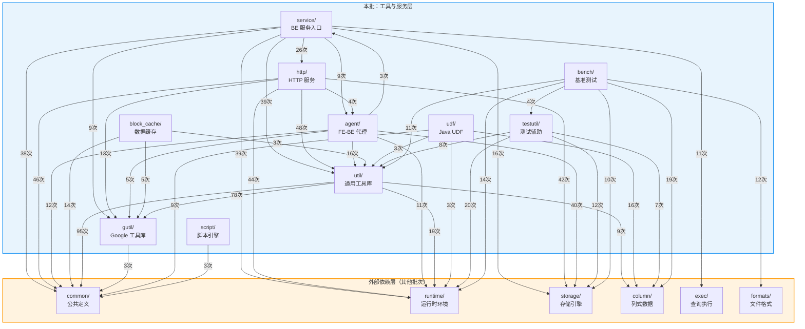

# StarRocks BE 源码导读 — 第 2 批：工具与服务层

> **目标读者**：熟悉 Java 的工程师，希望快速理解 StarRocks BE（C++）中"工具 / 服务 / 代理 / 缓存"等支撑层各目录与文件的职责。
>
> **阅读建议**：先看"目录总览"建立全局认知 → 再按需查阅各目录的文件级说明表。

---

## 1. 目录总览

本批共涵盖 **13 个目录**，约 490 个源文件。

| 目录 | 文件数 | 定位 | Java 类比 |
|------|--------|------|-----------|
| `util/` | ~253 | 通用工具库：位操作、线程、加密、JSON、LRU、Metrics 等 | `com.google.common.util` (Guava) + `java.util.concurrent` |
| `gutil/` | ~89 | Google 基础工具库（源自 Kudu）：原子操作、字符串、哈希 | Guava 底层原语 (`com.google.common.base/hash/primitives`) |
| `service/` | ~21 | BE 进程启动入口 & Thrift/BRPC RPC 服务实现 | Spring Boot 启动类 + gRPC Service |
| `http/` | ~75 | 内嵌 HTTP 服务器 & 运维 REST API（Stream Load / 监控 / pprof） | Spring MVC Controller + 内嵌 Tomcat |
| `agent/` | ~24 | FE→BE 代理通信：心跳、任务分发、版本发布、状态上报 | Java Agent 模式 / 消息消费者 Worker |
| `block_cache/` | ~12 | 本地 SSD / 内存数据缓存（支持 CacheLib、StarCache 后端） | Caffeine / EhCache 本地缓存 |
| `script/` | 2 | 内嵌 Wren 脚本引擎执行接口 | JSR-223 `ScriptEngine` |
| `tools/` | 1 | 命令行离线元数据工具 `meta_tool` | 独立运维 CLI 工具 |
| `thirdparty/` | ~26 | 内嵌第三方库源码（Wren 脚本引擎 + WrenBind17 C++ 绑定） | 内嵌 JAR / shade 依赖 |
| `udf/` | ~9 | Java UDF 集成（JNI 桥接、数据类型转换） | 自定义函数框架 (类似 Flink UDF) |
| `testutil/` | ~21 | 单元测试辅助宏 & Helper（断言、Fixture、SyncPoint） | JUnit 5 辅助类 / Mockito 工具 |
| `bench/` | ~16 | Google Benchmark 性能基准测试框架 | JMH (Java Microbenchmark Harness) |
| `gen_cpp/` | 1 | Thrift IDL 自动生成的 C++ 桩代码（手动定制部分） | Thrift / Protobuf 生成的 Java Stub |

---

## 1.1 模块依赖关系图

> 下图基于源码 `#include` 统计，箭头表示"A 依赖 B"（A 的源文件 `#include` 了 B 的头文件），括号内数字为引用次数。
>
> **阅读方式**：从上往下看 — 上层模块调用下层模块，同层模块之间也存在横向依赖。

**关键观察**：

| 观察点 | 说明 |
|--------|------|
| **`gutil/` 和 `common/` 是最底层** | 几乎所有模块都依赖它们，它们自身极少依赖其他模块。`gutil/` 相当于 Guava — 纯工具，零业务 |
| **`util/` 是核心工具枢纽** | 被 `service`(39)、`http`(48)、`agent`(16) 大量引用，同时它自身也依赖 `common`(95)、`gutil`(78) |
| **`http/` 和 `agent/` 直接依赖 `storage/`** | 因为 HTTP Action 直接操作 Tablet 元数据，Agent 任务（建表/删表/Clone）直接调用存储引擎 |
| **`block_cache/` 依赖极简** | 仅依赖 `common` + `gutil` + `util`，是一个高度解耦的独立缓存层 |
| **`service/` 是扇出最大的模块** | 作为 BE 入口，它需要编排所有子系统（HTTP、Agent、Runtime、Storage、Exec） |
| **`udf/` 主要依赖 `column/`** | JNI 桥接层核心工作是 C++ 列数据 ↔ Java 对象转换，因此强依赖列式数据结构 |

---

## 2. `util/` — 通用工具库

> **Java 类比**：相当于项目内部的 Guava + Apache Commons + `java.util.concurrent` 工具集合。每个文件职责单一，类似一个个独立的工具类。

### 2.1 顶层文件

| 文件 | 功能说明 | 功能边界 |
|------|---------|---------|
| `aes_util.h` | AES 对称加密/解密工具，支持 ECB/CBC 模式、128/192/256 位密钥。Java 类比：`javax.crypto.Cipher` | 纯加解密计算，不含密钥管理 |
| `aligned_new.h` | 提供 `AlignedNew<N>` 基类，重载 `operator new/delete` 以实现超对齐内存分配。Java 类比：Java 无直接对应，JVM 自动对齐 | 仅提供基类，不涉及分配器实现 |
| `alignment.h` | 宏 `ALIGN_DOWN` / `ALIGN_UP`，将地址/大小向下/向上对齐到指定边界 | 仅宏定义，内联计算 |
| `await.h` | `Awaitility` 类：带超时和轮询间隔的"等待条件成立"工具。Java 类比：Awaitility 库 (`org.awaitility`) | 阻塞等待，不含线程池 |
| `bfd_parser.h` | BFD（Binary File Descriptor）符号解析器，用于调试时将地址转换为函数名 | 仅解析符号，不生成调试信息 |
| `bit_mask.h` | `BitMask` 模板类：高效位掩码，支持 set/test 单个位。Java 类比：`java.util.BitSet` 的轻量版 | 位级操作，固定大小 |
| `bit_packing.h` | 整数位压缩打包工具，支持 0-64 位宽。Java 类比：Java 无直接对应（类似 Parquet 的 BitPacking） | 编解码，不含存储 |
| `bit_stream_utils.h` | 位流读写工具 `BitReader` / `BitWriter`，从字节流中读写任意位宽的值 | 流式操作，不管理缓冲区生命周期 |
| `bit_util.h` | 通用位操作工具：字节序转换、popcount、log2、位宽计算等。Java 类比：`Integer.bitCount()` / `Long.numberOfLeadingZeros()` | 内联函数集合 |
| `bitmap.h` | 位图操作工具函数（基于 `gutil/strings/fastmem.h`），用于批量位操作 | 辅助函数，非独立 Bitmap 容器 |
| `bitmap_intersect.h` | Bitmap 交集序列化大小计算工具，支持多种数据类型 | 仅计算序列化大小，不做实际交集运算 |
| `blocking_queue.hpp` | 线程安全阻塞队列，支持 `put` / `get` 阻塞操作和容量限制。Java 类比：`java.util.concurrent.LinkedBlockingQueue` | 生产者-消费者模型，不含优先级 |
| `blocking_priority_queue.hpp` | 线程安全阻塞优先级队列，空/满时阻塞。Java 类比：`java.util.concurrent.PriorityBlockingQueue` | 优先级排序 + 阻塞 |
| `brpc_stub_cache.h` | BRPC Stub 缓存池，根据 `butil::EndPoint` 缓存 RPC 客户端连接。Java 类比：gRPC `ManagedChannel` 连接池 | 管理 Stub 生命周期，不处理 RPC 逻辑 |
| `byte_buffer.h` | `ByteBuffer` 类：带引用计数的字节缓冲区，支持 flip/remaining 操作。Java 类比：`java.nio.ByteBuffer` | 内存管理，不含 IO |
| `c_string.h` | 轻量 C 风格字符串包装，`sizeof` 比 `std::string` 更小，提供 `size()` 和 `==` 操作 | 只读包装，不拥有内存 |
| `cidr.h` | CIDR 网段解析工具，解析 `192.168.1.0/24` 格式 | 仅解析，不做网络连接 |
| `coding.h` | 定长整数小端编解码（`encode_fixed32/64`、`decode_fixed32/64`）。Java 类比：`ByteBuffer.order(LITTLE_ENDIAN).putInt()` | 纯内存序列化函数 |
| `concurrent_limiter.h` | 并发限流器 `ConcurrentLimiter`，限制同时执行的操作数。Java 类比：`java.util.concurrent.Semaphore` | 仅计数限流，不含队列 |
| `core_local.h` | `CoreDataAllocator`：按 CPU 核心分配线程本地数据，减少 false sharing。Java 类比：`ThreadLocal` + `@Contended` | 分配策略，不含业务逻辑 |
| `countdown_latch.h` | 倒计数门闩 `CountDownLatch`：等待 N 个操作完成。Java 类比：`java.util.concurrent.CountDownLatch` | 一次性同步原语 |
| `cpu_info.h` | `CpuInfo`：查询 CPU 信息（缓存大小、核心数、SSE/AVX 支持等）。Java 类比：`Runtime.getRuntime().availableProcessors()` 的扩展 | 只读信息查询 |
| `cpu_usage_info.h` | `CpuUsageRecorder`：采集和记录 CPU 使用率 | 采集指标，不做调度 |
| `crc32c.h` | CRC32C 校验和计算，硬件加速（SSE4.2）。Java 类比：`java.util.zip.CRC32C` | 纯计算 |
| `date_func.h` | 日期时间工具函数：字符串 ↔ 时间戳转换。Java 类比：`java.time.format.DateTimeFormatter` | 格式转换，不含时区管理 |
| `debug_counters.h` | `DebugRuntimeProfile`：运行时调试计数器，通过宏 `ADD_DEBUG_COUNTER` 注册。Java 类比：Micrometer Counter | 调试期使用，生产环境可禁用 |
| `debug_util.h` | 调试工具函数：打印 Thrift 对象、获取构建版本信息 | 仅格式化输出 |
| `decimal_types.h` | 高精度十进制类型定义（`int128_t`）及精度/位数映射模板。Java 类比：`java.math.BigDecimal` 的底层表示 | 类型定义与常量表 |
| `defer_op.h` | `DeferOp`：RAII 析构时执行回调，保证资源清理。Java 类比：try-with-resources / `finally` 块 | 生命周期绑定的延迟执行 |
| `disk_info.h` | `DiskInfo`：查询磁盘信息（设备列表、数据盘配置等） | 只读信息查询 |
| `dispatch.h` | `dispatch_nonull_template`：根据列是否为常量列分发调用不同模板实例 | 编译期模板分发 |
| `dynamic_util.h` | 动态库加载工具（`dlopen` / `dlsym` 封装）。Java 类比：`System.loadLibrary()` | 符号查找，不管理生命周期 |
| `errno.h` | 将 `errno` 转换为可读字符串 | 错误码翻译 |
| `faststring.h` | `faststring`：高性能可变字节数组，避免 `std::string` 的小字符串优化开销。Java 类比：`ByteArrayOutputStream` | 原始字节容器 |
| `filesystem_util.h` | 文件系统工具：目录空间查询、文件操作等。Java 类比：`java.nio.file.Files` | 系统调用封装 |
| `gc_helper.h` | `GCHelper`：tcmalloc 内存 GC 策略，按时间窗口平滑释放。Java 无直接对应（JVM 有自己的 GC） | GC 字节量计算 |
| `hash_util.hpp` | 哈希工具集：CRC 哈希、FNV 哈希、组合哈希等。Java 类比：`Objects.hash()` / Guava `Hashing` | 多种哈希算法聚合 |
| `hdfs_util.h` | HDFS 工具函数：获取 NameNode、错误信息等 | 辅助函数 |
| `int96.h` | 96 位整数类型 `int96_t`（用于 Parquet 时间戳兼容） | 类型定义 |
| `json.h` | `JsonValue` 类：基于 VelocyPack 的 JSON 文档表示，支持解析、遍历、修改。Java 类比：Jackson `JsonNode` | JSON 数据模型 |
| `json_converter.h` | SIMD-JSON → `JsonValue` 转换工具 | 格式转换桥接 |
| `lru_cache.h` | LRU 缓存实现（源自 LevelDB），支持分片、自定义 charge。Java 类比：Guava `Cache` / Caffeine | 通用缓存容器 |
| `md5.h` | `Md5Digest`：MD5 摘要计算。Java 类比：`java.security.MessageDigest.getInstance("MD5")` | 纯计算 |
| `mem_info.h` | `MemInfo`：查询系统内存信息（总量、可用量等）。Java 类比：`Runtime.getRuntime().maxMemory()` | 只读查询 |
| `metrics.h` | 监控指标框架：Counter/Gauge/Histogram 注册与导出。Java 类比：Micrometer / Prometheus Java Client | 指标定义与采集 |
| `monotime.h` | `MonoTime` / `MonoDelta`：单调时钟时间点与时间段。Java 类比：`System.nanoTime()` / `java.time.Duration` | 时间测量 |
| `mysql_row_buffer.h` | MySQL 协议行数据缓冲区，按 MySQL 二进制/文本协议格式编码 | 协议编码 |
| `network_util.h` | 网络工具：主机名解析、端口检测等。Java 类比：`java.net.InetAddress` | 网络查询 |
| `once.h` | `DorisCallOnce`：线程安全的一次性初始化。Java 类比：`java.util.concurrent.atomic.AtomicBoolean` + DCL | 初始化保护 |
| `parse_util.h` | 字符串解析工具：内存大小 / 百分比等配置值解析 | 配置解析 |
| `path_util.h` | 路径操作工具（拼接、提取文件名等）。Java 类比：`java.nio.file.Paths` | 纯字符串路径操作 |
| `pretty_printer.h` | 数值格式化打印（字节、时间、速率等人类可读格式）。Java 类比：`String.format()` 的增强版 | 格式化输出 |
| `priority_thread_pool.hpp` | 带优先级的线程池。Java 类比：`ThreadPoolExecutor` + `PriorityBlockingQueue` | 任务调度 |
| `race_detect.h` | `RaceDetector`：数据竞争检测辅助类（调试用） | 调试检测 |
| `random.h` | `Random` 类：轻量伪随机数生成器（LCG）。Java 类比：`java.util.Random` / `ThreadLocalRandom` | 随机数生成 |
| `raw_container.h` | `raw::RawVector` / `raw::RawString`：不初始化零值的容器，避免 memset 开销。Java 无直接对应 | 性能优化容器 |
| `ref_count_closure.h` | `RefCountClosure`：带引用计数的 BRPC Closure，防止异步回调 UAF。Java 类比：`CompletableFuture` 的回调安全版 | 异步 RPC 回调管理 |
| `runtime_profile.h` | `RuntimeProfile`：运行时性能剖析树（计数器、计时器层次结构）。Java 类比：APM Span / Trace | 性能数据收集与聚合 |
| `scoped_cleanup.h` | `ScopedCleanup`：作用域退出时执行清理操作。Java 类比：try-with-resources | RAII 清理 |
| `sha.h` | SHA-224/256 摘要计算。Java 类比：`MessageDigest.getInstance("SHA-256")` | 纯计算 |
| `slice.h` | `Slice`：不拥有内存的字节视图（指针+长度）。Java 类比：`ByteBuffer.wrap()` 的只读视图 / `String` 的 substring 视图 | 零拷贝引用 |
| `sm3.h` | SM3 国密哈希算法 | 纯计算 |
| `spinlock.h` | `SpinLock`：自旋锁。Java 类比：`java.util.concurrent.locks.StampedLock` 的乐观读 | 短临界区同步 |
| `stack_trace_mutex.h` | 带堆栈追踪的互斥锁（死锁诊断用） | 调试增强锁 |
| `stopwatch.hpp` | `MonotonicStopWatch`：高精度计时器。Java 类比：Guava `Stopwatch` | 计时 |
| `string_parser.hpp` | 字符串→数值类型解析（int/float/bool/decimal）。Java 类比：`Integer.parseInt()` 系列 | 安全解析，返回状态码 |
| `system_metrics.h` | 系统级指标采集（CPU/内存/磁盘/网络）。Java 类比：Micrometer `SystemMeterBinder` | 系统监控 |
| `tcp_utils.h` | TCP 工具（Keepalive 设置等） | 套接字选项 |
| `thrift_client.h` | Thrift RPC 客户端封装（连接、超时管理）。Java 类比：`TSocket` + `TTransport` | 连接管理 |
| `thrift_rpc_helper.h` | Thrift RPC 调用辅助（序列化 / 重试） | RPC 工具函数 |
| `thrift_server.h` | Thrift 服务端封装。Java 类比：`TThreadPoolServer` | 服务端容器 |
| `thrift_util.h` | Thrift 序列化/反序列化工具函数 | 编解码 |
| `thread.h` | `Thread` 类：线程管理（创建、命名、监控注册）。Java 类比：`java.lang.Thread` + 命名线程工厂 | 线程生命周期 |
| `threadpool.h` | `ThreadPool`：通用线程池（支持 min/max 线程、令牌限流）。Java 类比：`java.util.concurrent.ThreadPoolExecutor` | 任务执行 |
| `time.h` | 时间工具函数（微秒/毫秒/纳秒获取、格式化） | 时间查询 |
| `timezone_utils.h` | 时区工具：时区名称 ↔ 偏移量映射。Java 类比：`java.time.ZoneId` | 时区转换 |
| `trace.h` | `Trace`：分布式追踪上下文（Span 收集）。Java 类比：OpenTelemetry `Span` | 链路追踪 |
| `uid_util.h` | UUID / QueryId 生成与字符串转换工具。Java 类比：`java.util.UUID` | ID 生成与格式化 |
| `url_coding.h` | URL 编解码工具。Java 类比：`java.net.URLEncoder/URLDecoder` | 编解码 |
| `utf8_check.h` | UTF-8 有效性校验（SIMD 加速） | 纯校验 |
| `xxh3.h` | XXH3 高性能哈希函数封装 | 纯计算 |
| `zip_util.h` | ZIP 压缩/解压工具。Java 类比：`java.util.zip.ZipInputStream` | 文件级压缩 |

### 2.2 子目录

| 子目录 | 功能说明 | Java 类比 |
|--------|---------|-----------|
| `arrow/` | StarRocks Column → Apache Arrow 列格式转换 | Arrow Java SDK |
| `bthreads/` | bthread（协程）同步原语：SharedMutex、Executor、Future | `java.util.concurrent.locks` + `CompletableFuture`（协程版） |
| `compression/` | 块压缩/流压缩工具（LZ4/Zstd/Snappy/Zlib），含压缩上下文池化 | `java.util.zip.Deflater` + 池化 |
| `debug/` | 调试工具：内存泄漏标注、查询追踪 | JFR (Java Flight Recorder) 辅助 |
| `failpoint/` | 故障注入框架：在代码中埋点，测试时触发异常路径。Java 类比：Byteman / FailSafe | 测试专用 |
| `moodycamel/` | Moodycamel 无锁并发队列。Java 类比：`java.util.concurrent.ConcurrentLinkedQueue` | 高性能无锁队列 |
| `mustache/` | Mustache 模板引擎（用于 Web UI 页面渲染）。Java 类比：Thymeleaf / Mustache.java | 模板渲染 |
| `orlp/` | pdqsort — 模式自适应快速排序。Java 类比：`Arrays.sort()` 底层的 TimSort（思路不同但定位相似） | 排序算法 |
| `phmap/` | Parallel HashMap（Google 的高性能并发哈希表）。Java 类比：`ConcurrentHashMap` | 并发哈希表 |

---

## 3. `gutil/` — Google 基础工具库

> **来源**：从 Google / Kudu 项目移植的底层工具集。
>
> **Java 类比**：相当于 Guava 的底层原语层（`com.google.common.base` / `com.google.common.hash` / `com.google.common.primitives`）。

### 3.1 顶层文件

| 文件 | 功能说明 | 功能边界 |
|------|---------|---------|
| `atomicops.h` | 跨平台原子操作封装（Barrier / NoBarrier / Acquire / Release）。Java 类比：`java.util.concurrent.atomic.AtomicLong` 的内存序语义 | 底层原子操作 |
| `basictypes.h` | 基础类型别名定义（`int8` / `uint64` 等） | 类型别名 |
| `bits.h` | 位操作工具：`Log2Floor` / `Log2Ceiling`。Java 类比：`Integer.numberOfLeadingZeros()` | 内联函数 |
| `casts.h` | 安全类型转换宏：`down_cast`（调试模式检查 `dynamic_cast`）。Java 类比：强制类型转换 `(Type) obj` | 类型安全断言 |
| `cpu.h` | CPU 特性检测（x86 扩展指令集识别） | 只读查询 |
| `dynamic_annotations.h` | ThreadSanitizer / 内存检测工具的注解宏 | 检测标注 |
| `endian.h` | 字节序转换工具。Java 类比：`ByteOrder.nativeOrder()` / `Integer.reverseBytes()` | 大小端转换 |
| `integral_types.h` | 整型类型定义 | 类型别名 |
| `macros.h` | 通用宏：`DISALLOW_COPY_AND_ASSIGN` / `PREDICT_TRUE` / `arraysize`。Java 类比：Lombok `@NoArgsConstructor` 等编译约束 | 编译期约束 |
| `port.h` | 平台兼容性宏 | 编译适配 |
| `ref_counted.h` | 引用计数基类 `RefCountedBase` / `RefCountedThreadSafe`。Java 类比：（Java 有 GC 无需手动计数）类似 `AtomicInteger` 引用计数 | 对象生命周期管理 |
| `stringprintf.h` | `StringPrintf` / `StringAppendF`：格式化字符串。Java 类比：`String.format()` | 格式化输出 |
| `strtoint.h` | 字符串→整数安全解析 | 解析函数 |
| `sysinfo.h` | 系统信息查询（CPU 核心数、主机名、进程 ID 等） | 只读查询 |
| `type_traits.h` | 类型特征辅助（编译期类型判断） | 元编程工具 |
| `walltime.h` | 挂钟时间获取工具。Java 类比：`System.currentTimeMillis()` | 时间查询 |

### 3.2 子目录

| 子目录 | 功能说明 | 关键文件 |
|--------|---------|---------|
| `hash/` | 多种哈希函数实现 | `city.h`（CityHash）、`jenkins.h`（Jenkins）、`hash128to64.h`（128 位折叠）、`string_hash.h`（字符串哈希）。Java 类比：Guava `Hashing.murmur3_128()` |
| `strings/` | 字符串操作工具集 | `join.h`（字符串拼接，类比 `String.join()`）、`split.h`（分割，类比 `String.split()`）、`substitute.h`（模板替换，类比 `MessageFormat`）、`numbers.h`（数值↔字符串）、`escaping.h`（转义/反转义）、`fastmem.h`（高性能 memcmp/memcpy）、`strip.h`（trim，类比 `String.trim()`）、`strcat.h`（高效字符串拼接，类比 `StringBuilder`）、`ascii_ctype.h`（ASCII 字符分类） |
| `threading/` | 线程安全辅助 | `thread_collision_warner.h`：检测非线程安全代码被并发访问。Java 类比：`@NotThreadSafe` 注解的运行时检测版 |
| `utf/` | UTF-8/UTF-16 编码工具 | `rune.h`：Unicode 码点操作。Java 类比：`Character.codePointAt()` |

---

## 4. `service/` — BE 服务入口

> **Java 类比**：相当于 Spring Boot 的 `Application` 主类 + `@GrpcService` 服务实现。`start_be()` 是整个 BE 进程的 `main()`。

| 文件 | 功能说明 | 功能边界 |
|------|---------|---------|
| `service.h` | 声明 `start_be()` 函数 — BE 进程启动入口。Java 类比：`SpringApplication.run()` | 仅声明入口函数 |
| `starrocks_main.cpp` | BE 的 `main()` 函数，解析命令行参数后调用 `start_be()`。Java 类比：`public static void main(String[] args)` | 进程入口 |
| `backend_base.h` | `BackendServiceBase`：Thrift Backend RPC 服务基类，将请求转发给实际处理器。Java 类比：gRPC `ServiceImpl` 基类 | RPC 路由分发 |
| `backend_options.h` | `BackendOptions`：BE 启动配置管理（本机地址、优先 CIDR 等）。Java 类比：`@ConfigurationProperties` | 配置管理 |
| `brpc.h` | BRPC 头文件引入及宏冲突修复（`butil` vs `gutil` 宏冲突） | 编译兼容 |
| `internal_service.h` | `PInternalServiceImplBase`：内部 BRPC 服务，处理 Fragment 执行、数据传输、Tablet 操作等。Java 类比：内部 gRPC Service | 内部 RPC 处理 |
| `staros_worker.h` | `StarOSWorker`：StarOS 存算分离 Worker 接口实现，管理 Shard 和文件系统。Java 类比：分布式存储 Worker 节点 | StarOS 集成 |
| `service_be/starrocks_be.cpp` | BE 启动主流程实现：初始化各子系统（StorageEngine, ExecEnv, HTTP Server 等） | 启动编排 |
| `service_be/backend_service.h` | Backend Thrift 服务具体实现（继承 `BackendServiceBase`） | RPC 处理实现 |
| `service_be/internal_service.h` | 内部 BRPC 服务具体实现 | RPC 处理实现 |
| `service_be/http_service.h` | HTTP 服务注册：将各 Action 注册到 `EvHttpServer` | HTTP 路由注册 |
| `service_be/lake_service.h` | Lake（存算分离）BRPC 服务实现 | Lake 模式 RPC |

---

## 5. `http/` — HTTP 服务与 Web UI

> **Java 类比**：相当于内嵌 Tomcat/Jetty + Spring MVC Controller 层。`EvHttpServer` 是服务器容器，`HttpHandler` 是 `@Controller`，每个 Action 是一个 `@RequestMapping` 方法。

### 5.1 核心框架

| 文件 | 功能说明 | 功能边界 |
|------|---------|---------|
| `ev_http_server.h` | `EvHttpServer`：基于 libevent 的 HTTP 服务器，支持多 worker 线程、路由注册。Java 类比：内嵌 Tomcat `EmbeddedServletContainer` | 请求监听与路由分发 |
| `http_handler.h` | `HttpHandler`：HTTP 请求处理器接口（纯虚类），定义 `handle()` / `on_header()` / `on_chunk_data()` 方法。Java 类比：`javax.servlet.http.HttpServlet` | 接口定义 |
| `http_request.h` | `HttpRequest`：HTTP 请求封装（method, URI, headers, params, body）。Java 类比：`HttpServletRequest` | 请求数据模型 |
| `http_response.h` | `HttpResponse`：HTTP 响应封装（status, headers, content）。Java 类比：`HttpServletResponse` | 响应数据模型 |
| `http_status.h` | HTTP 状态码枚举（200/400/404/500 等）。Java 类比：`HttpStatus` (Spring) | 常量定义 |
| `http_method.h` | HTTP 方法枚举（GET/POST/PUT/DELETE 等）。Java 类比：`RequestMethod` (Spring) | 常量定义 |
| `http_channel.h` | `HttpChannel`：HTTP 响应发送工具（`send_reply` / `send_error` / `send_file`）。Java 类比：`response.getWriter().write()` | 响应发送 |
| `http_stream_channel.h` | `HttpStreamChannel`：流式 HTTP 响应（chunked transfer）。Java 类比：`StreamingResponseBody` (Spring) | 流式输出 |
| `http_client.h` | `HttpClient`：基于 libcurl 的 HTTP 客户端，支持重试。Java 类比：`OkHttp` / `HttpClient` (Java 11+) | 对外 HTTP 调用 |
| `web_page_handler.h` | `WebPageHandler`：Web UI 页面管理器，使用 Mustache 模板渲染 HTML 页面。Java 类比：Spring MVC `ViewResolver` | 页面路由与渲染 |
| `download_action.h` | `DownloadAction`：文件下载 HTTP Handler，支持目录白名单校验。Java 类比：`ResourceHttpRequestHandler` (Spring) | 静态文件服务 |

### 5.2 运维 API Action（`http/action/` 子目录）

| 文件 | 功能说明（HTTP 端点） | 功能边界 |
|------|---------|---------|
| `health_action.h` | `GET /api/health` — 健康检查。Java 类比：Spring Actuator `/health` | 返回存活状态 |
| `metrics_action.h` | `GET /metrics` — Prometheus 格式指标导出。Java 类比：Micrometer `/actuator/prometheus` | 指标序列化 |
| `memory_metrics_action.h` | 内存使用详细指标查询 | 内存监控 |
| `pprof_actions.h` | `/pprof/heap`、`/pprof/profile`、`/pprof/symbol` — 性能剖析。Java 类比：JFR / async-profiler HTTP 接口 | CPU/堆剖析 |
| `compaction_action.h` | Compaction 信息查看与手动触发。Java 类比：HBase Compaction REST API | 存储运维 |
| `checksum_action.h` | Tablet 数据校验和计算 | 数据完整性校验 |
| `datacache_action.h` | `/api/datacache` — 数据缓存统计与管理 | 缓存监控 |
| `query_cache_action.h` | 查询缓存统计与清理 | 查询缓存管理 |
| `runtime_filter_cache_action.h` | Runtime Filter 缓存统计与追踪开关 | RF 缓存管理 |
| `stream_load.h` | `StreamLoadAction`：Stream Load HTTP 入口（`PUT /api/{db}/{table}/_stream_load`）。Java 类比：文件上传 `@PostMapping` | 数据导入 |
| `transaction_stream_load.h` | 事务型 Stream Load（`/api/transaction/begin|load|commit`） | 事务导入 |
| `update_config_action.h` | `POST /api/update_config` — 动态修改 BE 配置。Java 类比：Spring Cloud `@RefreshScope` | 运行时配置变更 |
| `snapshot_action.h` | Tablet 快照创建 | 快照管理 |
| `meta_action.h` | Tablet 元数据查询 | 元数据查看 |
| `reload_tablet_action.h` | 重新加载 Tablet | Tablet 运维 |
| `restore_tablet_action.h` | 恢复已删除的 Tablet | Tablet 恢复 |
| `compact_rocksdb_meta_action.h` | 触发 RocksDB 元数据 Compaction | 元数据运维 |
| `stop_be_action.h` | 优雅停止 BE 进程 | 进程管理 |
| `greplog_action.h` | 在线日志搜索 | 日志查询 |
| `pipeline_blocking_drivers_action.h` | 查看 Pipeline 引擎中阻塞的 Driver 信息（JSON 格式） | 查询诊断 |
| `action/lake/` | Lake 模式专用 Action（Tablet 元数据 dump 等） | 存算分离运维 |

---

## 6. `agent/` — FE-BE 代理通信

> **Java 类比**：相当于消息消费者 Worker 框架 — FE 通过 RPC 下发任务（建表、删表、Clone、Compaction 等），Agent 模块接收、调度并执行这些任务，然后上报结果。类似 Java 中的 `@RabbitListener` 消费任务 + `ThreadPoolExecutor` 执行。

| 文件 | 功能说明 | 功能边界 |
|------|---------|---------|
| `agent_common.h` | 定义 `TaskWorkerType` 枚举（CREATE_TABLE / DROP / CLONE / COMPACTION 等），以及任务请求包装结构 `AgentTaskRequestWithReqBody` | 类型定义，无业务逻辑 |
| `agent_server.h` | `AgentServer`：Agent 主服务类，接收 FE 的 RPC 调用并分发给对应 `TaskWorkerPool`。Java 类比：消息 Broker 消费者入口 | 任务接收与分发 |
| `agent_task.h` | 各类 Agent 任务的执行函数：`run_create_tablet_task` / `run_drop_tablet_task` / `run_alter_tablet_task` / `run_clone_task` 等 | 具体任务执行逻辑 |
| `finish_task.h` | `finish_task()`：向 FE Master 上报任务完成结果。Java 类比：异步回调 `callback.onSuccess()` | 结果上报 |
| `report_task.h` | `report_task()`：向 FE 上报状态（任务列表 / Tablet 信息 / 磁盘状态）。Java 类比：定时心跳上报 | 状态上报 |
| `publish_version.h` | `run_publish_version_task()`：发布数据版本，使新写入数据对查询可见 | 版本发布 |
| `heartbeat_server.h` | `HeartbeatServer`：处理 FE 心跳请求，初始化集群 ID，更新 Master 信息。Java 类比：心跳服务 `@Scheduled` | 心跳处理 |
| `master_info.h` | `get_master_info()` / `update_master_info()`：管理 FE Master 地址信息 | Master 地址缓存 |
| `task_signatures_manager.h` | `TaskSignaturesManager`：任务签名去重管理，防止重复任务提交。Java 类比：`ConcurrentHashMap` 去重 | 去重控制 |
| `task_worker_pool.h` | `TaskWorkerPool`：Agent 任务工作线程池，按任务类型创建不同规格的池。Java 类比：多个 `ThreadPoolExecutor` 实例 | 线程管理 |
| `utils.h` | `MasterServerClient`：与 FE Master 通信的 Thrift 客户端封装。Java 类比：Thrift Client Wrapper | RPC 客户端 |
| `resource_group_usage_recorder.h` | 按资源组记录 CPU 使用率 | 资源监控 |
| `status.h` | `AgentStatus` 枚举及打印函数（STARROCKS_SUCCESS / STARROCKS_ERROR 等） | 状态码定义 |

---

## 7. `block_cache/` — 数据缓存层

> **Java 类比**：相当于 Caffeine / EhCache 本地缓存层。在存算分离模式下，远端存储（S3/HDFS）的数据会被缓存到本地 SSD/内存，加速后续读取。

| 文件 | 功能说明 | 功能边界 |
|------|---------|---------|
| `block_cache.h` | `BlockCache`：缓存层主接口（单例），提供 `write_buffer` / `read_buffer` / `write_object` / `read_object` / `remove` 操作。Java 类比：`Cache<CacheKey, byte[]>` | 对外统一缓存 API |
| `cache_options.h` | `CacheOptions`：缓存初始化配置（内存/磁盘空间、引擎类型等）；`WriteCacheOptions` / `ReadCacheOptions`：读写选项 | 配置数据结构 |
| `kv_cache.h` | `KvCache`：KV 缓存抽象接口，定义 `write` / `read` / `remove` 方法。条件编译决定具体类型别名（`DataCacheHandle` 等） | 缓存引擎 SPI |
| `cachelib_wrapper.h` | `CacheLibWrapper`：基于 Facebook CacheLib 的 `KvCache` 实现。Java 类比：对接 CacheLib 原生库 | CacheLib 后端 |
| `starcache_wrapper.h` | `StarCacheWrapper`：基于 StarCache 的 `KvCache` 实现，含 `butil::Status` → `starrocks::Status` 转换 | StarCache 后端 |
| `io_buffer.h` | `IOBuffer`：基于 `butil::IOBuf` 的 IO 缓冲区包装 | 缓存 IO 缓冲 |
| `dummy_types.h` | `DummyCacheHandle` / `DummyCacheMetrics` / `DummyCacheStatus`：未启用 StarCache 时的占位类型 | 编译期占位 |

---

## 8. 辅助目录

### 8.1 `script/` — 脚本引擎

> **Java 类比**：`javax.script.ScriptEngine` (JSR-223)。

| 文件 | 功能说明 | 功能边界 |
|------|---------|---------|
| `script.h` | `execute_script()`：执行 Wren 脚本并捕获输出 | 脚本执行入口 |

### 8.2 `tools/` — 命令行工具

| 文件 | 功能说明 | 功能边界 |
|------|---------|---------|
| `meta_tool.cpp` | 离线元数据运维工具：查看/修改 Tablet 元数据、Header 信息等。Java 类比：独立 CLI 工具 | 独立可执行文件，不被 BE 进程引用 |

### 8.3 `thirdparty/` — 内嵌第三方库

| 子目录 | 功能说明 | 功能边界 |
|--------|---------|---------|
| `wren/` | Wren 脚本语言 C 实现（`wren.h` / `wren.c`）+ C++ 头文件绑定（`wren.hpp`） | 完整的嵌入式脚本语言 VM |
| `wrenbind17/` | WrenBind17：C++17 到 Wren 的自动绑定库 | C++ 类/函数暴露给 Wren 脚本 |

### 8.4 `udf/` — Java UDF 集成

> **Java 类比**：类似 Flink UDF 框架，但方向相反 — 这里是 C++ BE 通过 JNI 调用用户编写的 Java UDF 函数。

| 文件 | 功能说明 | 功能边界 |
|------|---------|---------|
| `java/java_udf.h` | `JVMFunctionHelper`：JVM 管理器（单例），负责 JNI 环境初始化、类加载、方法调用、类型转换。Java 类比：JNI `JNIEnv` 的高级封装 | JNI 桥接核心 |
| `java/java_native_method.h` | 注册给 Java 侧调用的 C++ native 方法（内存分配、Column 操作等）。Java 类比：`native` 方法声明 | JNI 反向调用 |
| `java/java_data_converter.h` | `JavaDataTypeConverter`：C++ Column 数据 → Java `DirectByteBuffer` 转换，最小化内存拷贝。Java 类比：`ByteBuffer.allocateDirect()` | 数据格式桥接 |

### 8.5 `testutil/` — 测试辅助

> **Java 类比**：JUnit 5 工具类 + Mockito 辅助 + Spring Test Fixture。

| 文件 | 功能说明 | 功能边界 |
|------|---------|---------|
| `assert.h` | 测试断言宏：`ASSERT_OK` / `EXPECT_OK` / `ASSERT_ERROR`（简化 `Status` 检查）。Java 类比：JUnit `assertDoesNotThrow()` | 断言宏 |
| `column_test_helper.h` | `ColumnTestHelper`：快速构造测试用 Column | 测试数据构造 |
| `desc_tbl_builder.h` | `DescriptorTblBuilder`：构造测试用描述符表 | 元数据 Fixture |
| `desc_tbl_helper.h` | `DescTblHelper`：描述符表构造辅助 | 元数据 Fixture |
| `exprs_test_helper.h` | `ExprsTestHelper`：表达式测试辅助（构造 SlotDescriptor、RuntimeState 等） | 表达式测试 Fixture |
| `function_utils.h` | `FunctionUtils`：函数测试辅助（创建 FunctionContext） | UDF 测试 Fixture |
| `id_generator.h` | `next_id()`：测试用自增 ID 生成器 | 测试 ID 分配 |
| `init_config.h` | `init_config_for_test()`：创建最小化测试配置文件 | 测试环境初始化 |
| `init_test_env.h` | `init_test_env()`：完整测试环境初始化（ExecEnv、StorageEngine 等） | 集成测试环境 |
| `parallel_test.h` | `PARALLEL_TEST` 宏：为每个 TEST 生成唯一 case 名，支持 gtest-parallel 并行执行 | 并行测试支持 |
| `schema_test_helper.h` | `SchemaTestHelper`：构造测试用 TabletSchema | Schema 测试 Fixture |
| `sync_point.h/impl.h` | `SyncPoint`：同步点注入框架（源自 RocksDB），支持定义执行顺序依赖和回调。Java 类比：`CountDownLatch` 编排的测试同步 | 确定性并发测试 |
| `tablet_test_helper.h` | `TabletTestHelper`：构造测试用 Tablet、RowsetWriter、DeltaWriter | Tablet 测试 Fixture |

### 8.6 `bench/` — 性能基准测试

> **Java 类比**：JMH (Java Microbenchmark Harness)。

| 文件 | 功能说明 | 功能边界 |
|------|---------|---------|
| `bench.h` | 基准测试公共头文件，引入 Google Benchmark + GTest + 测试辅助 | 基准测试基础设施 |

### 8.7 `gen_cpp/` — Thrift 生成代码

| 文件 | 功能说明 | 功能边界 |
|------|---------|---------|
| `thrift_types_customize_impl.cpp` | Thrift 自动生成结构体的手动定制实现（例如自定义序列化逻辑） | 覆盖 Thrift 默认行为 |

---

## 9. C++ 关键概念 → Java 类比 速查表

本批文档中频繁出现的 C++ 概念与 Java 对照：

| C++ 概念 | 说明 | Java 类比 |
|----------|------|-----------|
| RAII (Resource Acquisition Is Initialization) | 对象构造时获取资源，析构时释放。`DeferOp`、`ScopedCleanup` 均基于此 | try-with-resources / `AutoCloseable` |
| `std::unique_ptr<T>` | 独占所有权智能指针 | 无直接对应（GC 自动管理），概念类似 `AutoCloseable` 资源 |
| `std::shared_ptr<T>` | 共享所有权智能指针（引用计数） | 无直接对应（Java 的 GC 隐式引用计数） |
| `std::mutex` / `SpinLock` | 互斥锁 / 自旋锁 | `synchronized` / `ReentrantLock` / `StampedLock` |
| `std::condition_variable` | 条件变量 | `Object.wait()` / `Condition.await()` |
| `std::atomic<T>` | 原子变量 | `AtomicInteger` / `AtomicLong` / `AtomicReference` |
| 模板 (`template<typename T>`) | 编译期泛型 | Java 泛型 `<T>`（但 C++ 模板更强大，支持特化） |
| `constexpr` | 编译期常量计算 | `static final`（但 `constexpr` 可计算复杂表达式） |
| `#pragma once` / include guard | 防止头文件重复包含 | Java 无此概念（每个 `.java` 文件自成一个编译单元） |
| `namespace` | 命名空间 | Java `package` |
| `virtual` / 纯虚函数 | 虚函数 / 抽象方法 | `abstract` 方法 / `interface` |
| `enum class` | 强类型枚举 | Java `enum` |
| `StatusOr<T>` | 要么返回成功值，要么返回错误状态 | `Optional<T>` + 异常，或 Vavr `Either<Error, T>` |
| `bthread` | 百度协程（用户态线程） | Java 21 Virtual Thread（虚拟线程） |
| BRPC | 百度开源 RPC 框架 | gRPC |
| Thrift | Apache Thrift RPC 框架 | Java Thrift（用法一致，FE 和 BE 通过 Thrift 通信） |
| `dlopen` / `dlsym` | 动态加载共享库 | `System.loadLibrary()` / `MethodHandle` |
| `__attribute__((aligned(N)))` | 内存对齐指令 | Java `@Contended`（JDK 内部注解，防 false sharing） |
| JNI (`JNIEnv*`) | Java Native Interface — C++ 调用 Java 或反向调用 | JNI 在 Java 侧即 `native` 方法 |
| Failpoint | 代码中预埋故障注入点 | Byteman / Chaos Engineering 注入 |
| SyncPoint | 测试中的同步点（确定性重放） | 类似 `Phaser` + `CountDownLatch` 编排 |